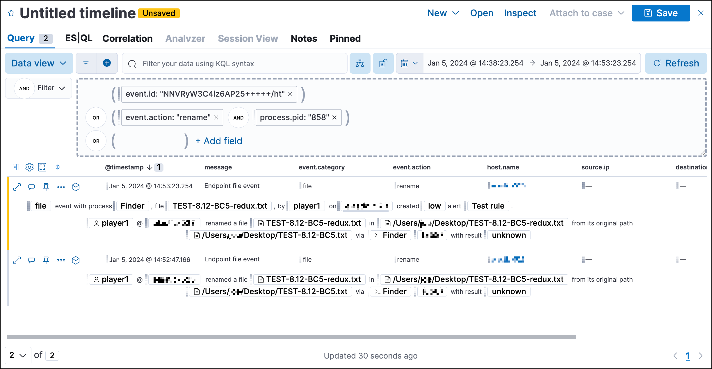

<DocBadge template="technical preview" />
<div id="interactive-investigation-guides"></div>

Detection rule investigation guides suggest steps for triaging, analyzing, and responding to potential security issues. For custom rules, you can create an interactive investigation guide that includes buttons for launching runtime queries in <DocLink id="serverlessSecurityTimelinesUi">Timeline</DocLink>, using alert data and hard-coded literal values. This allows you to start detailed Timeline investigations directly from an alert using relevant data. 

<DocImage size="l" url="../images/interactive-investigation-guides/-detections-ig-alert-flyout.png" alt="Alert details flyout with interactive investigation guide" />

Under the Investigation section, click **Show investigation guide** to open the **Investigation** tab in the left panel of the alert details flyout. 

<DocImage size="xl" url="../images/interactive-investigation-guides/-detections-ig-alert-flyout-invest-tab.png" alt="Alert details flyout with interactive investigation guide" />

The **Investigation** tab displays query buttons, and each query button displays the number of event documents found. Click the query button to automatically load the query in Timeline, based on configuration settings in the investigation guide.



<div id="add-ig-actions-rule"></div>

## Add investigation guide actions to a rule

<DocCallOut title="Note">
You can only create interactive investigation guides with custom rules because Elastic prebuilt rules can't be edited. However, you can duplicate a prebuilt rule, then configure the investigation guide for the duplicated rule.
</DocCallOut>

You can configure an interactive investigation guide when you <DocLink id="serverlessSecurityRulesUiCreate">create a new rule</DocLink> or <DocLink id="serverlessSecurityRulesUiManagement" section="modify-existing-rules-settings">edit an existing rule</DocLink>. 

1. When configuring the rule's settings (the **About rule** step for a new rule, or the **About** tab for an existing rule), expand the **Advanced settings**, then scroll down to the **Investigation guide** Markdown editor.

    

1. Place the editor cursor where you want to add the query button in the investigation guide, then select the Investigate icon in the toolbar. The **Add investigation query** builder form appears.

    <DocImage size="xl" url="../images/interactive-investigation-guides/-detections-ig-investigation-query-builder.png" alt="Add investigation guide UI" />

1. Complete the query builder form to create an investigation query:
    1. **Label**: Enter the text to appear on the query button.
    1. **Description**: (Optional) Enter additional text to include with the button.
    1. **Filters**: Select fields, operators, and values to build the query. Click **OR** or **AND** to create multiple filters and define their relationships.

        To use a field value from the alert as a query parameter, enter the field name surrounded by double curly brackets — such as `{{kibana.alert.example}}` — as a custom option for the filter value.

        <DocImage size="xl" url="../images/interactive-investigation-guides/-detections-ig-filters-field-custom-value.png" alt="Add investigation guide UI" />

    1. **Relative time range**: (Optional) Select a time range to limit the query, relative to the alert's creation time.

1. Click **Save changes**. The syntax is added to the investigation guide editor.

    <DocCallOut title="Note">
    If you need to change the query button's configuration, you can either edit the syntax directly in the editor (refer to the <DocLink id="serverlessSecurityInteractiveInvestigationGuides" section="query-button-syntax">syntax reference</DocLink> below), or delete the syntax and use the query builder form to recreate the query.
    </DocCallOut>

1. Save and enable the rule.

<div id="query-button-syntax"></div>

### Query button syntax

The following syntax defines a query button in an interactive investigation guide.

<DocTable columns={[
  {
    "title": "Field",
    "width": "25%"
  },
  {
    "title": "Description",
    "width": "75%"
  }
]}>
  <DocRow>
    <DocCell>`!{investigate{ }}`</DocCell>
    <DocCell>
      The container object holding all the query button's configuration attributes.
      
    </DocCell>
  </DocRow>
  <DocRow>
    <DocCell>`label`</DocCell>
    <DocCell>
      Identifying text on the button.
      
    </DocCell>
  </DocRow>
  <DocRow>
    <DocCell>`description`</DocCell>
    <DocCell>
      Additional text included with the button.
      
    </DocCell>
  </DocRow>
  <DocRow>
    <DocCell>`providers`</DocCell>
    <DocCell>
      A two-level nested array that defines the query to run in Timeline. Similar to the structure of queries in Timeline, items in the outer level are joined by an `OR` relationship, and items in the inner level are joined by an `AND` relationship.
      
      Each item in `providers` corresponds to a filter created in the query builder UI and is defined by these attributes:
      
      * `field`: The name of the field to query.
      * `excluded`: Whether the query result is excluded (such as **is not one of**) or included (*is one of*).
      * `queryType`: The query type used to filter events, based on the filter's operator. For example, `phrase` or `range`.
      * `value`: The value to search for. Either a hard-coded literal value, or the name of an alert field (in double curly brackets) whose value you want to use as a query parameter.
      * `valueType`: The data type of `value`, such as `string` or `boolean`.

      
    </DocCell>
  </DocRow>
  <DocRow>
    <DocCell>`relativeFrom`, `relativeTo`</DocCell>
    <DocCell>
      (Optional) The start and end, respectively, of the relative time range for the query. Times are relative to the alert's creation time, represented as `now` in [date math](((ref))/common-options.html#date-math) format. For example, selecting **Last 15 minutes** in the query builder form creates the syntax `"relativeFrom": "now-15m", "relativeTo": "now"`.
      
    </DocCell>
  </DocRow>
</DocTable>

<DocCallOut title="Note">
Some characters must be escaped with a backslash, such as `\"` for a quotation mark and `\\` for a literal backslash. Divide Windows paths with double backslashes (for example, `C:\\Windows\\explorer.exe`), and paths that already include double backslashes might require four backslashes for each divider. A clickable error icon (<DocIcon type="error" title="Error" />) displays below the Markdown editor if there are any syntax errors.
</DocCallOut>

### Example syntax

```json
!{investigate{
  "label": "Test action",
  "description": "Click to investigate.",
  "providers": [
    [
      {"field": "event.id", "excluded": false, "queryType": "phrase", "value": "{{event.id}}", "valueType": "string"}
    ],
    [
      {"field": "event.action", "excluded": false, "queryType": "phrase", "value": "rename", "valueType": "string"},
      {"field": "process.pid", "excluded": false, "queryType": "phrase", "value": "{{process.pid}}", "valueType": "string"}
    ]
  ],
  "relativeFrom": "now-15m",
  "relativeTo": "now"
}}
```

This example creates the following Timeline query, as illustrated below:

`(event.id : <alert value>)`
`OR (event.action : "rename" AND process.pid : <alert value>)`

<DocImage size="xl" url="../images/interactive-investigation-guides/-detections-ig-timeline-query.png" alt="Timeline query" />

### Timeline template fields

When viewing an interactive investigation guide in contexts unconnected to a specific alert (such a rule's details page), queries open as <DocLink id="serverlessSecurityTimelineTemplatesUi">Timeline templates</DocLink>, and `parameter` fields are treated as Timeline template fields.

<DocImage size="l" url="../images/interactive-investigation-guides/-detections-ig-timeline-template-fields.png" alt="Timeline template" />

