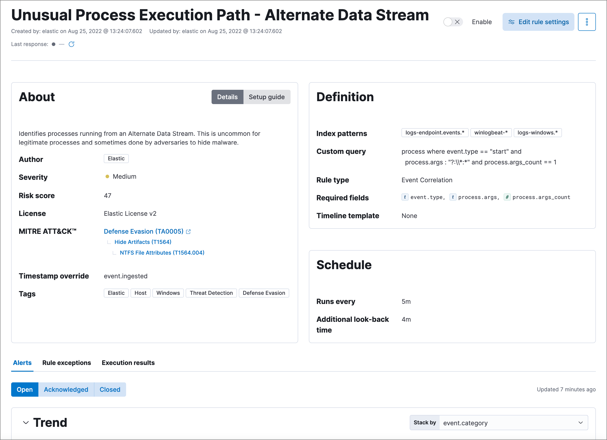
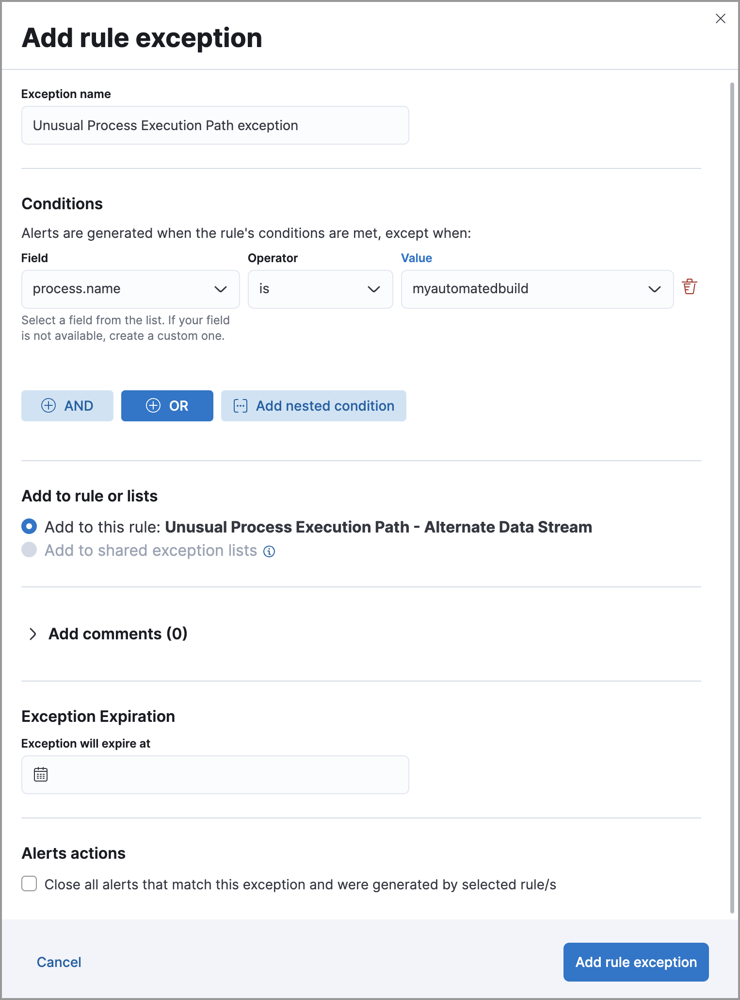

<DocBadge template="technical preview" />

Using the ((security-app)), you can tune prebuilt and custom detection rules to optimize alert generation. To reduce noise, you can:

* Add <DocLink id="serverlessSecurityAddExceptions">exceptions</DocLink> to detection rules.

    <DocCallOut title="Tip">
    Using exceptions is recommended as this ensure excluded source event values
    persist even after prebuilt rules are updated.
    </DocCallOut>

* Disable detection rules that rarely produce actionable alerts because they
    match expected local behavior, workflows, or policy exceptions.

* <DocLink id="serverlessSecurityRulesUiManagement" section="manage-rules">Clone and modify</DocLink> detection rule queries so they are
    aligned with local policy exceptions. This reduces noise while retaining
    actionable alerts.

* Clone and modify detection rule risk scores, and use branching logic to map
    higher risk scores to higher priority workflows.

* Enable <DocLink id="serverlessSecurityAlertSuppression">alert suppression</DocLink> for custom query rules to reduce the number of repeated or duplicate alerts.

For details about tuning rules for specific categories:

* <DocLink id="serverlessSecurityTuningDetectionSignals" section="tune-rules-detecting-authorized-processes">Tune rules detecting authorized processes</DocLink>
* <DocLink id="serverlessSecurityTuningDetectionSignals" section="tune-windows-child-process-and-powershell-rules">Tune Windows child process and PowerShell rules</DocLink>
* <DocLink id="serverlessSecurityTuningDetectionSignals" section="tune-network-rules">Tune network rules</DocLink>
* <DocLink id="serverlessSecurityTuningDetectionSignals" section="tune-indicator-match-rules">Tune indicator match rules</DocLink>

## Filter out uncommon application alerts

Organizations frequently use uncommon and in-house applications. Occasionally,
these can trigger unwanted alerts. To stop a rule matching on an application,
add an exception for the required application.

{/* Links to prebuilt rule pages temporarily removed for initial serverless docs. */}
{/* NOTE: Links to prebuilt rules will break if the rule is deprecated. Link to a different rule or remove the broken link. */}
For example, to prevent the **Unusual Process Execution Path - Alternate Data Stream** rule from
producing alerts for an in-house application named `myautomatedbuild`:

1. Go to **Rules** → **Detection rules (SIEM)**.
1. Search for and then click on the **Unusual Process Execution Path - Alternate Data Stream** rule.

    The **Unusual Process Execution Path - Alternate Data Stream** rule details page is displayed.
    

1. Select the **Rule exceptions** tab, then click **Add rule exception**.
1. Fill in these options:
   * **Field**: `process.name`
   * **Operator**: `is`
   * **Value**: `myautomatedbuild`

    

1. Click **Add rule exception**.

## Tune rules detecting authorized processes

Authorized security testing, system tools, management frameworks, and
administrative activity may trigger detection rules. These legitimate
activities include:

* Authorized security research.
* System and software management processes running scripts, including scripts
    that start child processes.

* Administrative and management frameworks that create users, schedule tasks,
    make `psexec` connections, and run WMI commands.

* Legitimate scripts using the `whoami` command.
* Applications that work with file shares, such as backup programs, and use the
    server message block (SMB) protocol.

To reduce noise for authorized activity, you can do any of these:

* Add an exception to the rules that exclude specific servers, such as
    the relevant host names, agent names, or other common identifiers.
    For example, `host.name is <server-name>`.

* Add an exception to the rules that <DocLink id="serverlessSecurityTuningDetectionSignals" section="filter-out-uncommon-application-alerts">exclude specific
    processes</DocLink>.
    For example, `process.name is <process-name>`.

* Add an exception to the rules that exclude a common user.
    For example, `user.name is <security-tester>`.

Another useful technique is to assign lower risk scores to rules triggered by
authorized activity. This enables detections while keeping the resulting alerts
out of high-priority workflows. Use these steps:

1. Before adding exceptions, duplicate the prebuilt rule.
1. Add an exception to the original prebuilt rule that excludes the relevant user
    or process name (`user.name is <user-name>` or `process.name is "process-name"`).

1. Edit the duplicated rule as follows:
   * Lower the `Risk score` (**Edit rule settings** → **About** tab).
   * Add an exception so the rule only matches the user or process name excluded
    in original prebuilt rules.
    (`user.name is not <user-name>` or `process.name is not <process-name>`).

    

1. Click **Add rule exception**.

## Tune Windows child process and PowerShell rules

Normal user activity may sometimes trigger one or more of these rules:

{/* Links to prebuilt rule pages temporarily removed for initial serverless docs. */}
{/* NOTE: Links to prebuilt rules will break if the rule is deprecated. Link to a different rule or remove the broken link. */}
* **Suspicious MS Office Child Process**
* **Suspicious MS Outlook Child Process**
* **System Shells via Services**
* **Unusual Parent-Child Relationship**
* **Windows Script Executing PowerShell**

While all rules can be adjusted as needed, use care when adding exceptions to
these rules. Exceptions could result in an undetected client-side execution, or
a persistence or malware threat going unnoticed.

Examples of when these rules may create noise include:

* Receiving and opening email-attached Microsoft Office files, which
    include active content such as macros or scripts, from a trusted third-party
    source.

* Authorized technical support personnel who provide remote workers with
    scripts to gather troubleshooting information.

In these cases, exceptions can be added to the rules using the relevant
`process.name`, `user.name`, and `host.name` conditions. Additionally,
you can create duplicate rules with lower risk scores.

## Tune network rules

The definition of normal network behavior varies widely across different
organizations. Different networks conform to different security policies,
standards, and regulations. When normal network activity triggers alerts,
network rules can be disabled or modified. For example:

* To exclude a specific source, add a `source.ip` exception with the
    relevant IP address, and a `destination.port` exception with the relevant port
    number (`source.ip is 196.1.0.12` and `destination.port is 445`).

* To exclude source network traffic for an entire subnet, add a `source.ip`
    exception with the relevant CIDR notation (`source.ip is 192.168.0.0/16`).

* To exclude a destination IP for a specific destination port, add a
    `destination.ip` exception with the IP address, and a `destination.port`
    exception with the port number
    (`destination.ip is 38.160.150.31` and `destination.port is 445`)

* To exclude a destination subnet for a specific destination port, add a
    `destination.ip` exception using CIDR notation, and a ‘destination.port’
    exception with the port number
    (`destination.ip is 172.16.0.0/12` and `destination.port is 445`).

## Tune indicator match rules

Take the following steps to tune indicator match rules:

* Specify a detailed query as part of the indicator index query. Results of the indicator index query are used by the detection engine to query the indices specified in your rule definition's index pattern. Using no query or the wildcard `***` query may result in your rule executing very large queries.
* Limit your rule's additional look-back time to as short a duration as possible, and no more than 24 hours.
* Avoid cluster performance issues by scheduling your rule to run in one-hour intervals or longer. For example, avoid scheduling an indicator match rule to check for indicators every five minutes.

<DocCallOut title="Note">
((elastic-sec)) provides limited support for indicator match rules. Visit <DocLink id="serverlessSecurityDetectionEngineOverview" section="limited-support-for-indicator-match-rules">support limitations</DocLink> for more information.
</DocCallOut>

### Noise from common cloud-based network traffic

In cloud-based organizations, remote workers sometimes access services over the
internet. The security policies of home networks probably differ from the
security policies of managed corporate networks, and these rules might need
tuning to reduce noise from legitimate administrative activities:

{/* Links to prebuilt rule pages temporarily removed for initial serverless docs. */}
{/* NOTE: Links to prebuilt rules will break if the rule is deprecated. Link to a different rule or remove the broken link. */}
* **RDP (Remote Desktop Protocol) from the Internet**

<DocCallOut title="Tip">
If your organization is widely distributed and the workforce travels a
lot, use the `windows_anomalous_user_name_ecs`,
`linux_anomalous_user_name_ecs`, and `suspicious_login_activity_ecs`
<DocLink id="serverlessSecurityMachineLearning">((ml))</DocLink> jobs to detect suspicious authentication activity.
</DocCallOut>

