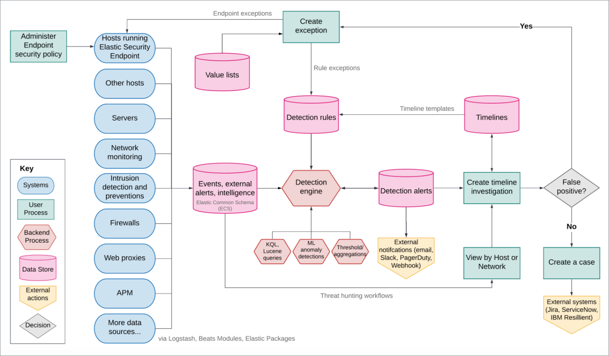

 
<DocBadge template="technical preview" />

((elastic-sec)) combines SIEM threat detection features with endpoint
prevention and response capabilities in one solution. These analytical and
protection capabilities, leveraged by the speed and extensibility of
Elasticsearch, enable analysts to defend their organization from threats before
damage and loss occur.

((elastic-sec)) provides the following security benefits and capabilities:

* A detection engine to identify attacks and system misconfigurations
* A workspace for event triage and investigations
* Interactive visualizations to investigate process relationships
* Inbuilt case management with automated actions
* Detection of signatureless attacks with prebuilt machine learning anomaly jobs and detection rules

## ((elastic-sec)) components and workflow

The following diagram provides a comprehensive illustration of the ((elastic-sec)) workflow.

Here's an overview of the flow and its components:

* Data is shipped from your hosts to ((elastic-sec)) in the following ways:
    * <DocLink id="serverlessSecurityInstallDefend">((elastic-defend))</DocLink>: ((agent)) integration that
        protects your hosts <DocLink id="serverlessSecurityDetectionEngineOverview" section="malware-prevention">against malware</DocLink> and ships these data sets:

        *  **Windows**: Process, network, file, DNS, registry, DLL and driver loads,
            malware security detections, API

        * **Linux/macOS**: Process, network, file
    * [((integrations))](((integrations-docs))): Integrations are a streamlined way to ship your data. Integrations are available for popular services and platforms, like Nginx, AWS, and MongoDB, as well as many generic input types like log files.
    * [Beat modules](https://www.elastic.co/integrations?solution=security): ((beats))
        are lightweight data shippers. Beat modules provide a way of collecting and
        parsing specific data sets from common sources, such as cloud and OS events,
        logs, and metrics. Common security-related modules are listed
        <DocLink id="serverlessSecurityIngestData" section="enable-modules-and-configuration-options">here</DocLink>.

* The ((security-app)) is used to manage the **Detection engine**,
    **Cases**, and **Timeline**, as well as administer hosts running ((elastic-defend)):

    * Detection engine: Automatically searches for suspicious host and network
        activity via the following:

        * <DocLink id="serverlessSecurityDetectionEngineOverview">Detection rules</DocLink>: Periodically search the data
            (((es)) indices) sent from your hosts for suspicious events. When a suspicious
            event is discovered, an alert is generated. External systems, such as
            Slack and email, can be used to send notifications when alerts are generated.
            You can create your own rules and make use of our <DocLink id="serverlessSecurityPrebuiltRules">prebuilt ones</DocLink>.

        * <DocLink id="serverlessSecurityDetectionsUiExceptions">Exceptions</DocLink>: Reduce noise and the number of
            false positives. Exceptions are associated with rules and prevent alerts when
            an exception's conditions are met. **Value lists** contain source event
            values that can be used as part of an exception's conditions. When
            ((elastic-defend)) is installed on your hosts, you can add malware exceptions
            directly to the endpoint from the Security app.

        * <DocLink id="serverlessSecurityMachineLearning" section="prebuilt-jobs">((ml-cap)) jobs</DocLink>: Automatic anomaly detection of host and network events. Anomaly scores are provided per host and can be used with detection rules.
    * <DocLink id="serverlessSecurityTimelinesUi">Timeline</DocLink>: Workspace for investigating alerts and events.
        Timelines use queries and filters to drill down into events related to
        a specific incident. Timeline templates are attached to rules and use predefined
        queries when alerts are investigated. Timelines can be saved and shared with
        others, as well as attached to Cases.

    * <DocLink id="serverlessSecurityCasesOverview">Cases</DocLink>: An internal system for opening, tracking, and sharing
        security issues directly in the ((security-app)). Cases can be integrated with
        external ticketing systems.

    * <DocLink id="serverlessSecurityEndpointsPage">Administration</DocLink>: View and manage hosts running ((elastic-defend)).

<DocLink id="serverlessSecurityIngestData">Ingest data to ((elastic-sec))</DocLink> and <DocLink id="serverlessSecurityInstallDefend">Install and configure the ((elastic-defend)) integration</DocLink> describe how to ship security-related data.

### Additional ((elastic-defend)) information

The [((elastic-defend)) integration](https://www.elastic.co/endpoint-security/)
for ((agent)) provides capabilities such as collecting events, detecting and preventing
malicious activity, exceptions, and artifact delivery. 
[((fleet))](((fleet-guide))/fleet-overview.html) is used to
install and manage ((agents)) and integrations on your hosts.

#### Elastic Endpoint self-protection

Self-protection means that ((elastic-endpoint)) has guards against users and attackers that may try to interfere with its functionality. This protection feature is consistently enhanced to prevent attackers who may attempt to use newer, more sophisticated tactics to interfere with the ((elastic-endpoint)). Self-protection is enabled by default when ((elastic-endpoint)) installs on supported platforms, listed below.

Self-protection is enabled on the following 64-bit Windows versions:

* Windows 8.1
* Windows 10
* Windows 11
* Windows Server 2012 R2
* Windows Server 2016
* Windows Server 2019
* Windows Server 2022

Self-protection is also enabled on the following macOS versions:

* macOS 10.15 (Catalina)
* macOS 11 (Big Sur)
* macOS 12 (Monterey)

<DocCallOut title="Note">
Other Windows and macOS variants (and all Linux distributions) do not have self-protection.
</DocCallOut>

Self-protection defines the following permissions:

* Users — even Administrator/root — **cannot** delete ((elastic-endpoint)) files (located at `c:\Program Files\Elastic\Endpoint` on Windows, and `/Library/Elastic/Endpoint` on macOS).
* Users **cannot** terminate the ((elastic-endpoint)) program or service.
* Administrator/root users **can** read the Endpoint's files. On Windows, the easiest way to read Endpoint files is to start an Administrator `cmd.exe` prompt. On macOS, an Administrator can use the `sudo` command.
* Administrator/root users **can** stop the ((elastic-agent))'s service. On Windows, run the `sc stop "Elastic Agent"` command. On macOS, run the `sudo launchctl stop elastic-agent` command.

### Integration with other Elastic products

You can use ((elastic-sec)) with other Elastic products and features to help you
identify and investigate suspicious activity:

* [((ml-cap))](https://www.elastic.co/products/stack/machine-learning)
* [Alerting](https://www.elastic.co/products/stack/alerting)

### APM transaction data sources

By default, ((elastic-sec)) monitors [APM](((apm-app-ref))/apm-getting-started.html)
`apm-*-transaction*` indices. To add additional APM indices, update the
index patterns in the `securitySolution:defaultIndex` setting in **Advanced Settings**.

### ECS compliance data requirements

The [Elastic Common Schema (ECS)](((ecs-ref))) defines a common set of fields to be used for
storing event data in Elasticsearch. ECS helps users normalize their event data
to better analyze, visualize, and correlate the data represented in their
events. ((elastic-sec)) supports events and indicator index data from any ECS-compliant data source.

<DocCallOut title="Important" color="warning">
((elastic-sec)) requires [ECS-compliant data](((ecs-ref))). If you use third-party data collectors to ship data to ((es)), the data must be mapped to ECS.
<DocLink id="serverlessSecuritySiemFieldReference" /> lists ECS fields used in ((elastic-sec)).
</DocCallOut>
