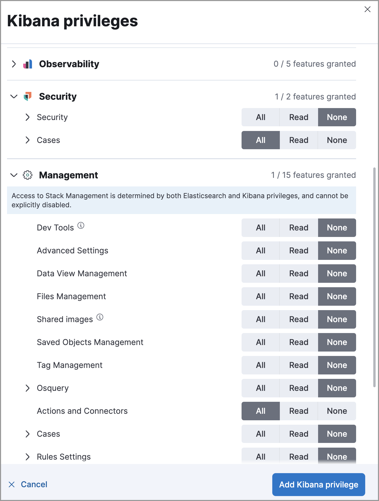

<DocBadge template="technical preview" />

{/* To view cases, you need the ((kib)) space `Read` privilege for the `Security` feature. To create cases and add comments, you need the `All` ((kib)) */}
{/* space privilege for the `Security` feature. */}

{/* For more information, see */}
{/* ((kibana-ref))/xpack-spaces.html#spaces-control-user-access[Feature access based on user privileges]. */}

User roles define feature privileges at different levels to manage feature access. To access cases, you must have the appropriate <DocLink id="serverlessGeneralAssignUserRoles">user role</DocLink>.

<DocCallOut title="Requirements">

To send cases to external systems, you need the Security Analytics Complete <DocLink id="serverlessGeneralManageProject" text="project feature"/>.

</DocCallOut>

<DocCallOut title="Important" color="warning">
Certain feature tiers and roles might be required to manage case attachments. For example, to add alerts to cases, you must have a role that allows <DocLink id="serverlessSecurityDetectionsPermissionsSection" section="enable-and-access-detections">managing alerts</DocLink>. 
</DocCallOut>

{/* Hiding the whole table because it's classic-only. We'll replace with serverless info when it's available. */}
{/* To grant access to cases, set the ((kib)) space privileges for the **Cases** and **((connectors-feature))** features as follows:

<DocTable columns={[
  {
    "title": "Action",
    "width": "50%"
  },
  {
    "title": "((kib)) Privileges",
    "width": "50%"
  }
]}>
  <DocRow>
    <DocCell>
      Give full access to manage cases
      
    </DocCell>
    <DocCell>
      * **All** for the **Cases** feature under **Security**

      * **All** for the **((connectors-feature))** feature under **Management**

      
      <DocCallOut title="Note">
      Roles without **All** **((connectors-feature))** feature privileges cannot create, add, delete, or modify case connectors.
      </DocCallOut>
      
      
      
    </DocCell>
  </DocRow>
  <DocRow>
    <DocCell>
      Give assignee access to cases
      
    </DocCell>
    <DocCell>
      * **All** for the **Cases** feature under **Security**
      
      <DocCallOut title="Note">
      Before a user can be assigned to a case, they must log into ((kib)) at least
      once, which creates a user profile.
      </DocCallOut>
      
      
      
    </DocCell>
  </DocRow>
  <DocRow>
    <DocCell>Give view-only access for cases</DocCell>
    <DocCell>
      **Read** for the **Security** feature and **All** for the **Cases** feature
      
      
    </DocCell>
  </DocRow>
  <DocRow>
    <DocCell>
      Give access to view and delete cases
      
    </DocCell>
    <DocCell>
      **Read** for the **Cases** feature under **Security** with the **Delete** sub-feature selected
      
      <DocCallOut title="Note">
      These privileges also enable you to delete comments and alerts from a case.
      </DocCallOut>
      
      
      
    </DocCell>
  </DocRow>
  <DocRow>
    <DocCell>Revoke all access to cases</DocCell>
    <DocCell>
      **None** for the **Cases** feature under **Security**
      
      
    </DocCell>
  </DocRow>
</DocTable>

 */}
