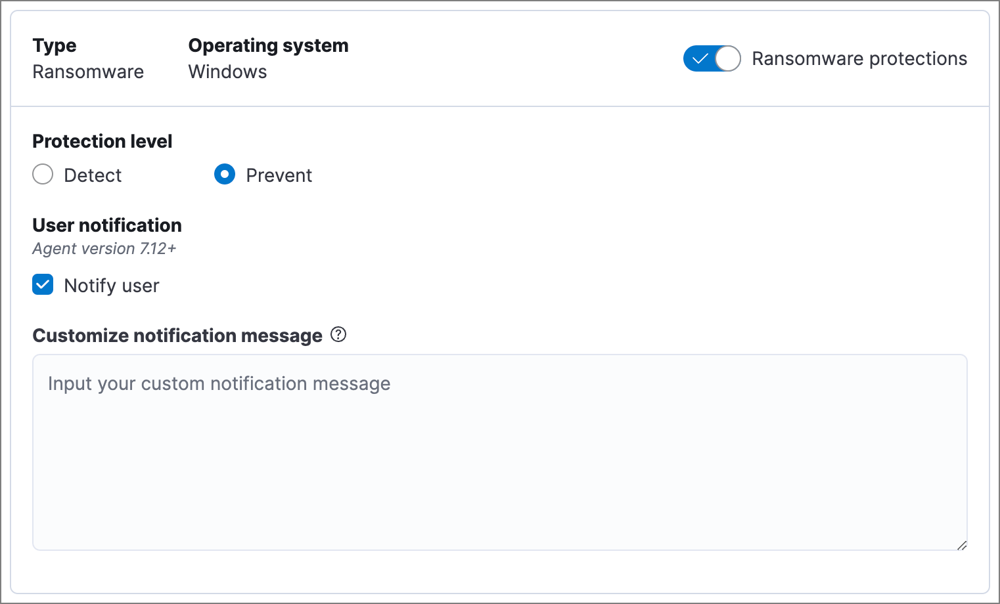
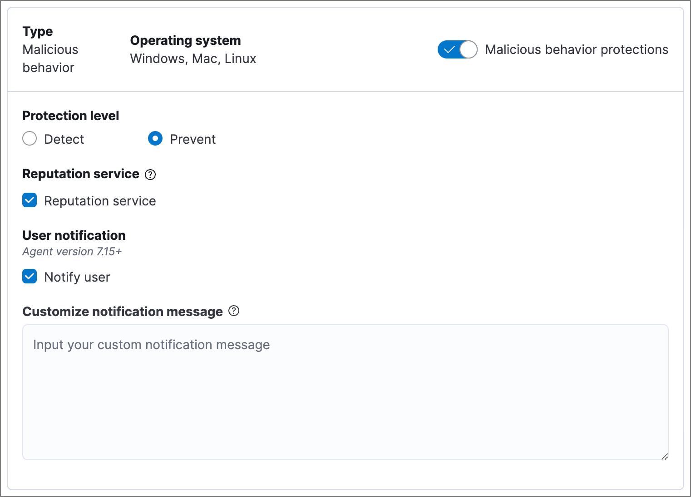
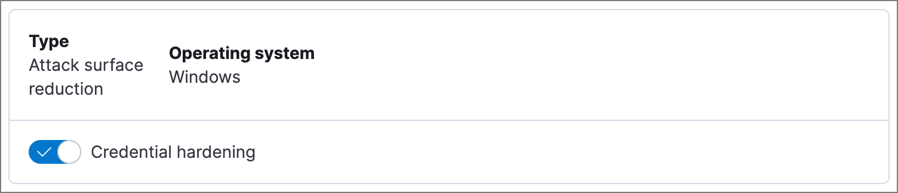
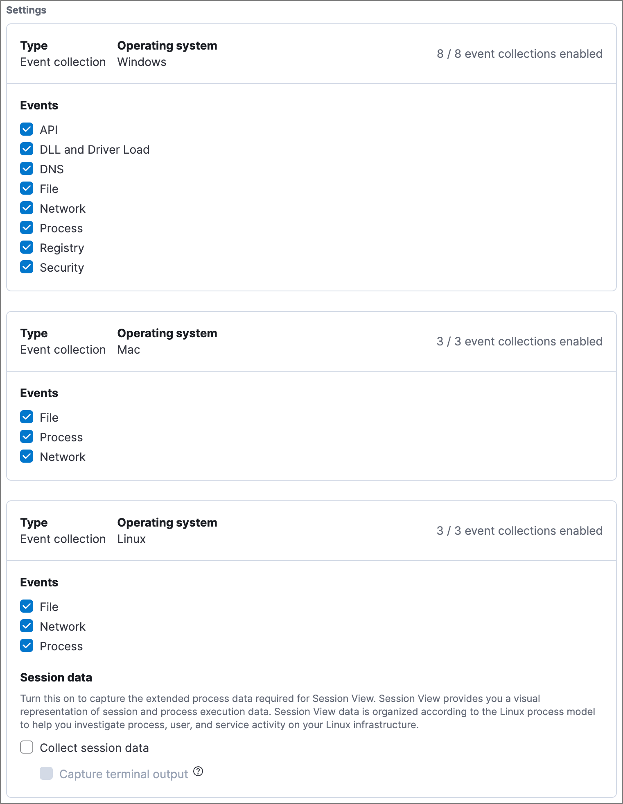
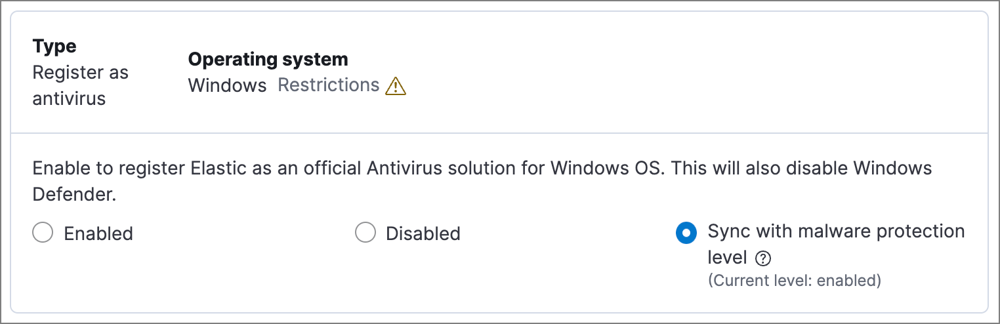

<DocBadge template="technical preview" />

After the ((agent)) is installed with the ((elastic-defend)) integration, several protections features — including
preventions against malware, ransomware, memory threats, and malicious behavior — are automatically enabled
on protected hosts (most features require the Endpoint Protection Essentials or Endpoint Protection Complete <DocLink slug="/serverless/elasticsearch/manage-project" text="project feature"/>). If needed, you can update the
integration policy to configure protection settings, event collection, antivirus settings, trusted applications,
event filters, host isolation exceptions, and blocked applications to meet your organization's security needs.

You can also create multiple ((elastic-defend)) integration policies to maintain unique configuration profiles. To create an additional ((elastic-defend)) integration policy, go to **Project settings** → **Integrations**, then follow the steps for <DocLink slug="/serverless/security/install-edr" section="add-the-((elastic-defend))-integration">adding the ((elastic-defend)) integration</DocLink>.

<DocCallOut title="Requirements">

You must have the appropriate user role to configure an integration policy.

</DocCallOut>

{/* Commented out because APIs are not exposed in initial serverless release. We can uncommment this and add a link to API docs once APIs are available.
<DocCallOut title="Tip">
In addition to configuring an {elastic-defend} policy through the ((elastic-sec)) UI, you can create and customize an ((elastic-defend)) policy through the API.
</DocCallOut> 
*/}

To configure an integration policy:

1. Go to **Assets** → **Endpoints** → **Policies** to view the **Policies** page.
1. Select the integration policy you want to configure. The integration policy configuration page appears.
1. On the **Policy settings** tab, review and configure the following settings as appropriate:

   * <DocLink slug="/serverless/security/configure-endpoint-integration-policy" section="malware-protection">Malware protection</DocLink>
   * <DocLink slug="/serverless/security/configure-endpoint-integration-policy" section="ransomware-protection">Ransomware protection</DocLink>
   * <DocLink slug="/serverless/security/configure-endpoint-integration-policy" section="memory-threat-protection">Memory threat protection</DocLink>
   * <DocLink slug="/serverless/security/configure-endpoint-integration-policy" section="malicious-behavior-protection">Malicious behavior protection</DocLink>
   * <DocLink slug="/serverless/security/configure-endpoint-integration-policy" section="attack-surface-reduction">Attack surface reduction</DocLink>
   * <DocLink slug="/serverless/security/configure-endpoint-integration-policy" section="event-collection">Event collection</DocLink>
   * <DocLink slug="/serverless/security/configure-endpoint-integration-policy" section="register-as-antivirus">Register ((elastic-sec)) as antivirus (optional)</DocLink>
   * <DocLink slug="/serverless/security/configure-endpoint-integration-policy" section="advanced-policy-settings-optional">Advanced policy settings (optional)</DocLink>
   * <DocLink slug="/serverless/security/configure-endpoint-integration-policy" section="save-the-general-policy-settings">Save the general policy settings</DocLink>

1. Click the **Trusted applications**, **Event filters**, **Host isolation exceptions**, and **Blocklist** tabs to review the endpoint policy artifacts assigned to this integration policy (for more information, refer to <DocLink slug="/serverless/security/trusted-applications">trusted applications</DocLink>, <DocLink slug="/serverless/security/event-filters">event filters</DocLink>, <DocLink slug="/serverless/security/host-isolation-exceptions">host isolation exceptions</DocLink>, and <DocLink slug="/serverless/security/blocklist">blocklist</DocLink>). On these tabs, you can:

   * Expand and view an artifact — Click the arrow next to its name.
   * View an artifact's details — Click the actions menu (<DocIcon type="boxesHorizontal" title="Actions menu" size="m" />), then select **View full details**.
   * Unassign an artifact — Click the actions menu (<DocIcon type="boxesHorizontal" title="Actions menu" size="m" />),
    then select **Remove from policy**. This does not delete the artifact; this just unassigns it from the current policy.
   * Assign an existing artifact — Click **Assign _x_ to policy**,
    then select an item from the flyout. This view lists any existing artifacts that aren't already assigned to the current policy.

    <DocCallOut title="Note">
    You can't create a new endpoint policy artifact while configuring an integration policy.
    To create a new artifact, go to its main page in the ((security-app)) (for example,
    to create a new trusted application, go to **Assets** → **Endpoints** → **Trusted applications**).
    </DocCallOut>

1. Click the **Protection updates** tab to configure how ((elastic-defend)) receives updates from Elastic with the latest threat detections, malware models, and other protection artifacts. Refer to <DocLink slug="/serverless/security/protection-artifact-control"/> for more information.

## Malware protection

((elastic-defend)) malware prevention detects and stops malicious attacks by using a <DocLink slug="/serverless/security/detection-engine-overview" section="machine-learning-model">machine learning model</DocLink>
that looks for static attributes to determine if a file is malicious or benign.

By default, malware protection is enabled on Windows, macOS, and Linux hosts.
To disable malware protection, turn off the **Malware protections** toggle.

<DocCallOut title="Requirements">

Malware protection requires the Endpoint Protection Essentials <DocLink slug="/serverless/elasticsearch/manage-project" text="project feature"/>.

</DocCallOut>

Malware protection levels are:

* **Detect**: Detects malware on the host and generates an alert. The agent will **not** block malware.
    You must pay attention to and analyze any malware alerts that are generated.

* **Prevent** (Default): Detects malware on the host, blocks it from executing, and generates an alert.

These additional options are available for malware protection:

* **Blocklist**: Enable or disable the <DocLink slug="/serverless/security/blocklist">blocklist</DocLink> for all hosts associated with this ((elastic-defend)) policy. The blocklist allows you to prevent specified applications from running on hosts, extending the list of processes that ((elastic-defend)) considers malicious.

* **Scan files upon modification**: By default, ((elastic-defend)) scans files every time they're modified, which can be resource-intensive on hosts where files are frequently modified, such as servers and developer machines. Turn off this option to only scan files when they're executed. ((elastic-defend)) will continue to identify malware as it attempts to run, providing a robust level of protection while improving endpoint performance.

Select **Notify user** to send a push notification in the host operating system when activity is detected or prevented. Notifications are enabled by default for the **Prevent** option.

<DocCallOut title="Tip">
Endpoint Protection Complete customers can customize these notifications using the `Elastic Security {action} {filename}` syntax.
</DocCallOut>

### Manage quarantined files

When **Prevent** is enabled for malware protection, ((elastic-defend)) will quarantine any malicious file it finds. Specifically ((elastic-defend)) will remove the file from its current location, encrypt it with the encryption key `ELASTIC`, move it to a different folder, and rename it as a GUID string, such as `318e70c2-af9b-4c3a-939d-11410b9a112c`.

The quarantine folder location varies by operating system:

- macOS: `/System/Volumes/Data/.equarantine`
- Linux: `.equarantine` at the root of the mount point of the file being quarantined
- Windows - ((elastic-defend)) versions 8.5 and later: `[DriveLetter:]\.quarantine`, unless the files are from the `C:` drive. These files are moved to `C:\Program Files\Elastic\Endpoint\state\.equarantine`.
- Windows - ((elastic-defend)) versions 8.4 and earlier: `[DriveLetter:]\.quarantine`, for any drive

To restore a quarantined file to its original state and location, <DocLink slug="/serverless/security/add-exceptions">add an exception</DocLink> to the rule that identified the file as malicious. If the exception would've stopped the rule from identifying the file as malicious, ((elastic-defend)) restores the file.

You can access a quarantined file by using the `get-file` <DocLink slug="/serverless/security/response-actions" section="response-action-commands">response action command</DocLink> in the response console. To do this, copy the path from the alert's **Quarantined file path** field (`file.Ext.quarantine_path`), which appears under **Highlighted fields** in the alert details flyout. Then paste the value into the `--path` parameter. This action doesn't restore the file to its original location, so you will need to do this manually.

<DocCallOut title="Note">
Response actions and the response console UI are Endpoint Protection Complete <DocLink slug="/serverless/elasticsearch/manage-project" text="project features"/>.
</DocCallOut>

## Ransomware protection

Behavioral ransomware prevention detects and stops ransomware attacks on Windows systems by
analyzing data from low-level system processes. It is effective across an array of widespread
ransomware families — including those targeting the system’s master boot record.

<DocCallOut title="Requirements">

Ransomware protection requires the Endpoint Protection Essentials <DocLink slug="/serverless/elasticsearch/manage-project" text="project feature"/>.

</DocCallOut>

Ransomware protection levels are:

* **Detect**: Detects ransomware on the host and generates an alert. ((elastic-defend))
    will **not** block ransomware. You must pay attention to and analyze any ransomware alerts that are generated.

* **Prevent** (Default): Detects ransomware on the host, blocks it from executing,
    and generates an alert.

When ransomware protection is enabled, canary files placed in targeted locations on your hosts provide an early warning system for potential ransomware activity. When a canary file is modified, Elastic Defend immediately generates a ransomware alert. If **prevent** ransomware is active, ((elastic-defend)) terminates the process that modified the file.

Select **Notify user** to send a push notification in the host operating system when activity is detected or prevented. Notifications are enabled by default for the **Prevent** option.

<DocCallOut title="Tip">
Endpoint Protection Complete customers can customize these notifications using the `Elastic Security {action} {filename}` syntax.
</DocCallOut>

## Memory threat protection

Memory threat protection detects and stops in-memory threats, such as shellcode injection,
which are used to evade traditional file-based detection techniques.

<DocCallOut title="Requirements">

Memory threat protection requires the Endpoint Protection Essentials <DocLink slug="/serverless/elasticsearch/manage-project" text="project feature"/>.

</DocCallOut>

Memory threat protection levels are:

* **Detect**: Detects memory threat activity on the host and generates an alert.
    ((elastic-defend)) will **not** block the in-memory activity. You must pay attention to and analyze any alerts that are generated.

* **Prevent** (Default): Detects memory threat activity on the host, forces the process
    or thread to stop, and generates an alert.

Select **Notify user** to send a push notification in the host operating system when activity is detected or prevented. Notifications are enabled by default for the **Prevent** option.

<DocCallOut title="Tip">
Endpoint Protection Complete customers can customize these notifications using the `Elastic Security {action} {rule}` syntax.
</DocCallOut>

## Malicious behavior protection

Malicious behavior protection detects and stops threats by monitoring the behavior
of system processes for suspicious activity. Behavioral signals are much more difficult
for adversaries to evade than traditional file-based detection techniques.

<DocCallOut title="Requirements">

Malicious behavior protection requires the Endpoint Protection Essentials <DocLink slug="/serverless/elasticsearch/manage-project" text="project feature"/>.

</DocCallOut>

Malicious behavior protection levels are:

* **Detect**: Detects malicious behavior on the host and generates an alert.
    ((elastic-defend)) will **not** block the malicious behavior. You must pay attention to and analyze any alerts that are generated.

* **Prevent** (Default): Detects malicious behavior on the host, forces the process to stop,
    and generates an alert.

Select whether you want to use **Reputation service** for additional protection. Elastic's reputation service leverages our extensive threat intelligence knowledge to make high confidence real-time prevention decisions. For example, reputation service can detect suspicious downloads of binaries with low or malicious reputation. Endpoints communicate with the reputation service directly at https://cloud.security.elastic.co.

Select **Notify user** to send a push notification in the host operating system when activity is detected or prevented. Notifications are enabled by default for the **Prevent** option.

<DocCallOut title="Tip">
Endpoint Protection Complete customers can customize these notifications using the `Elastic Security {action} {rule}` syntax.
</DocCallOut>

## Attack surface reduction

This section helps you reduce vulnerabilities that attackers can target on Windows endpoints.

<DocCallOut title="Requirements">

Attack surface reduction requires the Endpoint Protection Essentials <DocLink slug="/serverless/elasticsearch/manage-project" text="project feature"/>.

</DocCallOut>

* **Credential hardening**: Prevents attackers from stealing credentials stored in Windows system process memory. Turn on the toggle to remove any overly permissive access rights that aren't required for standard interaction with the Local Security Authority Subsystem Service (LSASS). This feature enforces the principle of least privilege without interfering with benign system activity that is related to LSASS.

## Event collection

In the **Settings** section, select which categories of events to collect on each operating system.
Most categories are collected by default, as seen below.

## Register ((elastic-sec)) as antivirus (optional)

With ((elastic-defend)) version 7.10 or later on Windows 7 or later, you can
register ((elastic-sec)) as your hosts' antivirus software by enabling **Register as antivirus**.

<DocCallOut title="Note">
Windows Server is not supported. Antivirus registration requires Windows Security Center, which is not included in Windows Server operating systems.
</DocCallOut>

By default, the **Sync with malware protection level** is selected to automatically set antivirus registration to match how you've configured ((elastic-defend))'s <DocLink slug="/serverless/security/configure-endpoint-integration-policy" section="malware-protection">malware protection</DocLink>. If malware protection is turned on _and_ set to **Prevent**, antivirus registration will also be enabled; in any other case, antivirus registration will be disabled.

If you don't want to sync antivirus registration, you can set it manually with **Enabled** or **Disabled**.

## Advanced policy settings (optional)

Users with unique configuration and security requirements can select **Show advanced settings**
to configure the policy to support advanced use cases. Hover over each setting to view its description.

<DocCallOut title="Note">
Advanced settings are not recommended for most users.
</DocCallOut>

This section includes:

* <DocLink slug="/serverless/security/endpoint-diagnostic-data">Turn off diagnostic data for ((elastic-defend))</DocLink>
* <DocLink slug="/serverless/security/self-healing-rollback">Configure self-healing rollback for Windows endpoints</DocLink>
* <DocLink slug="/serverless/security/linux-file-monitoring">Configure Linux file system monitoring</DocLink>

## Save the general policy settings

After you have configured the general settings on the **Policy settings** tab, click **Save**. A confirmation message appears.
