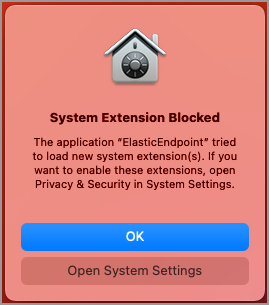
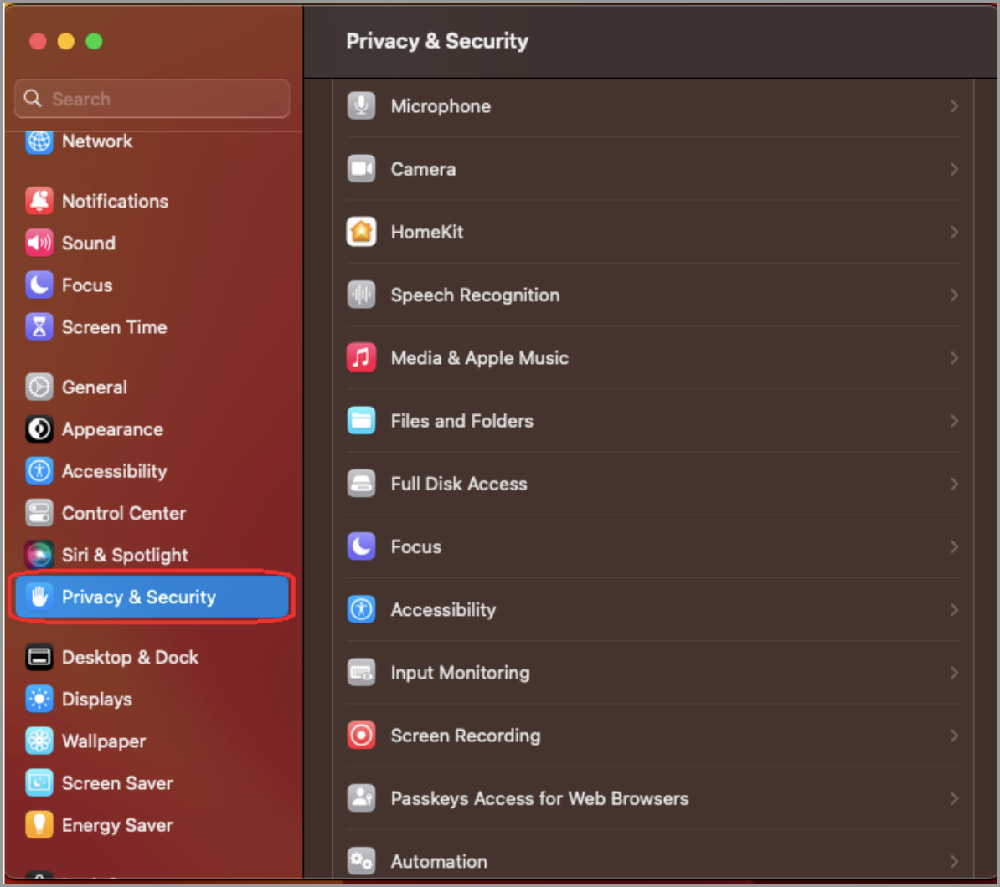
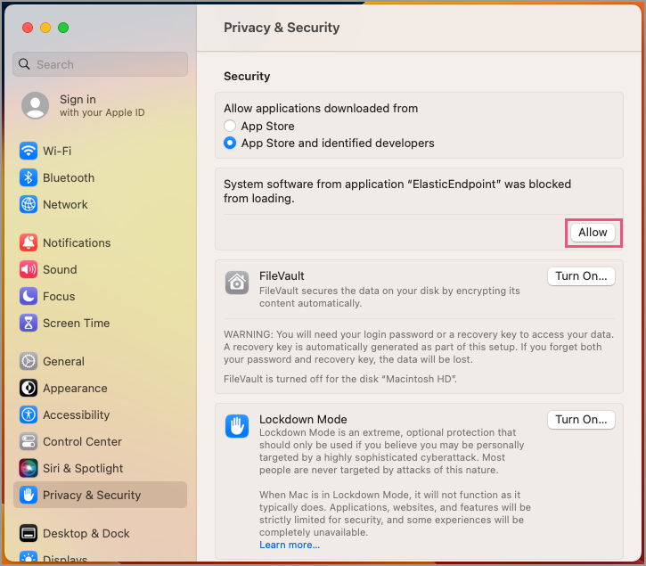
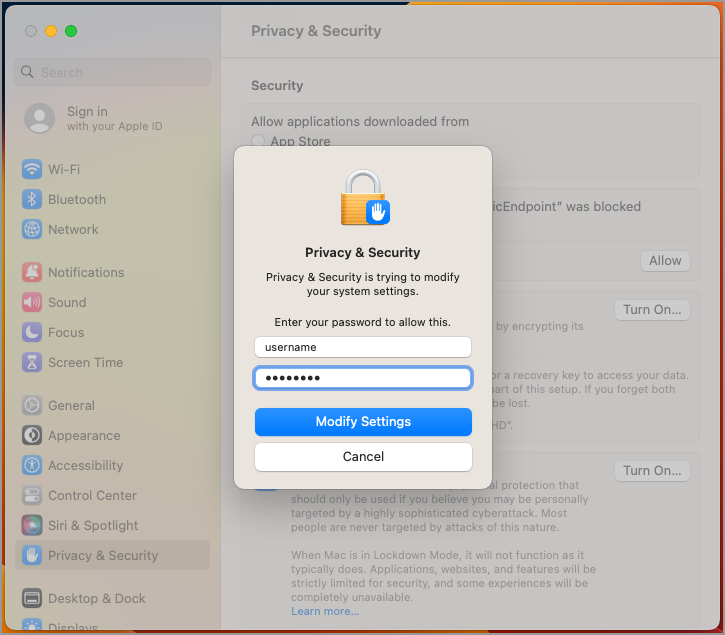
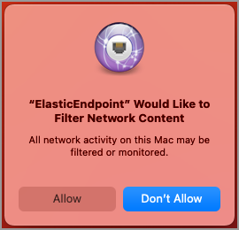
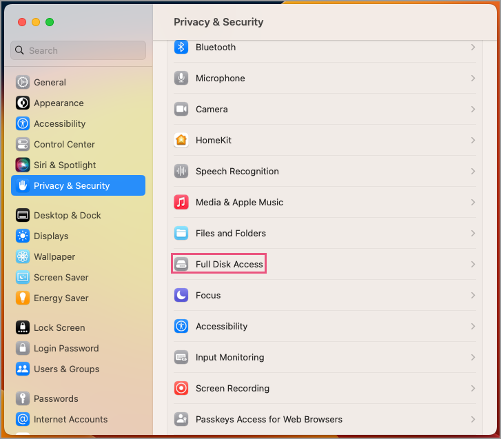
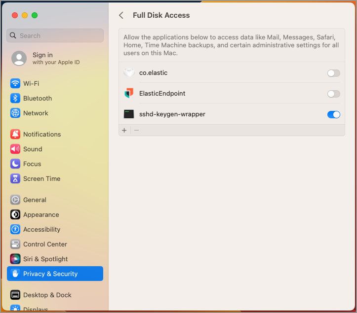
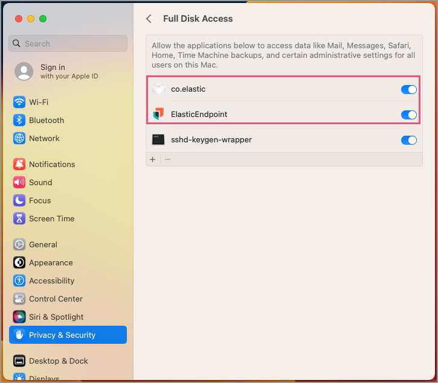

<DocBadge template="technical preview" />

To properly install and configure ((elastic-defend)) manually without a Mobile Device Management (MDM) profile, there are additional permissions that must be enabled on the host before ((elastic-endpoint))—the installed component that performs ((elastic-defend))'s threat monitoring and prevention—is fully functional:

* <DocLink slug="/serverless/security/deploy-elastic-endpoint-ven" section="approve-the-system-extension-for-((elastic-endpoint))">Approve the system extension</DocLink>
* <DocLink slug="/serverless/security/deploy-elastic-endpoint-ven" section="approve-network-content-filtering-for-((elastic-endpoint))">Approve network content filtering</DocLink>
* <DocLink slug="/serverless/security/deploy-elastic-endpoint-ven" section="enable-full-disk-access-for-((elastic-endpoint))">Enable Full Disk Access</DocLink>

<DocCallOut title="Note">
The following permissions that need to be enabled are required after you <DocLink slug="/serverless/security/install-edr">configure and install the ((elastic-defend)) integration</DocLink>, which includes <DocLink slug="/serverless/security/install-edr" section="configure-and-enroll-the-((agent))">enrolling the ((agent))</DocLink>.
</DocCallOut>

## Approve the system extension for ((elastic-endpoint))

For macOS Ventura (13.0) and later, ((elastic-endpoint)) will attempt to load a system extension during installation. This system extension must be loaded in order to provide insight into system events such as process events, file system events, and network events.

The following message appears during installation:

1. Click **Open System Settings**.
1. In the left pane, click **Privacy & Security**.

    

1. On the right pane, scroll down to the Security section. Click **Allow** to allow the ElasticEndpoint system extension to load.

    

1. Enter your username and password and click **Modify Settings** to save your changes.

    

## Approve network content filtering for ((elastic-endpoint))

After successfully loading the ElasticEndpoint system extension, an additional message appears, asking to allow ((elastic-endpoint)) to filter network content.

Click **Allow** to enable content filtering for the ElasticEndpoint system extension. Without this approval, ((elastic-endpoint)) cannot receive network events and, therefore, cannot enable network-related features such as <DocLink slug="/serverless/security/isolate-host">host isolation</DocLink>.

## Enable Full Disk Access for ((elastic-endpoint))

((elastic-endpoint)) requires Full Disk Access to subscribe to system events via the ((elastic-defend)) framework and to protect your network from malware and other cybersecurity threats. Full Disk Access permissions is a privacy feature introduced in macOS Mojave (10.14) that prevents some applications from accessing your data. 

If you have not granted Full Disk Access, the following notification prompt will appear. 

To enable Full Disk Access, you must manually approve ((elastic-endpoint)). 

<DocCallOut title="Note">
The following instructions apply only to ((elastic-endpoint)) version 8.0.0 and later. To see Full Disk Access requirements for the Endgame sensor, refer to Endgame's documentation.
</DocCallOut>

1. Open the **System Settings** application.
1. In the left pane, select **Privacy & Security**.

    

1. From the right pane, select **Full Disk Access**.

    

1. Enable `ElasticEndpoint` and `co.elastic` to properly enable Full Disk Access.

    

If the endpoint is running ((elastic-endpoint)) version 7.17.0 or earlier:

1. Click the **+** button to view **Finder**.
1. The system may prompt you to enter your username and password if you haven't already.

    

1. Navigate to `/Library/Elastic/Endpoint`, then select the `elastic-endpoint` file.
1. Click **Open**.
1. In the **Privacy** tab, confirm that `ElasticEndpoint` and `co.elastic.systemextension` are selected to properly enable Full Disk Access.

