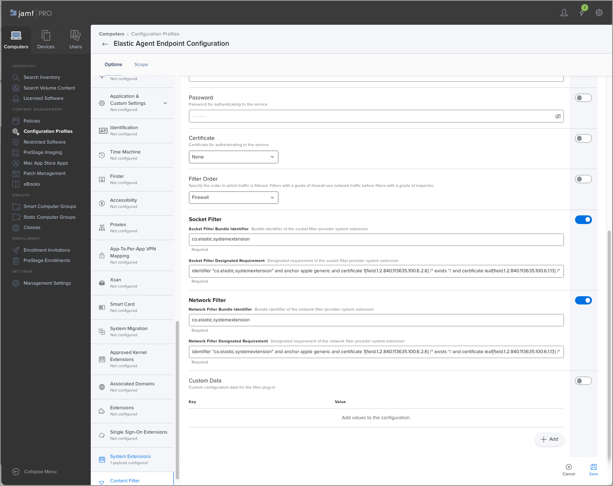
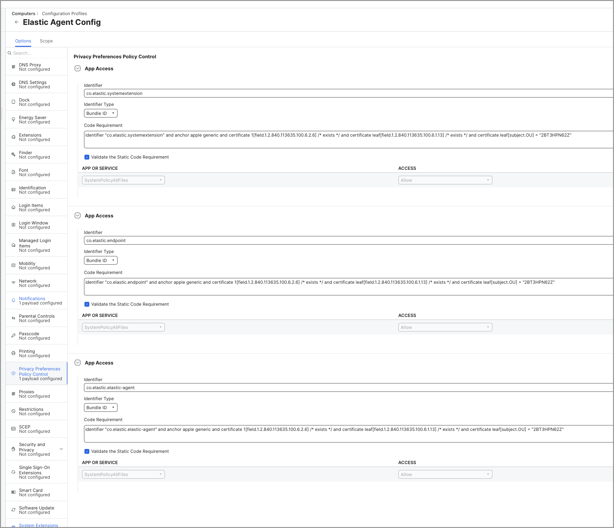

<DocBadge template="technical preview" />
<div id="deploy-elastic-endpoint-mdm"></div>

To silently install and deploy ((elastic-defend)) without the need for user interaction, you need to configure a mobile device management (MDM) profile for ((elastic-endpoint))—the installed component that performs ((elastic-defend))'s threat monitoring and prevention. This allows you to pre-approve the ((elastic-endpoint)) system extension and grant Full Disk Access to all the necessary components.

This page explains how to deploy ((elastic-defend)) silently using Jamf.

## Configure a Jamf MDM profile

In Jamf, create a configuration profile for ((elastic-endpoint)). Follow these steps to configure the profile:

1. <DocLink slug="/serverless/security/deploy-with-mdm" section="approve-the-system-extension">Approve the system extension</DocLink>.
1. <DocLink slug="/serverless/security/deploy-with-mdm" section="approve-network-content-filtering">Approve network content filtering</DocLink>.
1. <DocLink slug="/serverless/security/deploy-with-mdm" section="enable-notifications">Enable notifications</DocLink>.
1. <DocLink slug="/serverless/security/deploy-with-mdm" section="enable-full-disk-access">Enable Full Disk Access</DocLink>.

### Approve the system extension

1. Select the **System Extensions** option to configure the system extension policy for the ((elastic-endpoint)) configuration profile. 
1. Make sure that **Allow users to approve system extensions** is selected. 
1. In the **Allowed Team IDs and System Extensions** section, add the ((elastic-endpoint)) system extension:
    1. (Optional) Enter a **Display Name** for the ((elastic-endpoint)) system extension.
    1. From the **System Extension Types** dropdown, select **Allowed System Extensions**.
    1. Under **Team Identifier**, enter `2BT3HPN62Z`.
    1. Under **Allowed System Extensions**, enter `co.elastic.systemextension`.
1. Save the configuration.


### Approve network content filtering

1. Select the **Content Filter** option to configure the Network Extension policy for the ((elastic-endpoint)) configuration profile.
1. Under **Filter Name**, enter `ElasticEndpoint`.
1. Under **Identifier**, enter `co.elastic.endpoint`.
1. In the **Socket Filter** section, fill in these fields:
    1. **Socket Filter Bundle Identifier**: Enter `co.elastic.systemextension`
    1. **Socket Filter Designated Requirement**: Enter the following:
    ```
    identifier "co.elastic.systemextension" and anchor apple generic and certificate 1[field.1.2.840.113635.100.6.2.6] /* exists */ and certificate leaf[field.1.2.840.113635.100.6.1.13] /* exists */ and certificate leaf[subject.OU] = "2BT3HPN62Z"
    ```
1. In the **Network Filter** section, fill in these fields:
    1. **Network Filter Bundle Identifier**: Enter `co.elastic.systemextension`
    1. **Network Filter Designated Requirement**: Enter the following:
    ```
    identifier "co.elastic.systemextension" and anchor apple generic and certificate 1[field.1.2.840.113635.100.6.2.6] /* exists */ and certificate leaf[field.1.2.840.113635.100.6.1.13] /* exists */ and certificate leaf[subject.OU] = "2BT3HPN62Z"
    ```
1. Save the configuration.



### Enable notifications

1. Select the **Notifications** option to configure the Notification Center policy for the ((elastic-endpoint)) configuration profile. 
1. Under **App Name**, enter `Elastic Security.app`.
1. Under **Bundle ID**, enter `co.elastic.alert`.
1. In the **Settings** section, include these options with the following settings:
    1. **Critical Alerts**: **Enable**.
    1. **Notifications**: **Enable**.
    1. **Banner alert type**: **Persistent**.
    1. **Notifications on Lock Screen**: **Display**.
    1. **Notifications in Notification Center**: **Display**.
    1. **Badge app icon**: **Display**.
    1. **Play sound for notifications**: **Enable**.
1. Save the configuration.


### Enable Full Disk Access

1. Select the **Privacy Preferences Policy Control** option to configure the Full Disk Access policy for the ((elastic-endpoint)) configuration profile.
1. Add a new entry with the following details:
    1. Under **Identifier**, enter `co.elastic.systemextension`.
    1. From the **Identifier Type** dropdown, select **Bundle ID**.
    1. Under **Code Requirement**, enter the following:
    ```
    identifier "co.elastic.systemextension" and anchor apple generic and certificate 1[field.1.2.840.113635.100.6.2.6] /* exists */ and certificate leaf[field.1.2.840.113635.100.6.1.13] /* exists */ and certificate leaf[subject.OU] = "2BT3HPN62Z"
    ```
    1. Make sure that **Validate the Static Code Requirement** is selected.
1. Add a second entry with the following details:
    1. Under **Identifier**, enter `co.elastic.endpoint`.
    1. From the **Identifier Type** dropdown, select **Bundle ID**.
    1. Under **Code Requirement**, enter the following:
    ```
    identifier "co.elastic.endpoint" and anchor apple generic and certificate 1[field.1.2.840.113635.100.6.2.6] /* exists */ and certificate leaf[field.1.2.840.113635.100.6.1.13] /* exists */ and certificate leaf[subject.OU] = "2BT3HPN62Z"
    ```
    1. Make sure that **Validate the Static Code Requirement** is selected.
1. Add a third entry with the following details:
    1. Under **Identifier**,  enter `co.elastic.elastic-agent`.
    1. From the **Identifier Type** dropdown, select **Bundle ID**.
    1. Under **Code Requirement**, enter the following:
    ```
    identifier "co.elastic.elastic-agent" and anchor apple generic and certificate 1[field.1.2.840.113635.100.6.2.6] /* exists */ and certificate leaf[field.1.2.840.113635.100.6.1.13] /* exists */ and certificate leaf[subject.OU] = "2BT3HPN62Z"
    ```
    1. Make sure that **Validate the Static Code Requirement** is selected.
1. Save the configuration.



After you complete these steps, generate the mobile configuration profile and install it onto the macOS machines. Once the profile is installed, ((elastic-defend)) can be deployed without the need for user interaction.
