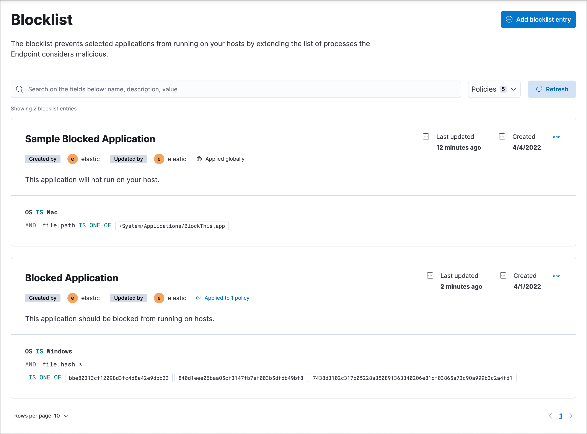

<DocBadge template="technical preview" />

The blocklist (**Assets** → **Blocklist**) allows you to prevent specified applications from running on hosts, extending the list of processes that ((elastic-defend)) considers malicious. This helps ensure that known malicious processes aren't accidentally executed by end users. 

The blocklist is not intended to broadly block benign applications for non-security reasons; only use it to block potentially harmful applications. To compare the blocklist with other endpoint artifacts, refer to <DocLink slug="/serverless/security/optimize-edr" />.

<DocCallOut title="Requirements">

* In addition to configuring specific entries on the **Blocklist** page, you must also ensure that the blocklist is enabled on the ((elastic-defend)) integration policy in the <DocLink slug="/serverless/security/configure-endpoint-integration-policy" section="malware-protection">Malware protection settings</DocLink>. This setting is enabled by default.

* You must have the appropriate user role to use this feature.
{/* Placeholder statement until we know which specific roles are required. Classic statement below for reference. */}
{/* * You must have the **Blocklist** <DocLink slug="/serverless/security/endpoint-management-req">privilege</DocLink> to access this feature. */}

</DocCallOut>

By default, a blocklist entry is recognized globally across all hosts running ((elastic-defend)). You can also assign a blocklist entry to specific ((elastic-defend)) integration policies, which blocks the process only on hosts assigned to that policy.

1. Go to **Assets** → **Blocklist**.

1. Click **Add blocklist entry**. The **Add blocklist** flyout appears.

1. Fill in these fields in the **Details** section:
    1. `Name`: Enter a name to identify the application in the blocklist.
    1. `Description`: Enter a description to provide more information on the blocklist entry (optional).

1. In the **Conditions** section, enter the following information about the application you want to block:
    1. `Select operating system`: Select the appropriate operating system from the drop-down.
    1. `Field`: Select a field to identify the application being blocked:
        * `Hash`: The MD5, SHA-1, or SHA-256 hash value of the application's executable.
        * `Path`: The full file path of the application's executable.
        * `Signature`: (Windows only) The name of the application's digital signer.

            <DocCallOut title="Tip">
            To find the signer's name for an application, go to **Discover** and query the process name of the application's executable (for example, `process.name : "mctray.exe"` for a McAfee security binary). Then, search the results for the `process.code_signature.subject_name` field, which contains the signer's name (for example, `McAfee, Inc.`).
            </DocCallOut>

    1. `Operator`: The operator is `is one of` and cannot be modified.

    1. `Value`: Enter the hash value, file path, or signer name. To enter multiple values (such as a list of known malicious hash values), you can enter each value individually or paste a comma-delimited list, then press **Return**.

        <DocCallOut title="Note">
        Hash values must be valid to add them to the blocklist.
        </DocCallOut>

1. Select an option in the **Assignment** section to assign the blocklist entry to a specific integration policy:

    * `Global`: Assign the blocklist entry to all ((elastic-defend)) integration policies.
    * `Per Policy`: Assign the blocklist entry to one or more specific ((elastic-defend)) integration policies. Select each policy where you want the blocklist entry to apply.

        <DocCallOut title="Note">
        You can also select the `Per Policy` option without immediately assigning a policy to the blocklist entry. For example, you could do this to create and review your blocklist configurations before putting them into action with a policy.
        </DocCallOut>

1. Click **Add blocklist**. The new entry is added to the **Blocklist** page.

1. When you're done adding entries to the blocklist, ensure that the blocklist is enabled for the ((elastic-defend)) integration policies that you just assigned:
    1. Go to **Assets** → **Policies**, then click on an integration policy.
    1. On the **Policy settings** tab, ensure that the **Malware protections** and **Blocklist** toggles are switched on. Both settings are enabled by default.

## View and manage the blocklist

The **Blocklist** page (**Assets** → **Blocklist**) displays all the blocklist entries that have been added to the ((security-app)). To refine the list, use the search bar to search by name, description, or field value.

### Edit a blocklist entry
You can individually modify each blocklist entry. You can also change the policies that a blocklist entry is assigned to.

To edit a blocklist entry:

1. Click the actions menu (<DocIcon type="boxesHorizontal" title="Actions menu icon" />) for the blocklist entry you want to edit, then select **Edit blocklist**.
1. Modify details as needed.
1. Click **Save**.

### Delete a blocklist entry
You can delete a blocklist entry, which removes it entirely from all ((elastic-defend)) policies. This allows end users to access the application that was previously blocked.

To delete a blocklist entry:

1. Click the actions menu (<DocIcon type="boxesHorizontal" title="Actions menu icon" />) for the blocklist entry you want to delete, then select **Delete blocklist**.
1. On the dialog that opens, verify that you are removing the correct blocklist entry, then click **Delete**. A confirmation message displays.

