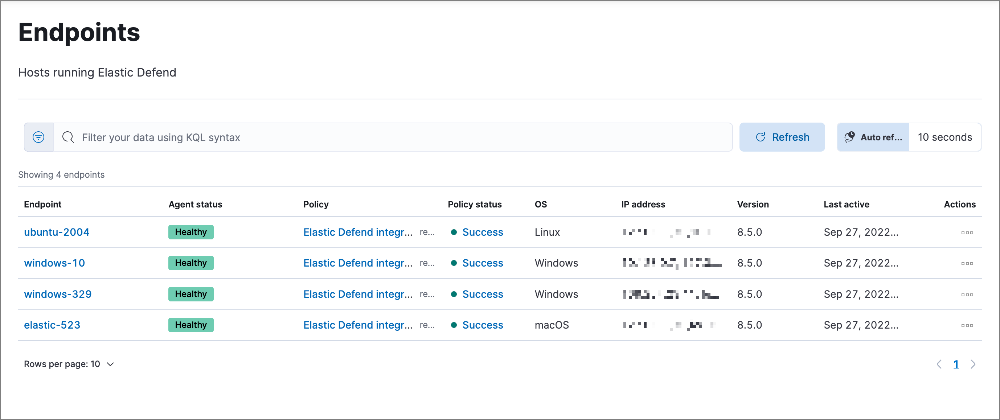
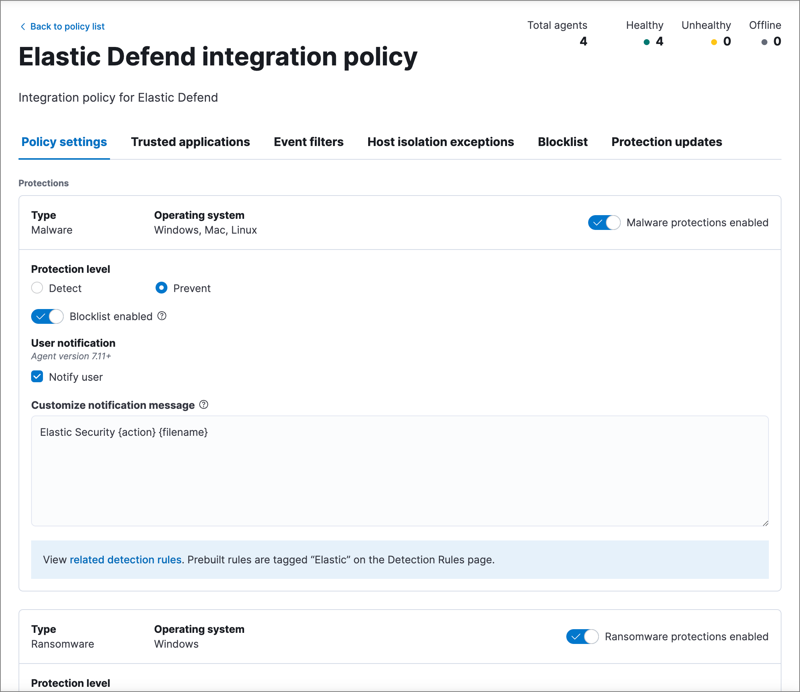
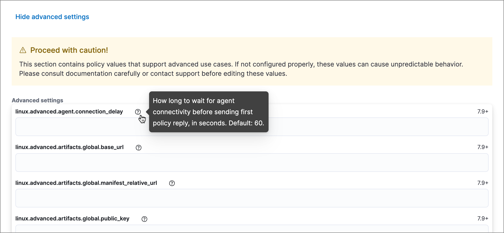

<DocBadge template="technical preview" />

The **Endpoints** page (**Assets** → **Endpoints**) allows administrators to view and manage endpoints that are running the <DocLink slug="/serverless/security/install-edr">((elastic-defend)) integration</DocLink>.

<DocCallOut title="Requirements">

* ((fleet)) must be enabled for administrative actions to function correctly.

* You must have the appropriate user role to use this feature.
{/* Placeholder statement until we know which specific roles are required. Classic statement below for reference. */}
{/* * You must have the **Endpoint List** <DocLink slug="/serverless/security/endpoint-management-req">privilege</DocLink> to access this feature. */}

</DocCallOut>

## Endpoints list

The **Endpoints** list displays all hosts running ((elastic-defend)) and their relevant integration details. Endpoints appear in chronological order, with newly added endpoints at the top.

The Endpoints list provides the following data:

* **Endpoint**: The system hostname. Click the link to display <DocLink slug="/serverless/security/endpoints-page" section="endpoint-details">endpoint details</DocLink> in a flyout.

* **Agent Status**: The current status of the ((agent)), which is one of the following:

    * `Healthy`: The agent is online and communicating with ((elastic-sec)).

    * `Unenrolling`: The agent is currently unenrolling and will soon be removed from Fleet. Afterward, the endpoint will also uninstall.

    * `Unhealthy`: The agent is online but requires attention from an administrator because it's reporting a problem with a process. An unhealthy status could mean an upgrade failed and was rolled back to its previous version, or an integration might be missing prerequisites or additional configuration. Refer to <DocLink slug="/serverless/security/troubleshoot-endpoints" section="ts-unhealthy-agent">Endpoint management troubleshooting</DocLink> for more on resolving an unhealthy agent status.

    * `Updating`: The agent is online and is updating the agent policy or binary, or is enrolling or unenrolling.

    * `Offline`: The agent is still enrolled but may be on a machine that is shut down or currently does not have internet access. In this state, the agent is no longer communicating with ((elastic-sec)) at a regular interval.

        <DocCallOut title="Note">
        ((agent)) statuses in ((fleet)) correspond to the agent statuses in the ((security-app)).
        </DocCallOut>

* **Policy:** The name of the associated integration policy when the agent was installed. Click the link to display the <DocLink slug="/serverless/security/endpoints-page" section="integration-policy-details">integration policy details</DocLink> page.

* **Policy status:** Indicates whether the integration policy was successfully applied. Click the link to view <DocLink slug="/serverless/security/endpoints-page" section="policy-status">policy status</DocLink> response details in a flyout.

* **OS**: The host's operating system.

* **IP address**: All IP addresses associated with the hostname.

* **Version**: The ((agent)) version currently running.

* **Last active**: A date and timestamp of the last time the ((agent)) was active.

* **Actions**: Select the context menu (*...*) to do the following:

    * **Isolate host**: <DocLink slug="/serverless/security/isolate-host">Isolate the host</DocLink> from your network, blocking communication until the host is released.

    * **Respond**: Open the <DocLink slug="/serverless/security/response-actions">response console</DocLink> to perform response actions directly on the host.

    * **View response actions history**: View a <DocLink slug="/serverless/security/endpoints-page" section="response-actions-history">history of response actions</DocLink> performed on the host.

    * **View host details**: View host details on the **Hosts** page in the ((security-app)).

    * **View agent policy**: View the agent policy in ((fleet)).

    * **View agent details**: View ((agent)) details and activity logs in ((fleet)).

    * **Reassign agent policy**: Change the [agent policy](((fleet-guide))/agent-policy.html#apply-a-policy) assigned to the host in ((fleet)).

### Endpoint details

Click any link in the **Endpoint** column to display host details in a flyout. You can also use the **Take Action** menu button to perform the same actions as those listed in the Actions context menu, such as isolating the host, viewing host details, and viewing or reassigning the agent policy. 

<DocImage size="xl" url="../images/endpoints-page/-management-admin-host-flyout.png" alt="Endpoint details flyout" />

### Response actions history

The endpoint details flyout also includes the **Response actions history** tab, which provides a log of the <DocLink slug="/serverless/security/response-actions">response actions</DocLink> performed on the endpoint, such as isolating a host or terminating a process. You can use the tools at the top to filter the information displayed in this view. Refer to <DocLink slug="/serverless/security/response-actions-history">Response actions history</DocLink> for more details.

<DocImage size="xl" url="../images/endpoints-page/-management-admin-response-actions-history-endpoint-details.png" alt="Response actions history with a few past actions" />

### Integration policy details

To view the integration policy page, click the link in the **Policy** column. If you are viewing host details, you can also click the **Policy** link on the flyout.

On this page, you can view and configure endpoint protection and event collection settings. In the upper-right corner are Key Performance Indicators (KPIs) that provide current endpoint status. If you need to update the policy, make changes as appropriate, then click the **Save** button to apply the new changes.

<DocCallOut title="Note">
Users must have permission to read/write to ((fleet)) APIs to make changes to the configuration.
</DocCallOut>

Users who have unique configuration and security requirements can select **Show advanced settings** to configure the policy to support advanced use cases. Hover over each setting to view its description.

<DocCallOut title="Note">
Advanced settings are not recommended for most users.
</DocCallOut>

### Policy status

The status of the integration policy appears in the **Policy status** column and displays one of the following:

* `Success`: The policy was applied successfully.

* `Warning` or `Partially Applied`: The policy is pending application, or the policy was not applied in its entirety.

    <DocCallOut title="Note">
    In some cases, actions taken on the endpoint may fail during policy application, but these cases are not critical failures - meaning there may be a failure, but the endpoints are still protected. In this case, the policy status will display as "Partially Applied."
    </DocCallOut>

* `Failure`: The policy did not apply correctly, and endpoints are not protected.

* `Unknown`: The user interface is waiting for the API response to return, or, in rare cases, the API returned an undefined error or value.

For more details on what's causing a policy status, click the link in the **Policy status** column and review the details flyout. Expand each section and subsection to display individual responses from the agent.

<DocCallOut title="Tip">
If you need help troubleshooting a configuration failure, refer to <DocLink slug="/serverless/security/troubleshoot-endpoints" section="ts-unhealthy-agent">Endpoint management troubleshooting</DocLink> and [((fleet)) troubleshooting](((fleet-guide))/fleet-troubleshooting.html).
</DocCallOut>

<DocImage size="l" url="../images/endpoints-page/-management-admin-config-status.png" alt="Config status details" />

### Filter endpoints

To filter the Endpoints list, use the search bar to enter a query using **[((kib)) Query Language (KQL)](((kibana-ref))/kuery-query.html)**. To refresh the search results, click **Refresh**.

<DocCallOut title="Note">
The date and time picker on the right side of the page allows you to set a time interval to automatically refresh the Endpoints list — for example, to check if new endpoints were added or deleted.
</DocCallOut>
