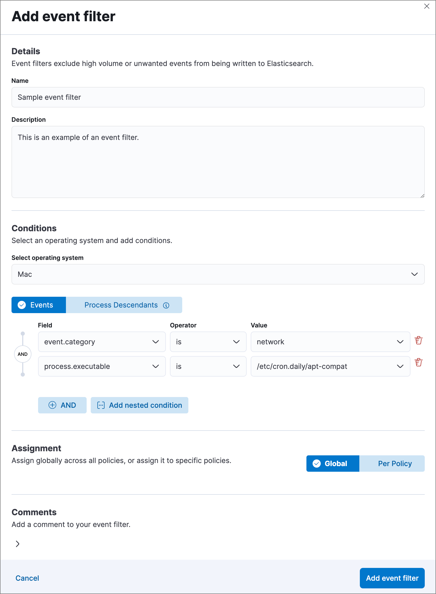
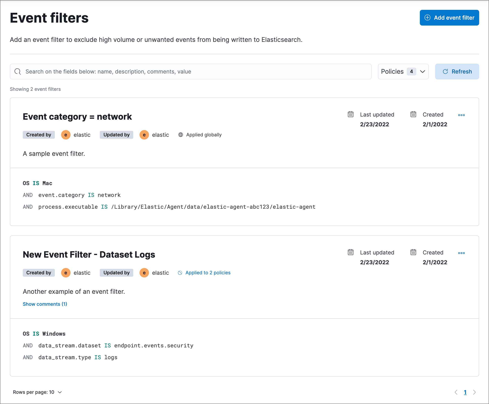

<DocBadge template="technical preview" />

Event filters (**Assets** → **Event filters**) allow you to filter out endpoint events that you don't want stored in ((es)) — for example, high-volume events. By creating event filters, you can optimize your storage in ((es)).

Event filters do not lower CPU usage on hosts; ((elastic-endpoint)) still monitors events to detect and prevent possible threats, but without writing event data to ((es)). To compare event filters with other endpoint artifacts, refer to <DocLink slug="/serverless/security/optimize-edr" />.

<DocCallOut title="Requirements">

You must have the appropriate user role to use this feature.
{/* Placeholder statement until we know which specific roles are required. Classic statement below for reference. */}
{/* You must have the **Event Filters** <DocLink slug="/serverless/security/endpoint-management-req">privilege</DocLink> to access this feature. */}

</DocCallOut>

<DocCallOut title="Important" color="warning">
Since an event filter blocks an event from streaming to ((es)), be conscious of event filter conditions you set and any existing rule conditions. If there is too much overlap, the rule may run less frequently than specified and, therefore, will not trigger the corresponding alert for that rule. This is the expected behavior of event filters.
</DocCallOut>

By default, event filters are recognized globally across all hosts running ((elastic-defend)). You can also assign an event filter to a specific ((elastic-defend)) integration policy, which would filter endpoint events from the hosts assigned to that policy.

Create event filters from the Hosts page or the Event filters page.

1. Do one of the following:

    * To create an event filter from the Hosts page:
        1. Go to **Explore** → **Hosts**.
        1. Select the **Events** tab to view the Events table.

        1. Find the event to filter, click the **More actions** menu (<DocIcon type="boxesHorizontal" title="More actions menu icon" />), then select **Add Endpoint event filter**.

        <DocCallOut title="Tip">
        Since you can only create filters for endpoint events, be sure to filter the Events table to display events generated by the ((elastic-endpoint)).
        For example, in the KQL search bar, enter the following query to find endpoint network events: `event.dataset : endpoint.events.network`.
        </DocCallOut>

    * To create an event filter from the Event filters page:
        1. Go to **Assets** → **Event filters**.
        1. Click **Add event filter**. The **Add event filter** flyout opens.

    

1. Fill in these fields in the **Details** section:
      1. `Name`: Enter a name for the event filter.
      1. `Description`: Enter a filter description (optional).
1. In the **Conditions** section, depending which page you're using to create the filter, either modify the pre-populated conditions or add new conditions to define how ((elastic-sec)) will filter events. Use these settings:
    1. `Select operating system`: Select the appropriate operating system.
    1. Select which kind of event filter you'd like to create:
    
        * `Events`: Create a generic event filter that can match any event type. All matching events are excluded.
        * `Process Descendants`: Specify a process, and suppress the activity of its descendant processes. Events from the matched process will be ingested, but events from its descendant processes will be excluded.

            This option adds the condition `event.category is process` to narrow the filter to process-type events. You can add more conditions to identify the process whose descendants you want to exclude.
    1. `Field`: Select a field to identify the event being filtered.
    1. `Operator`: Select an operator to define the condition. Available options are:
        * `is`
        * `is not`
        * `is one of`
        * `is not one of`
        * `matches` | `does not match`: Allows you to use wildcards in `Value`, such as `C:\path\*\app.exe`.  Available wildcards are `?` (match one character) and `*` (match zero or more characters).
            <DocCallOut title="Important" color="warning">
            Using wildcards in file paths can impact performance. To create a more efficient event filter using wildcards, use multiple conditions and make them as specific as possible. For example, adding conditions using `process.name` or `file.name` can help limit the scope of wildcard matching.
            </DocCallOut>
    1. `Value`: Enter the value associated with the `Field`. To enter multiple values (when using `is one of` or `is not one of`), enter each value, then press **Return**.

1. To define multiple conditions, click the `AND` button and configure a new condition. You can also add nested conditions with the `Add nested condition` button. For example, the event filter pictured above excludes events whose `event.category` field is `network`, and whose `process.executable` field is as specified.

1. Select an option in the **Assignment** section to assign the event filter to a specific integration policy:

    * `Global`: Assign the event filter to all integration policies for ((elastic-defend)).
    * `Per Policy`: Assign the event filter to one or more specific ((elastic-defend)) integration policies. Select each policy in which you want the events to be filtered.

    <DocCallOut title="Note">
    You can also select the `Per Policy` option without immediately assigning a policy to the event filter. For example, you could do this to create and review your event filter configurations before putting them into action with a policy.
    </DocCallOut>

1. Add a comment if you want to provide more information about the event filter (optional).
1. Click **Add event filter**. The new filter is added to the **Event filters** list.

## View and manage event filters

The **Event filters** page (**Assets** → **Event filters**) displays all the event filters that have been added to the ((security-app)). To refine the list, use the search bar to search by filter name, description, comments, or field value.

### Edit an event filter
You can individually modify each event filter. You can also change the policies that an event filter is assigned to.

To edit an event filter:

1. Click the actions menu (<DocIcon type="boxesHorizontal" title="Actions menu icon" />) for the event filter you want to edit, then select **Edit event filter**.
1. Modify details or conditions as needed.
1. Click **Save**.

### Delete an event filter
You can delete an event filter, which removes it entirely from all ((elastic-defend)) integration policies.

To delete an event filter:

1. Click the actions menu (<DocIcon type="boxesHorizontal" title="Actions menu icon" />) on the event filter you want to delete, then select **Delete event filter**.
1. On the dialog that opens, verify that you are removing the correct event filter, then click **Delete**. A confirmation message is displayed.

