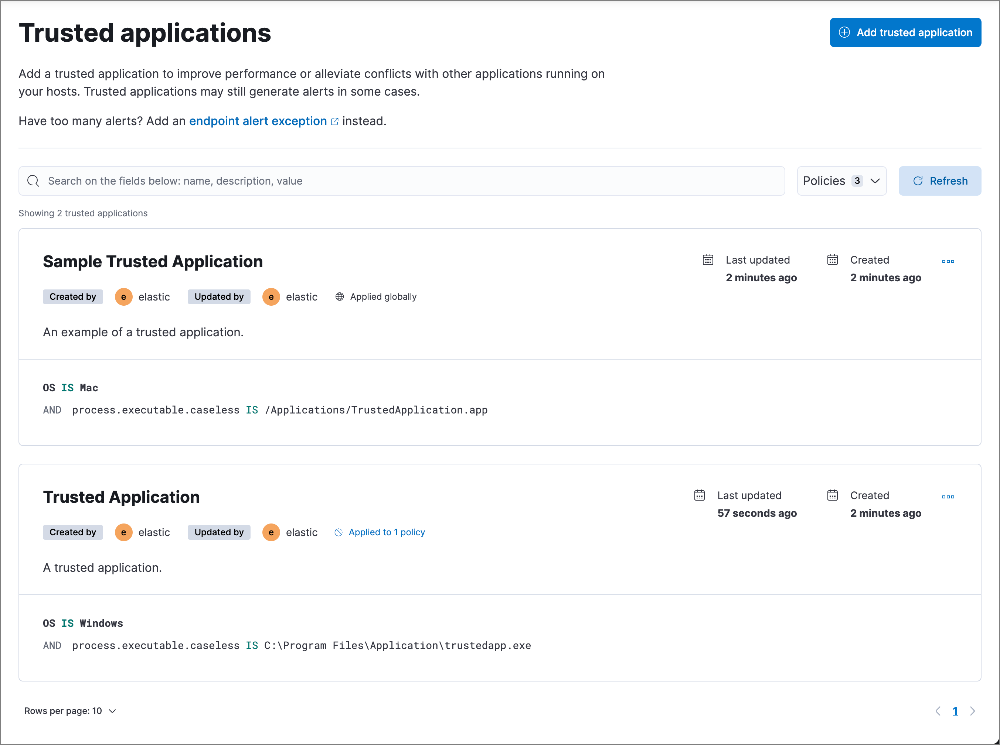

<DocBadge template="technical preview" />

On the **Trusted applications** page (**Assets** → **Trusted applications**), you can add Windows, macOS, and Linux applications that should be trusted, such as other antivirus or endpoint security applications. Trusted applications are designed to help mitigate performance issues and incompatibilities with other endpoint software installed on your hosts. Trusted applications apply only to hosts running the ((elastic-defend)) integration.

<DocCallOut title="Requirements">

You must have the appropriate user role to use this feature.
{/* Placeholder statement until we know which specific roles are required. Classic statement below for reference. */}
{/* You must have the **Trusted Applications** <DocLink id="serverlessSecurityEndpointManagementReq">privilege</DocLink> to access this feature. */}

</DocCallOut>

Trusted applications create blindspots for ((elastic-defend)), because the applications are no longer monitored for threats. One avenue attackers use to exploit these blindspots is by DLL (Dynamic Link Library) side-loading, where they leverage processes signed by trusted vendors — such as antivirus software — to execute their malicious DLLs. Such activity appears to originate from the trusted application's process.

Trusted applications might still generate alerts in some cases, such as if the application's process events indicate malicious behavior. To reduce false positive alerts, add an <DocLink id="serverlessSecurityAddExceptions" section="add-((elastic-endpoint))-exceptions">Endpoint alert exception</DocLink>, which prevents ((elastic-defend)) from generating alerts. To compare trusted applications with other endpoint artifacts, refer to <DocLink id="serverlessSecurityOptimizeEdr" />.

Additionally, trusted applications still generate process events for visualizations and other internal use by the ((stack)). To prevent process events from being written to ((es)), use an <DocLink id="serverlessSecurityEventFilters">event filter</DocLink> to filter out the specific events that you don't want stored in ((es)), but be aware that features that depend on these process events may not function correctly.

By default, a trusted application is recognized globally across all hosts running ((elastic-defend)). You can also assign a trusted application to a specific ((elastic-defend)) integration policy, enabling the application to be trusted by only the hosts assigned to that policy.

To add a trusted application:

1. Go to **Manage** → **Trusted applications**.

1. Click **Add trusted application**.

1. Fill in the following fields in the **Add trusted application** flyout:

    * `Name your trusted application`: Enter a name for the trusted application.

    * `Description`(Optional): Enter a description for the trusted application.

    * `Select operating system`: Select the appropriate operating system from the drop-down.

    * `Field`: Select a field to identify the trusted application:
        * `Hash`: The MD5, SHA-1, or SHA-256 hash value of the application's executable.
        * `Path`: The full file path of the application's executable.
        * `Signature`: (Windows only) The name of the application's digital signer.

            <DocCallOut title="Tip">
            To find the signer's name for an application, go to **Discover** and query the process name of the application's executable (for example, `process.name : "mctray.exe"` for a McAfee security binary). Then, search the results for the `process.code_signature.subject_name` field, which contains the signer's name (for example, `McAfee, Inc.`).
            </DocCallOut>

    * `Operator`: Select an operator to define the condition:
        * `is`: Must be _exactly_ equal to `Value`; wildcards are not supported. This operation is required for the `Hash` and `Signature` field types.
        * `matches`: Can include wildcards in `Value`, such as `C:\path\*\app.exe`. This operator is only available for the `Path` field type. Available wildcards are `?` (match one character) and `*` (match zero or more characters).

    * `Value`: Enter the hash value, file path, or signer name. To add an additional value, click **AND**.

        <DocCallOut title="Note">
        You can only add a single field type value per trusted application. For example, if you try to add two `Path` values, you'll get an error message. Also, an application's hash value must be valid to add it as a trusted application. In addition, to minimize visibility gaps in the ((security-app)), be as specific as possible in your entries. For example, combine `Signature` information with a known `Path`.
        </DocCallOut>

1. Select an option in the **Assignment** section to assign the trusted application to a specific integration policy:
    * `Global`: Assign the trusted application to all integration policies for ((elastic-defend)).
    * `Per Policy`: Assign the trusted application to one or more specific ((elastic-defend)) integration policies. Select each policy in which you want the application to be trusted.

    <DocCallOut title="Note">
    You can also select the `Per Policy` option without immediately assigning a policy to the trusted application. For example, you could do this to create and review your trusted application configurations before putting them into action with a policy.
    </DocCallOut>

1. Click **Add trusted application**. The application is added to the **Trusted applications** list.

## View and manage trusted applications

The **Trusted applications** page (**Assets** → **Trusted applications**) displays all the trusted applications that have been added to the ((security-app)). To refine the list, use the search bar to search by name, description, or field value.

### Edit a trusted application
You can individually modify each trusted application. You can also change the policies that a trusted application is assigned to.

To edit a trusted application:

1. Click the actions menu (*...*) on the trusted application you want to edit, then select **Edit trusted application**.
1. Modify details as needed.
1. Click **Save**.

### Delete a trusted application
You can delete a trusted application, which removes it entirely from all ((elastic-defend)) integration policies.

To delete a trusted application:

1. Click the actions menu (*...*) on the trusted application you want to delete, then select **Delete trusted application**.
1. On the dialog that opens, verify that you are removing the correct application, then click **Delete**. A confirmation message is displayed.

