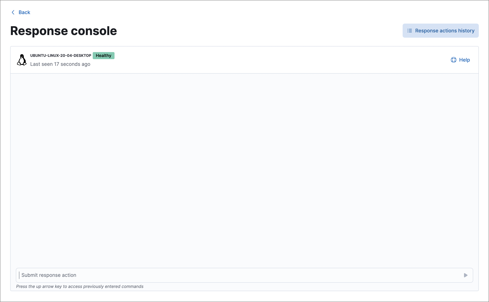

<DocBadge template="technical preview" />

The response console allows you to perform response actions on an endpoint using a terminal-like interface. You can enter action commands and get near-instant feedback on them. Actions are also recorded in the endpoint's <DocLink id="serverlessSecurityResponseActions" section="response-actions-history">response actions history</DocLink> for reference.

Response actions are supported on all endpoint platforms (Linux, macOS, and Windows).

<DocCallOut title="Requirements">

* Response actions and the response console UI require the Endpoint Protection Complete <DocLink id="serverlessGeneralManageProject" text="project feature"/>.

* Endpoints must have ((agent)) version 8.4 or higher installed with the ((elastic-defend)) integration to receive response actions.

* Some response actions require specific user roles, indicated below. These are required to perform actions both in the response console and in other areas of the ((security-app)) (such as isolating a host from a detection alert).

* Users must have the appropriate user role privileges for at least one response action to access the response console.

</DocCallOut>

Launch the response console from any of the following places in ((elastic-sec)):

* **Endpoints** page → **Actions** menu (<DocIcon type="boxesHorizontal" title="Actions menu icon" />) → **Respond**
* Endpoint details flyout → **Take action** → **Respond**
* Alert details flyout → **Take action** → **Respond**
* Host details page → **Respond**

To perform an action on the endpoint, enter a <DocLink id="serverlessSecurityResponseActions" section="response-action-commands">response action command</DocLink> in the input area at the bottom of the console, then press **Return**. Output from the action is displayed in the console.

If a host is unavailable, pending actions will execute once the host comes online. Pending actions expire after two weeks and can be tracked in the response actions history.

<DocCallOut title="Note">
Some response actions may take a few seconds to complete. Once you enter a command, you can immediately enter another command while the previous action is running. 
</DocCallOut>

Activity in the response console is persistent, so you can navigate away from the page and any pending actions you've submitted will continue to run. To confirm that an action completed, return to the response console to view the console output or check the <DocLink id="serverlessSecurityResponseActions" section="response-actions-history">response actions history</DocLink>.

<DocCallOut title="Important" color="warning">
Once you submit a response action, you can't cancel it, even if the action is pending for an offline host.
</DocCallOut>

## Response action commands

The following response action commands are available in the response console.

### `isolate`
<DocLink id="serverlessSecurityHostIsolationOv">Isolate the host</DocLink>, blocking communication with other hosts on the network. 

Required role: **Tier 3 analyst**, **SOC manager**, or **Endpoint operations analyst**

Example: `isolate --comment "Isolate host related to detection alerts"`

### `release`
Release an isolated host, allowing it to communicate with the network again.

Required role: **Tier 3 analyst**, **SOC manager**, or **Endpoint operations analyst**

Example: `release --comment "Release host, everything looks OK"`

### `status`
Show information about the host's status, including: ((agent)) status and version, the ((elastic-defend)) integration's policy status, and when the host was last active.
 
### `processes`
Show a list of all processes running on the host. This action may take a minute or so to complete.

Required role: **Tier 3 analyst**, **SOC manager**, or **Endpoint operations analyst**

<DocCallOut title="Tip">

Use this command to get current PID or entity ID values, which are required for other response actions such as `kill-process` and `suspend-process`.

Entity IDs may be more reliable than PIDs, because entity IDs are unique values on the host, while PID values can be reused by the operating system.

</DocCallOut>

### `kill-process`

Terminate a process. You must include one of the following parameters to identify the process to terminate:

* `--pid` : A process ID (PID) representing the process to terminate.
* `--entityId` : An entity ID representing the process to terminate.

Required role: **Tier 3 analyst**, **SOC manager**, or **Endpoint operations analyst**

Example: `kill-process --pid 123 --comment "Terminate suspicious process"`

### `suspend-process`

Suspend a process. You must include one of the following parameters to identify the process to suspend:

* `--pid` : A process ID (PID) representing the process to suspend.
* `--entityId` : An entity ID representing the process to suspend.

Required role: **Tier 3 analyst**, **SOC manager**, or **Endpoint operations analyst**

Example: `suspend-process --pid 123 --comment "Suspend suspicious process"`

### `get-file`

Retrieve a file from a host. Files are downloaded in a password-protected `.zip` archive to prevent the file from running. Use password `elastic` to open the `.zip` in a safe environment.

You must include the following parameter to specify the file's location on the host:

* `--path` : The file's full path (including the file name).

Required role: **Tier 3 analyst**, **SOC manager**, or **Endpoint operations analyst**

Example: `get-file --path "/full/path/to/file.txt" --comment "Possible malware"`

<DocCallOut title="Tip">
You can use the <DocLink id="serverlessSecurityUseOsquery">Osquery manager integration</DocLink> to query a host's operating system and gain insight into its files and directories, then use `get-file` to retrieve specific files.
</DocCallOut>

<DocCallOut title="Note">

When ((elastic-defend)) prevents file activity due to <DocLink id="serverlessSecurityConfigureEndpointIntegrationPolicy" section="malware-protection">malware prevention</DocLink>, the file is quarantined on the host and a malware prevention alert is created. To retrieve this file with `get-file`, copy the path from the alert's **Quarantined file path** field (`file.Ext.quarantine_path`), which appears under **Highlighted fields** in the alert details flyout. Then paste the value into the `--path` parameter. 

</DocCallOut>

### `execute`

Run a shell command on the host. The command's output and any errors appear in the response console, up to 2000 characters. The complete output (stdout and stderr) are also saved to a downloadable `.zip` archive (password: `elastic`). Use these parameters:

* `--command` : (Required) A shell command to run on the host. The command must be supported by `bash` for Linux and macOS hosts, and `cmd.exe` for Windows.

    <DocCallOut title="Note">

    * Multiple consecutive dashes in the value must be escaped; single dashes do not need to be escaped. For example, to represent a directory named `/opt/directory--name`, use the following: `/opt/directory\-\-name`.

    * You can use quotation marks without escaping. For example:
        `execute --command "cd "C:\Program Files\directory""`

    </DocCallOut>

* `--timeout` : (Optional) How long the host should wait for the command to complete. Use `h` for hours, `m` for minutes, `s` for seconds (for example, `2s` is two seconds). If no timeout is specified, it defaults to four hours.

Required role: **SOC manager** or **Endpoint operations analyst**

Example: `execute --command "ls -al" --timeout 2s --comment "Get list of all files"`

<DocCallOut title="Warning" color="warning">
This response action runs commands on the host using the same user account running the ((elastic-defend)) integration, which normally has full control over the system. Be careful with any commands that could cause irrevocable changes.
</DocCallOut>

### `upload`

Upload a file to the host. The file is saved to the location on the host where ((elastic-endpoint)) is installed. After you run the command, the full path is returned in the console for reference. Use these parameters:

* `--file` : (Required) The file to send to the host. As soon as you type this parameter, a popup appears — select it to navigate to the file, or drag and drop the file onto the popup.
* `--overwrite` : (Optional) Overwrite the file on the host if it already exists.

Required role: **Tier 3 analyst**, **SOC manager**, or **Endpoint operations analyst**

Example: `upload --file --comment "Upload remediation script"`

<DocCallOut title="Tip">
You can follow this with the `execute` response action to upload and run scripts for mitigation or other purposes.
</DocCallOut>

<DocCallOut title="Note">
The default file size maximum is 25 MB, configurable in `kibana.yml` with the `maxUploadResponseActionFileBytes` setting. You must enter the value in bytes (the maximum is `104857600` bytes, or 100 MB).
</DocCallOut>

## Supporting commands and parameters

### `--comment`

Add to a command to include a comment explaining or describing the action. Comments are included in the response actions history.

### `--help`

Add to a command to get help for that command.

Example: `isolate --help`

### `clear`

Clear all output from the response console.

### `help`

List supported commands in the console output area.

<DocCallOut title="Tip">
You can also get a list of commands in the <DocLink id="serverlessSecurityResponseActions" section="help-panel">Help panel</DocLink>, which stays on the screen independently of the output area.
</DocCallOut>

## Help panel

Click <DocIcon type="help" title="Help" /> **Help** in the upper-right to open the **Help** panel, which lists available response action commands and parameters as a reference. 

<DocCallOut title="Note">
This panel displays only the response actions that you have the user role privileges to perform.
</DocCallOut>

<DocImage size="l" url="../images/response-actions/-management-admin-response-console-help-panel.png" alt="Help panel" />

You can use this panel to build commands with less typing. Click the add icon (<DocIcon type="plusInCircle" title="Add" />) to add a command to the input area, enter any additional parameters or a comment, then press **Return** to run the command.

If the endpoint is running an older version of ((agent)), some response actions may not be supported, as indicated by an informational icon and tooltip. [Upgrade ((agent))](((fleet-guide))/upgrade-elastic-agent.html) on the endpoint to be able to use the latest response actions.

<DocImage size="l" url="../images/response-actions/-management-admin-response-console-unsupported-command.png" alt="Unsupported response action with tooltip" />

## Response actions history

Click **Response actions history** to display a log of the response actions performed on the endpoint, such as isolating a host or terminating a process. You can filter the information displayed in this view. Refer to <DocLink id="serverlessSecurityResponseActionsHistory">Response actions history</DocLink> for more details.

<DocImage size="xl" url="../images/response-actions/-management-admin-response-actions-history-console.png" alt="Response actions history with a few past actions" />
