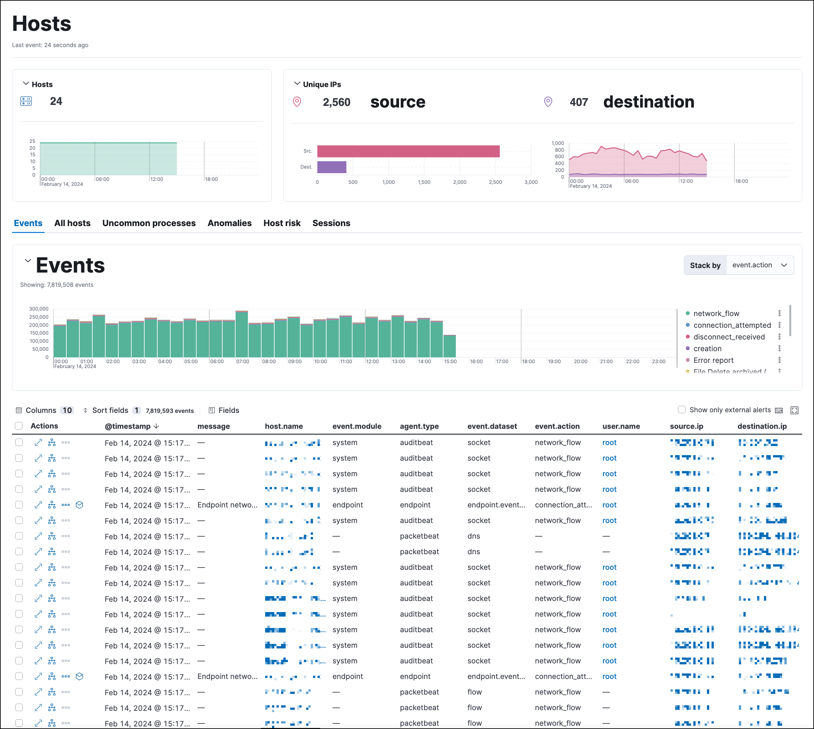
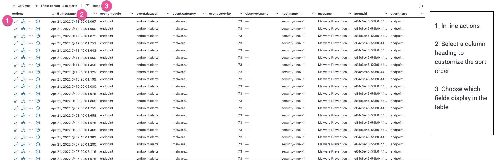
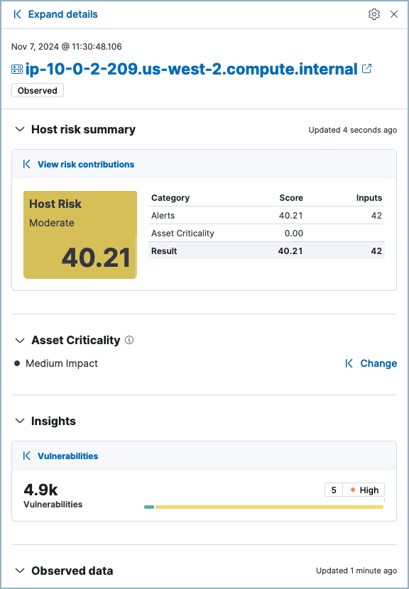
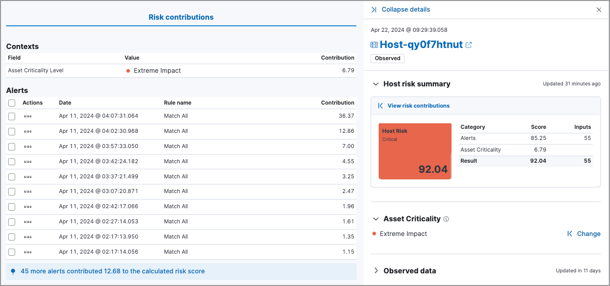
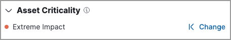
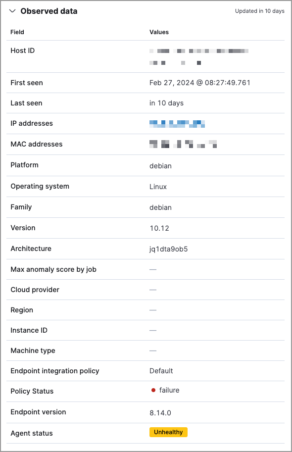

<DocBadge template="technical preview" />

The Hosts page provides a comprehensive overview of all hosts and host-related security events. Key performance indicator (KPI) charts, data tables, and interactive widgets let you view specific data, drill down for deeper insights, and interact with Timeline for further investigation.

The Hosts page has the following sections:

## Host KPI (key performance indicator) charts

KPI charts show metrics for hosts and unique IPs within the time range specified in the date picker. This data is visualized using linear or bar graphs.

<DocCallOut title="Tip">
Hover inside a KPI chart to display the actions menu (<DocIcon type="boxesHorizontal" title="Actions menu icon" />), where you can perform these actions: inspect, open in Lens, and add to a new or existing case.
</DocCallOut>

## Data tables

Beneath the KPI charts are data tables, categorized by individual tabs, which are useful for viewing and investigating specific types of data. Select the relevant tab to view the following data:

* **Events**: All host events. To display alerts received from external monitoring tools, scroll down to the Events table and select **Show only external alerts** on the right.
* **All hosts**: High-level host details.
* **Uncommon processes**: Uncommon processes running on hosts.
* **Anomalies**: Anomalies discovered by machine learning jobs.
* **Host risk**: The latest recorded host risk score for each host, and its host risk classification. This feature requires the Security Analytics Complete <DocLink slug="/serverless/elasticsearch/manage-project" text="project feature"/> and must be enabled to display the data. To learn more, refer to our <DocLink slug="/serverless/security/entity-risk-scoring">entity risk scoring documentation</DocLink>.  
* **Sessions**: Linux process events that you can open in <DocLink slug="/serverless/security/session-view">Session View</DocLink>, an investigation tool that allows you to examine Linux process data at a hierarchal level.

The tables within the **Events** and **Sessions** tabs include inline actions and several customization options. To learn more about what you can do with the data in these tables, refer to <DocLink slug="/serverless/security/alerts-manage">Manage detection alerts</DocLink>.

## Host details page

A host's details page displays all relevant information for the selected host. To view a host's details page, click its **Host name** link in the **All hosts** table.

The host details page includes the following sections: 

* **Asset Criticality**: If the `securitySolution:enableAssetCriticality` <DocLink slug="/serverless/security/advanced-settings" section="enable-asset-criticality-workflows" >advanced setting</DocLink> is on, this section displays the host's current <DocLink slug="/serverless/security/asset-criticality">asset criticality level</DocLink>.
* **Summary**: Details such as the host ID, when the host was first and last seen, the associated IP addresses, and associated operating system. If the entity risk score feature is enabled, this section also displays host risk score data. 
* **Alert metrics**: The total number of alerts by severity, rule, and status (`Open`, `Acknowledged`, or `Closed`).  
* **Data tables**: The same data tables as on the main Hosts page, except with values for the selected host instead of all hosts. 

## Host details flyout

In addition to the host details page, relevant host information is also available in the host details flyout throughout the ((elastic-sec)) app. You can access this flyout from the following places:

* The Alerts page, by clicking on a host name in the Alerts table
* The Entity Analytics dashboard, by clicking on a host name in the Host Risk Scores table
* The **Events** tab on the Users and user details pages, by clicking on a host name in the Events table
* The **User risk** tab on the user details page, by clicking on a host name in the Top risk score contributors table
* The **Events** tab on the Hosts and host details pages, by clicking on a host name in the Events table
* The **Host risk** tab on the host details page, by clicking on a host name in the Top risk score contributors table

The host details flyout includes the following sections:

* <DocLink slug="/serverless/security/hosts-overview" section="host-risk-summary">Host risk summary</DocLink>, which displays host risk data and inputs.
* <DocLink slug="/serverless/security/hosts-overview" section="asset-criticality">Asset Criticality</DocLink>, which allows you to view and assign asset criticality.
* <DocLink slug="/serverless/security/hosts-overview" section="observed-data">Observed data</DocLink>, which displays host details.

### Host risk summary

<DocCallOut title="Requirements">
The **Host risk summary** section is only available if the <DocLink slug="/serverless/security/turn-on-risk-engine" >risk scoring engine is turned on</DocLink>.
</DocCallOut>

The **Host risk summary** section contains a risk summary visualization and table.

The risk summary visualization shows the host risk score and host risk level. Hover over the visualization to display the **Options** menu (<DocIcon type="boxesHorizontal" title="Options menu" />). Use this menu to inspect the visualization's queries, add it to a new or existing case, save it to your Visualize Library, or open it in Lens for customization.

The risk summary table shows the category, score, and number of risk inputs that determine the host risk score. Hover over the table to display the **Inspect** button (<DocIcon type="inspect" title="Inspect" />), which allows you to inspect the table's queries.

To expand the **Host risk summary** section, click **View risk contributions**. The left panel displays additional details about the host's risk inputs:

* The asset criticality level and contribution score from the latest risk scoring calculation.
* The top 10 alerts that contributed to the latest risk scoring calculation, and each alert's contribution score.

If more than 10 alerts contributed to the risk scoring calculation, the remaining alerts' aggregate contribution score is displayed below the **Alerts** table.

### Asset Criticality

<DocCallOut title="Requirements">
The **Asset Criticality** section is only available if the `securitySolution:enableAssetCriticality` <DocLink slug="/serverless/security/advanced-settings" section="enable-asset-criticality-workflows" >advanced setting</DocLink> is on.
</DocCallOut>

The **Asset Criticality** section displays the selected host's <DocLink slug="/serverless/security/asset-criticality">asset criticality level</DocLink>. Asset criticality contributes to the overall <DocLink slug="/serverless/security/entity-risk-scoring" >host risk score</DocLink>. The criticality level defines how impactful the host is when calculating the risk score.

Click **Assign** to assign a criticality level to the selected host, or **Change** to change the currently assigned criticality level.

### Observed data

This section displays details such as the host ID, when the host was first and last seen, the associated IP addresses and operating system, and the relevant Endpoint integration policy information.

