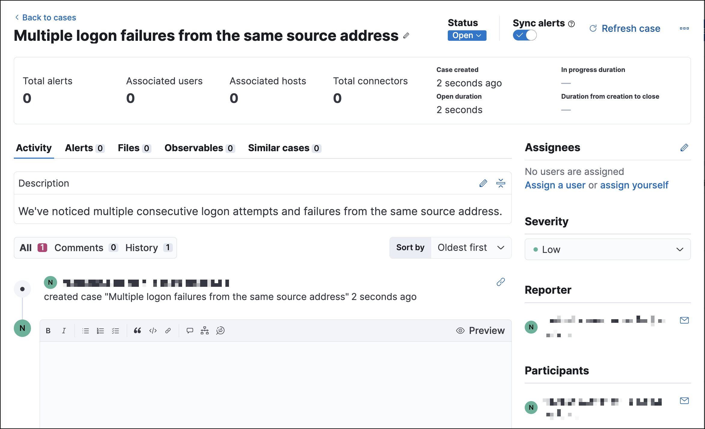
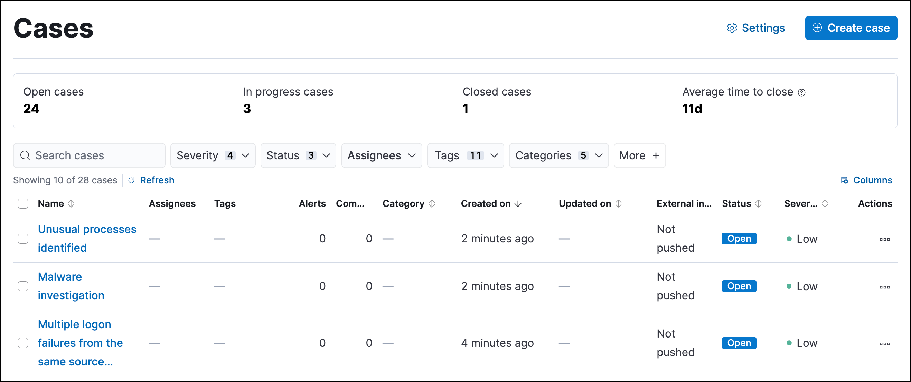
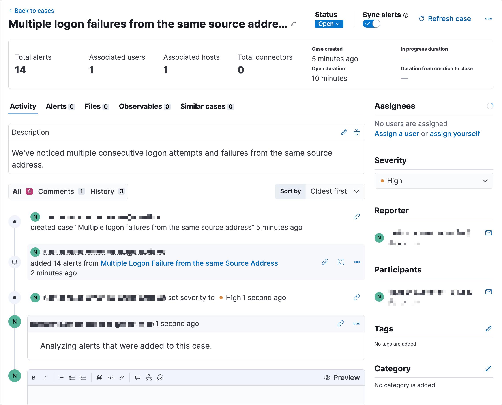
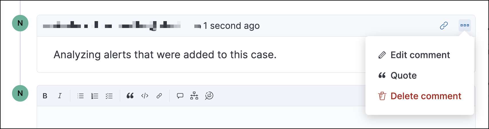
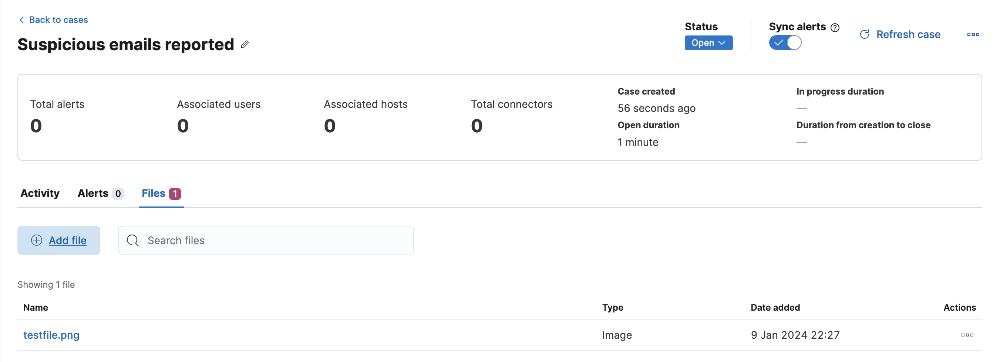
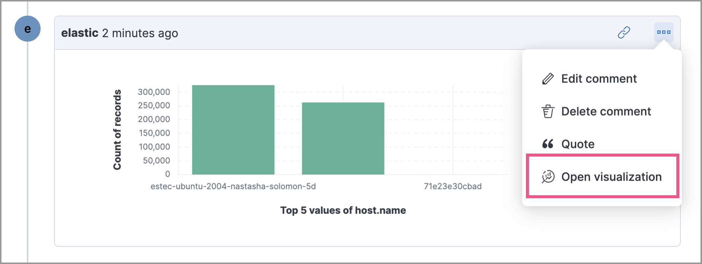
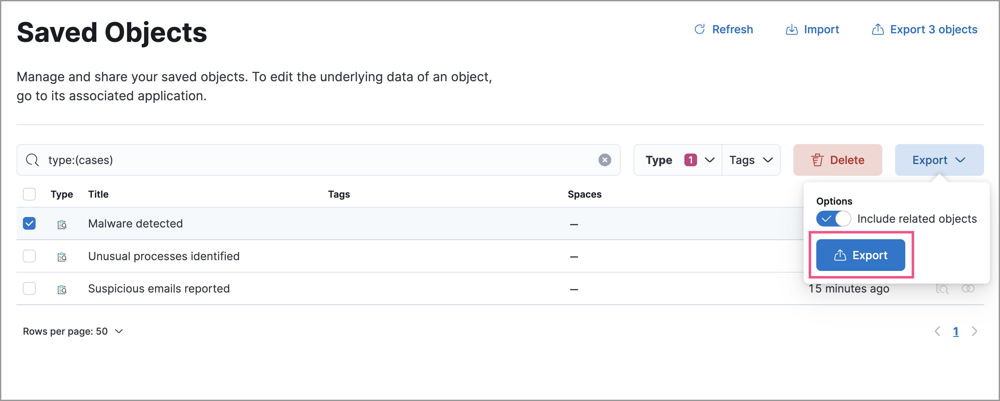

<DocBadge template="technical preview" />

You can create and manage cases using the UI or the [Cases API](((security-guide))/cases-api-overview.html).
{/* Link to classic docs until serverless API docs are available. */}

## Open a new case

Open a new case to keep track of security issues and share their details with
colleagues.

1. Go to **Cases**, then click **Create case**. If no cases exist, the Cases table will be empty and you'll be prompted to create one by clicking the **Create case** button inside the table.
1. (Optional) If you defined <DocLink slug="/serverless/security/cases-settings" section="templates">templates</DocLink>, select one to use its default field values. <DocBadge template="technical preview" />
1. Give the case a name, assign a severity level, and provide a description. You can use
    [Markdown](https://www.markdownguide.org/cheat-sheet) syntax in the case description.

    <DocCallOut title="Note">
    If you do not assign your case a severity level, it will be assigned **Low** by default.
    </DocCallOut>

    <DocCallOut title="Tip">
    You can insert a Timeline link in the case description by clicking the Timeline icon (<DocIcon type="timeline" title="Timeline" />).
    </DocCallOut>

1. Optionally, add a category, assignees and relevant tags. You can add users only if they meet the necessary <DocLink slug="/serverless/security/cases-requirements">prerequisites</DocLink>.
1. If you defined <DocLink slug="/serverless/security/cases-settings" section="custom-fields">custom fields</DocLink>, they appear in the **Additional fields** section.
1. Choose if you want alert statuses to sync with the case's status after they are added to the case. This option is enabled by default, but you can turn it off after creating the case.
1. From **External incident management**, select a <DocLink slug="/serverless/security/cases-settings">connector</DocLink>. If you've previously added one, that connector displays as the default selection. Otherwise, the default setting is `No connector selected`.
1. Click **Create case**.

    <DocCallOut title="Note">
    If you've selected a connector for the case, the case is automatically pushed to the third-party system it's connected to.
    </DocCallOut>

{/* NOTE: This is an autogenerated screenshot. Do not edit it directly. */}

{/* 
This functionality does not exist yet in serverless.
To be updated: references to Kibana, ESS. Once this section is added back in, edit the frontmatter description back to: Create a case in ((elastic-sec)), configure email notifications, and add files and visualizations.

## Add email notifications

You can configure email notifications that occur when users are assigned to cases.

For hosted ((kib)) on ((ess)):

1. Add the email addresses to the monitoring email allowlist. Follow the steps in
    [Send alerts by email](((cloud))/ec-watcher.html#ec-watcher-allowlist).

    You do not need to take any more steps to configure an email connector or update
    ((kib)) user settings, since the preconfigured Elastic-Cloud-SMTP connector is
    used by default.

For self-managed ((kib)):

1. Create a preconfigured email connector.

    <DocCallOut title="Note">
    At this time, email notifications support only [preconfigured email connectors](((kibana-ref))/pre-configured-connectors.html),
    which are defined in the `kibana.yml` file.
    </DocCallOut>

1. Set the `notifications.connectors.default.email` ((kib)) setting to the name of
    your email connector.

1. If you want the email notifications to contain links back to the case, you
    must configure the [server.publicBaseUrl](((kibana-ref))/settings.html#server-publicBaseUrl) setting.

When you subsequently add assignees to cases, they receive an email.

 */}

## Manage existing cases

From the Cases page, you can search existing cases and filter them by attributes such as assignees, categories, severity, status, and tags. You can also select multiple cases and use bulk actions to delete cases or change their attributes. General case metrics, including how long it takes to close cases, are provided above the table.

{/* NOTE: This is an autogenerated screenshot. Do not edit it directly. */}

To explore a case, click on its name. You can then:

* <DocLink slug="/serverless/security/cases-open-manage" section="review-the-case-summary">Review the case summary</DocLink>
* <DocLink slug="/serverless/security/cases-open-manage" section="manage-case-comments">Add and manage comments</DocLink>

    <DocCallOut title="Tip">
    Comments can contain Markdown. For syntax help, click the Markdown icon (<DocImage flatImage alt="Click markdown icon,17,17" url="../images/cases-open-manage/-detections-markdown-icon.png" />) in the bottom right of the comment.
    </DocCallOut>

* Examine <DocLink slug="/serverless/security/cases-open-manage" section="examine-alerts-attached-to-a-case">alerts</DocLink> and <DocLink slug="/serverless/security/indicators-of-compromise" section="review-indicator-details-in-cases">indicators</DocLink> attached to the case
* <DocLink slug="/serverless/security/cases-open-manage" section="add-files">Add files</DocLink>
* <DocLink slug="/serverless/security/cases-open-manage" section="add-a-lens-visualization">Add a Lens visualization</DocLink>
* Modify the case's description, assignees, category, severity, status, and tags. 
* Manage connectors and send updates to external systems (if you've added a connector to the case)
* <DocLink slug="/serverless/security/cases-open-manage" section="copy-the-case-uuid">Copy the case UUID</DocLink>
* Refresh the case to retrieve the latest updates

### Review the case summary

Click on an existing case to access its summary. The case summary, located under the case title, contains metrics that summarize alert information and response times. These metrics update when you attach additional unique alerts to the case, add connectors, or modify the case's status:

* **Total alerts**: Total number of unique alerts attached to the case
* **Associated users**: Total number of unique users that are represented in the attached alerts
* **Associated hosts**: Total number of unique hosts that are represented in the attached alerts
* **Total connectors**: Total number of connectors that have been added to the case
* **Case created**: Date and time that the case was created
* **Open duration**: Time elapsed since the case was created
* **In progress duration**: How long the case has been in the `In progress` state
* **Duration from creation to close**: Time elapsed from when the case was created to when it was closed

### Manage case comments
To edit, delete, or quote a comment, select the appropriate option from the **More actions** menu (<DocIcon type="boxesHorizontal" title="More actions" />).

### Examine alerts attached to a case

To explore the alerts attached to a case, click the **Alerts** tab. In the table, alerts are organized from oldest to newest. To <DocLink slug="/serverless/security/view-alert-details">view alert details</DocLink>, click the **View details** button.

<DocCallOut>
Each case can have a maximum of 1,000 alerts.
</DocCallOut>

### Add files

To upload files to a case, click the **Files** tab:

{/* NOTE: This is an autogenerated screenshot. Do not edit it directly. */}

You can add images and text, CSV, JSON, PDF, or ZIP files.
For the complete list, check [mime_types.ts](https://github.com/elastic/kibana/blob/main/x-pack/plugins/cases/common/constants/mime_types.ts).

<DocCallOut title="Note">
There is a 10 MiB size limit for images. For all other MIME types, the limit is 100 MiB.    
</DocCallOut>

To download or delete the file, or copy the file hash to your clipboard, open the **Actions** menu (**…**).
The available hash functions are MD5, SHA-1, and SHA-256.

When you add a file, a comment is added to the case activity log.
To view an image, click its name in the activity or file list.

### Add a Lens visualization

<DocCallOut template="beta" />
Add a Lens visualization to your case to portray event and alert data through charts and graphs.

To add a Lens visualization to a comment within your case:

1. Click the **Visualization** button. The **Add visualization** dialog appears.
1. Select an existing visualization from your Visualize Library or create a new visualization.

    <DocCallOut title="Important" color="warning">
    Set an absolute time range for your visualization. This ensures your visualization doesn't change over time after you save it to your case, and provides important context for others managing the case.
    </DocCallOut>

1. Save the visualization to your Visualize Library by clicking the **Save to library** button (optional).
    1. Enter a title and description for the visualization.
    1. Choose if you want to keep the **Update panel on Security** activated. This option is activated by default and automatically adds the visualization to your Visualize Library.
1. After you've finished creating your visualization, click **Save and return** to go back to your case.
1. Click **Preview** to show how the visualization will appear in the case comment.
1. Click **Add Comment** to add the visualization to your case.

Alternatively, while viewing a <DocLink slug="/serverless/security/dashboards-overview">dashboard</DocLink> you can open a panel's menu then click **More actions** (<DocIcon type="boxesHorizontal" title="More actions" />​) → **Add to existing case** or **More actions** (<DocIcon type="boxesHorizontal" title="More actions" />​) → **Add to new case**.

After a visualization has been added to a case, you can modify or interact with it by clicking the **Open Visualization** option in the case's comment menu.

### Copy the case UUID

Each case has a universally unique identifier (UUID) that you can copy and share. To copy a case's UUID to a clipboard, go to the Cases page and select **Actions** → **Copy Case ID** for the case you want to share. Alternatively, go to a case's details page, then from the **More actions** menu (<DocIcon type="boxesHorizontal" title="More actions" />), select **Copy Case ID**.

<DocImage size="m" url="../images/cases-open-manage/-cases-cases-copy-case-id.png" alt="Copy Case ID option in More actions menu 40%" />

## Export and import cases

Cases can be <DocLink slug="/serverless/security/cases-open-manage" section="export-a-case">exported</DocLink> and <DocLink slug="/serverless/security/cases-open-manage" section="import-a-case">imported</DocLink> as saved objects using the Saved Objects <DocLink slug="/serverless/security/project-settings" section="add-files">project settings</DocLink> UI.

<DocCallOut title="Important" color="warning">
Before importing Lens visualizations, Timelines, or alerts, ensure their data is present. Without it, they won't work after being imported.
</DocCallOut>

### Export a case
Use the **Export** option to move cases between different ((elastic-sec)) instances. When you export a case, the following data is exported to a newline-delimited JSON (`.ndjson`) file:

* Case details
* User actions
* Text string comments
* Case alerts
* Lens visualizations (exported as JSON blobs).

<DocCallOut title="Note">

The following attachments are _not_ exported:

* **Case files**: Case files are not exported. However, they are accessible in **Project settings** → **Management** → **Files** to download and re-add.
* **Alerts**: Alerts attached to cases are not exported. You must re-add them after importing cases.

</DocCallOut>

To export a case:

1. Go to **Project settings** → **Management** → **Saved objects**.
1. Search for the case by choosing a saved object type or entering the case title in the search bar.
1. Select one or more cases, then click the **Export** button.
1. Click **Export**. A confirmation message that your file is downloading displays.

    <DocCallOut title="Tip">
    Keep the **Include related objects** option enabled to ensure connectors are exported too.
    </DocCallOut>

### Import a case

To import a case:

1. Go to **Project settings** → **Management** → **Saved objects**.
1. Click **Import**.
1. Select the NDJSON file containing the exported case and configure the import options.
1. Click **Import**.
1. Review the import log and click **Done**.

    <DocCallOut title="Important" color="warning">

    Be mindful of the following:

    * If the imported case had connectors attached to it, you'll be prompted to re-authenticate the connectors. To do so, click **Go to connectors** on the **Import saved objects** flyout and complete the necessary steps. Alternatively, open the main menu, then go to **Project settings** → **Management** → **((connectors-ui))** to access connectors.

    * If the imported case had attached alerts, verify that the alerts' source documents exist in the environment. Case features that interact with alerts (such as the Alert details flyout and rule details page) rely on the alerts' source documents to function.

    </DocCallOut>

