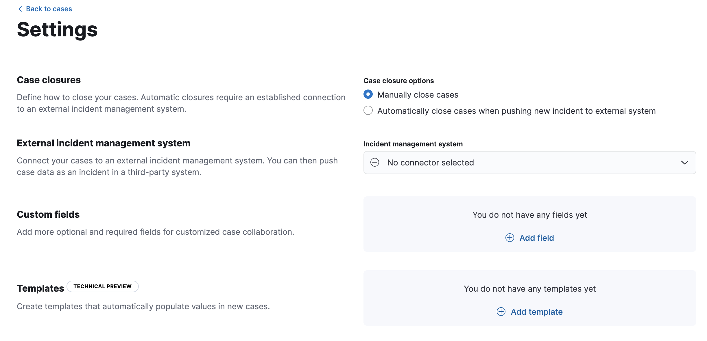
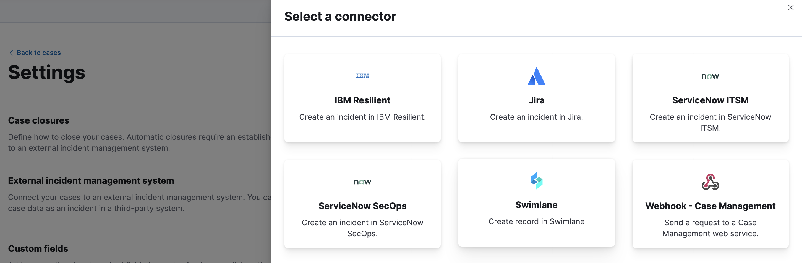
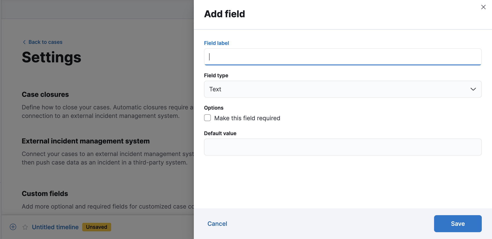
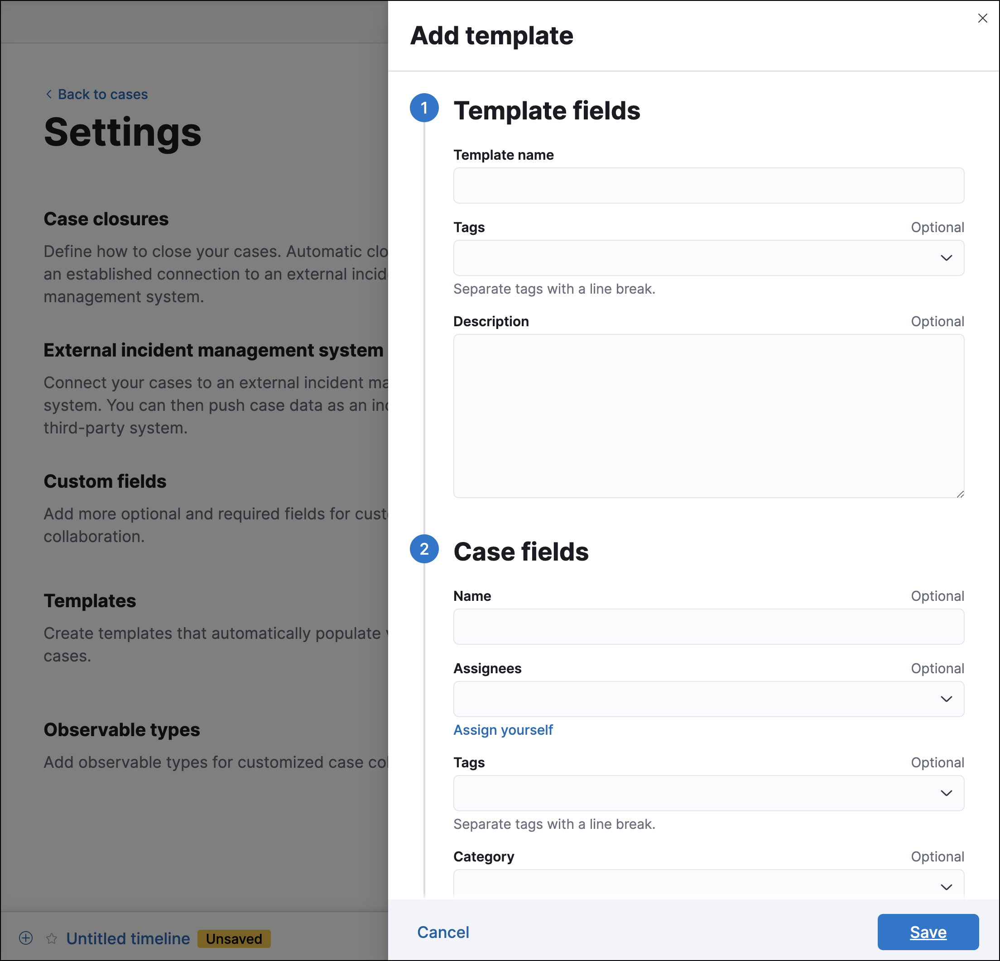

<DocBadge template="technical preview" />

To access case settings in a ((security)) project, go to **Cases** → **Settings**.

{/* NOTE: This is an autogenerated screenshot. Do not edit it directly. */}

## Case closures

If you close cases in your external incident management system, the cases will remain open in ((elastic-sec)) until you close them manually.

To close cases when they are sent to an external system, select **Automatically close Security cases when pushing new incident to external system**.

## External incident management systems

You can push ((elastic-sec)) cases to these third-party systems:

* ((sn-itsm))
* ((sn-sir))
* ((jira)) (including Jira Service Desk)
* ((ibm-r))
* ((swimlane))
* ((webhook-cm))

To push cases, you need to create a connector, which stores the information required to interact with an external system. After you have created a connector, you can set ((elastic-sec)) cases to automatically close when they are sent to external systems.

<DocCallOut title="Requirements">
To create connectors and send cases to external systems, you need the Security Analytics Complete <DocLink slug="/serverless/elasticsearch/manage-project" text="project feature"/> and the appropriate user role. For more information, refer to <DocLink slug="/serverless/security/cases-requirements">Cases prerequisites</DocLink>.
</DocCallOut>

To create a new connector

1. From the **Incident management system** list, select **Add new connector**.

1. Select the system to send cases to: **((sn))**, **((jira))**, **((ibm-r))**, **((swimlane))**, or **((webhook-cm))**.
   
   {/* NOTE: This is an autogenerated screenshot. Do not edit it directly. */}

1. Enter your required settings. For connector configuration details, refer to:
    - [((sn-itsm)) connector](((kibana-ref))/servicenow-action-type.html)
    - [((sn-sir)) connector](((kibana-ref))/servicenow-sir-action-type.html)
    - [((jira)) connector](((kibana-ref))/jira-action-type.html)
    - [((ibm-r)) connector](((kibana-ref))/resilient-action-type.html)
    - [((swimlane)) connector](((kibana-ref))/swimlane-action-type.html)
    - [((webhook-cm)) connector](((kibana-ref))/cases-webhook-action-type.html)

To change the settings of an existing connector:

1. Select the required connector from the incident management system list.
1. Click **Update \<connector name>**.
1. In the **Edit connector** flyout, modify the connector fields as required, then click **Save & close** to save your changes.

To change the default connector used to send cases to external systems, select the required connector from the incident management system list.

### Mapped case fields

When you export an ((elastic-sec)) case to an external system, case fields are mapped to existing fields in ((sn)), ((jira)), ((ibm-r)), and ((swimlane)). For the ((webhook-cm)) connector, case fields can be mapped to custom or pre-existing fields in the external system you're connecting to.

Once fields are mapped, you can push updates to external systems, and mapped fields are overwritten or appended. Retrieving data from external systems is not supported.

<DocTable columns={[
  {
    "title": "Case field",
    "width": "20%"
  },
  {
    "title": "Mapped field",
    "width": "80%"
  }
]}>
  <DocRow>
    <DocCell>
      Title
      
      
    </DocCell>
    <DocCell>
      The case `Title` field is mapped to corresponding fields in external systems. Mapped field values are overwritten when you push updates.
      
      * **((sn))**: `Short description`
      * **((jira))**: `Summary`
      * **((ibm-r))**: `Name`
      * **((swimlane))**: `Description`

      
      
    </DocCell>
  </DocRow>
  <DocRow>
    <DocCell>
      Description
      
    </DocCell>
    <DocCell>
      The case `Description` field is mapped to the `Description` field in all systems. Mapped field values are overwritten when you push updates.
      
      
    </DocCell>
  </DocRow>
  <DocRow>
    <DocCell>
      Comments
      
      
    </DocCell>
    <DocCell>
      The case `Comments` field is mapped to corresponding fields in external systems.
      
      * **((sn))**: `Work Notes`
      * **((jira))**: `Comments`
      * **((ibm-r))**: `Comments`
      * **((swimlane))**: `Comments`

      
      New and edited comments are added to incident records when pushed to ((sn)), ((jira)), or ((ibm-r)). Comments pushed to ((swimlane)) are appended to the `Comment` field in ((swimlane)) and posted individually.
      
      
    </DocCell>
  </DocRow>
</DocTable>

## Custom fields

You can add optional and required fields for customized case collaboration.

1. In the **Custom fields** section, click **Add field**.
   
   {/* NOTE: This is an autogenerated screenshot. Do not edit it directly. */}

1. You must provide a field label and type (text or toggle).
   You can optionally designate it as a required field and provide a default value.

When you create a custom field, it's added to all new and existing cases.
In existing cases, new custom text fields initially have null values.

You can subsequently remove or edit custom fields on the **Settings** page.

## Templates

<DocCallOut template="technical_preview" />

You can make the case creation process faster and more consistent by adding templates.
A template defines values for one or all of the case fields (such as severity, tags, description, and title) as well as any custom fields.

To create a template:

1. In the **Templates** section, click **Add template**.

    
    {/* NOTE: This is an autogenerated screenshot. Do not edit it directly. */}

1. You must provide a template name and case severity. You can optionally add template tags and a description, values for each case field, and a case connector.

When users create cases, they can optionally select a template and use its field values or override them.

<DocCallOut>
If you update or delete templates, existing cases are unaffected.
</DocCallOut>