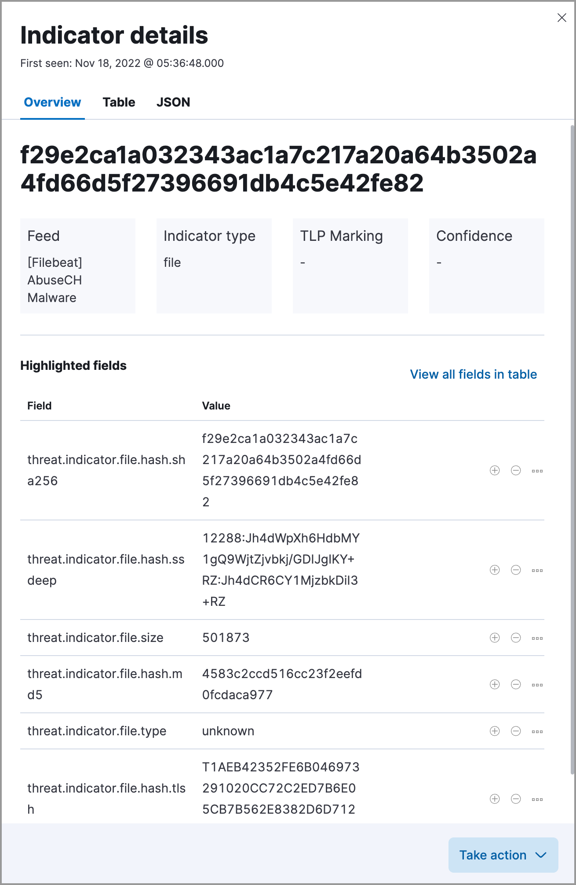
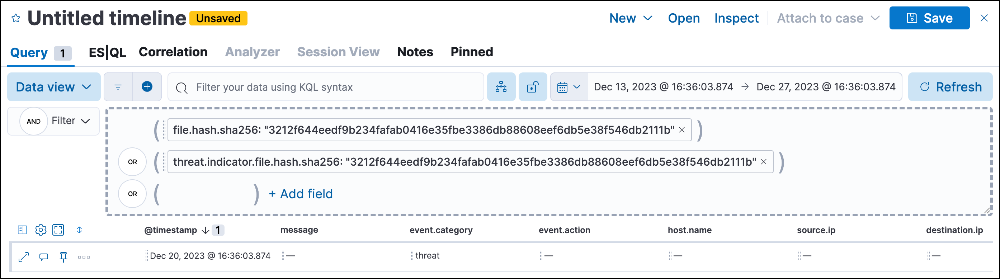
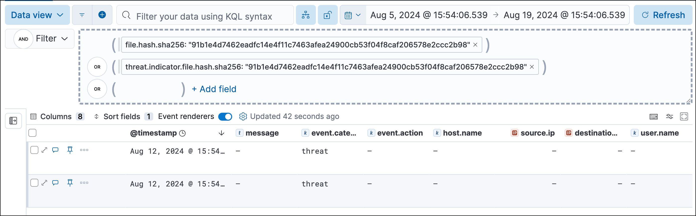
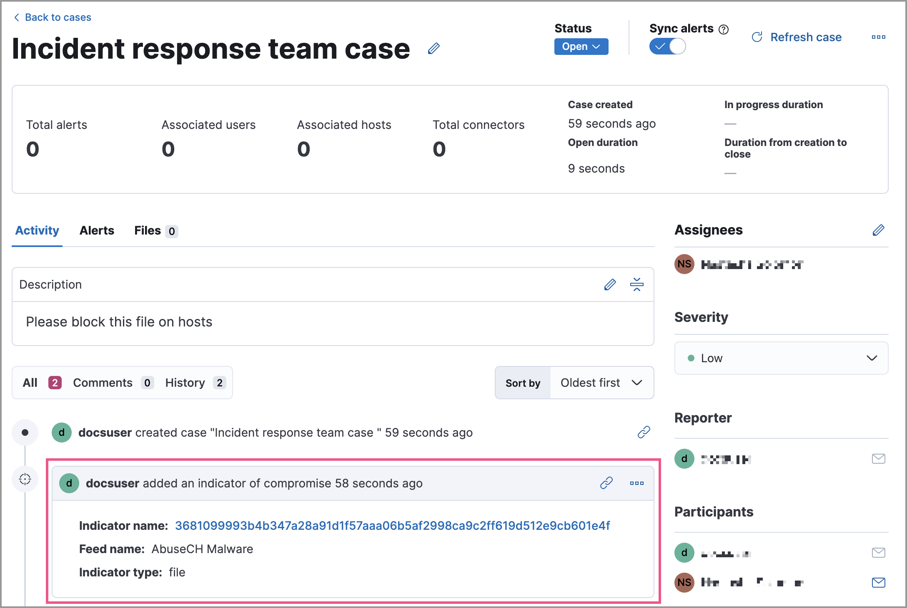
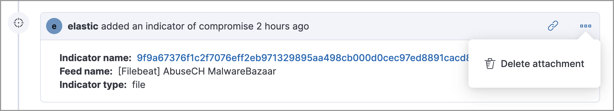

<DocBadge template="technical preview" />

The Indicators page collects data from enabled threat intelligence feeds and provides a centralized view of indicators, also known as indicators of compromise (IoCs). This topic helps you set up the Indicators page and explains how to work with IoCs.

<DocCallOut title="Requirements">

* The Indicators page requires the Security Analytics Complete <DocLink slug="/serverless/elasticsearch/manage-project" text="project feature"/>.
* You must have _one_ of the following installed on the hosts you want to monitor:
    * **((agent))** - Install a [((fleet))-managed ((agent))](((fleet-guide))/install-fleet-managed-elastic-agent.html) and ensure the agent's status is `Healthy`. Refer to [((fleet)) Troubleshooting](((fleet-guide))/fleet-troubleshooting.html) if it isn't.
    * **((filebeat))** - Install [((filebeat))](((filebeat-ref))/filebeat-installation-configuration.html).

</DocCallOut>

## Threat intelligence and indicators
Threat intelligence is a research function that analyzes current and emerging threats and recommends appropriate actions to strengthen a company's security posture. Threat intelligence requires proactivity to be useful, such as gathering, analyzing, and investigating various threat and vulnerability data sources.

An indicator, also referred to as an IoC, is a piece of information associated with a known threat or reported vulnerability. There are many types of indicators, including URLs, files, domains, email addresses, and more. Within SOC teams, threat intelligence analysts use indicators to detect, assess, and respond to threats.

## Set up the Indicators page

Install a threat intelligence integration to add indicators to the Indicators page.

1. From the ((security-app)) main menu, select one of the following:
    * **Intelligence** → **Indicators** → **Add Integrations**.
    * **Project settings** → **Integrations**.
1. In the search bar, search for `Threat Intelligence` to get a list of threat intelligence integrations.
1. Select a threat intelligence integration, then complete the integration's guided installation.

    <DocCallOut title="Note">
    For more information about available fields, go to the [Elastic integration documentation](https://docs.elastic.co/integrations) and search for a specific threat intelligence integration.
    </DocCallOut>

1. Return to the Indicators page in ((elastic-sec)). Refresh the page if indicator data isn't displaying.

### Troubleshooting
If indicator data is not appearing in the Indicators table after you installed a threat intelligence integration:

* Verify that the index storing indicator documents is included in the <DocLink slug="/serverless/security/advanced-settings" section="update-default-elastic-security-indices">default ((elastic-sec)) indices</DocLink> (`securitySolution:defaultIndex`). The index storing indicator documents will differ based on the way you're collecting indicator data:
    * **((agent)) integrations** - `logs_ti*`
    * **((filebeat)) integrations** - `filebeat-*`
* Ensure the indicator data you're ingesting is mapped to [Elastic Common Schema (ECS)](((ecs-ref))).

<DocCallOut title="Note">
These troubleshooting steps also apply to the <DocLink slug="/serverless/security/threat-intelligence">Threat Intelligence view</DocLink>.
</DocCallOut>

## Indicators page UI

After you add indicators to the Indicators page, you can <DocLink slug="/serverless/security/indicators-of-compromise" section="examine-indicator-details">examine</DocLink>, search, filter, and take action on indicator data. Indicators also appear in the Trend view, which shows the total values in the legend.

<DocImage size="xl" url="../images/indicators-of-compromise/-cases-interact-with-indicators-table.gif" alt="Shows how to interact with the Intelligence page" />

### Examine indicator details
Learn more about an indicator by clicking **View details**, then opening the Indicator details flyout. The flyout contains these informational tabs:

* **Overview**: A summary of the indicator, including the indicator's name, the threat intelligence feed it came from, the indicator type, and additional relevant data.

    <DocCallOut title="Note">
    Some threat intelligence feeds provide  [Traffic Light Protocol (TLP) markings](https://www.cisa.gov/tlp#:~:text=Introduction,shared%20with%20the%20appropriate%20audience). The `TLP Marking` and `Confidence` fields will be empty if the feed doesn't provide that data.
    </DocCallOut>

* **Table**: The indicator data in table format.
* **JSON**: The indicator data in JSON format.

    

## Find related security events

Investigate an indicator in <DocLink slug="/serverless/security/timelines-ui">Timeline</DocLink> to identify and predict related events in your environment. You can add an indicator to Timeline from the Indicators table or the Indicator details flyout.

When you add an indicator to Timeline, a new Timeline opens with an auto-generated KQL query. The query contains the indicator field-value pair that you selected plus the field-value pair of the automatically mapped source event. By default, the query's time range is set to seven days before and after the indicator's `timestamp`. 

### Example indicator Timeline investigation  

The following image shows a file hash indictor being investigated in Timeline. The indicator field-value pair is:

`threat.indicator.file.hash.sha256 : 116dd9071887611c19c24aedde270285a4cf97157b846e6343407cf3bcec115a`

The auto-generated query contains the indicator field-value pair (mentioned previously) and the auto-mapped source event field-value pair, which is:

`file.hash.sha256 : 116dd9071887611c19c24aedde270285a4cf97157b846e6343407cf3bcec115a`

The query results show an alert with a matching `file.hash.sha256` field value, which may indicate suspicious or malicious activity in the environment.  

## Attach indicators to cases

Attaching indicators to cases provides more context and available actions for your investigations. This feature allows you to easily share or escalate threat intelligence to other teams.

To add indicators to cases:

1. From the Indicators table, click the **More actions** (<DocIcon type="boxesHorizontal" title="More actions" />) menu. Alternatively, open an indicator's details, then select **Take action**.
1. Select one of the following:

    * **Add to existing case**: From the **Select case** dialog box, select the case to which you want to attach the indicator. 
    * **Add to new case**: Configure the case details. Refer to <DocLink slug="/serverless/security/cases-open-manage" section="open-a-new-case">Open a new case</DocLink> to learn more about opening a new case. 

    The indicator is added to the case as a new comment. 

### Review indicator details in cases

When you attach an indicator to a case, the indicator is added as a new comment with the following details:

* **Indicator name**: Click the linked name to open the Indicator details flyout, which contains the following tabs:
    * **Overview**: A summary of the threat indicator, including its name and type, which threat intelligence feed it came from, and additional relevant data.

        <DocCallOut title="Note">
        Some threat intelligence feeds provide  [Traffic Light Protocol (TLP) markings](https://www.cisa.gov/tlp#:~:text=Introduction,shared%20with%20the%20appropriate%20audience). The `TLP Marking` and `Confidence` fields will be empty if the feed doesn't provide that data.
        </DocCallOut>

    * **Table**: The indicator data in table format.
    * **JSON**: The indicator data in JSON format.
* **Feed name**: The threat feed from which the indicator was ingested.
* **Indicator type**: The indicator type, for example, `file` or `.exe`.

### Remove indicators from cases
To remove an indicator attached to a case, click the **More actions** (<DocIcon type="boxesHorizontal" title="More actions" />) menu → **Delete attachment** in the case comment. 

## Use data from indicators to expand the blocklist

Add indicator values to the <DocLink slug="/serverless/security/blocklist">blocklist</DocLink> to prevent selected applications from running on your hosts. You can use MD5, SHA-1, or SHA-256 hash values from `file` type indicators. 

You can add indicator values to the blocklist from the Indicators table or the Indicator details flyout. From the Indicators table, select the **More actions** (<DocIcon type="boxesHorizontal" title="More actions" />) menu → **Add blocklist entry**.  Alternatively, open an indicator's details, then select the **Take action** menu → **Add blocklist entry**. 

<DocCallOut title="Note">
Refer to <DocLink slug="/serverless/security/blocklist">Blocklist</DocLink> for more information about blocklist entries. 
</DocCallOut>

