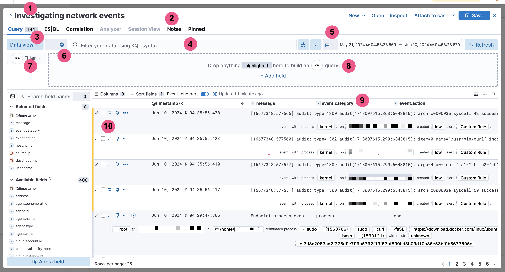

<DocBadge template="technical preview" />

The Timeline schema lists all the JSON fields and objects required to create a Timeline or a Timeline template using the Create Timeline API.

<DocCallOut title="Important" color="warning">
All column, dropzone, and filter fields must be
[ECS fields](((ecs-ref))).
</DocCallOut>

This screenshot maps the Timeline UI components to their JSON objects:

1. <DocLink slug="/serverless/security/timeline-object-schema" section="timeline-object-title">Title</DocLink> (`title`)
2. <DocLink slug="/serverless/security/timeline-object-schema" section="timeline-object-global-notes">Global notes</DocLink> (`globalNotes`)
3. <DocLink slug="/serverless/security/timeline-object-schema" section="timeline-object-dataViewId">Data view</DocLink> (`dataViewId`)
4. <DocLink slug="/serverless/security/timeline-object-schema" section="timeline-object-kqlquery">KQL bar query</DocLink> (`kqlQuery`)
5. <DocLink slug="/serverless/security/timeline-object-schema" section="timeline-object-daterange">Time filter</DocLink> (`dateRange`)
6. <DocLink slug="/serverless/security/timeline-object-schema" section="timeline-object-filters">Additional filters</DocLink> (`filters`)
7. <DocLink slug="/serverless/security/timeline-object-schema" section="timeline-object-kqlmode">KQL bar mode</DocLink> (`kqlMode`)
8. <DocLink slug="/serverless/security/timeline-object-schema" section="timeline-object-dropzone">Dropzone</DocLink> (each clause is contained in its own `dataProviders` object)
9. <DocLink slug="/serverless/security/timeline-object-schema" section="timeline-object-columns">Column headers</DocLink> (`columns`)
10. <DocLink slug="/serverless/security/timeline-object-schema" section="timeline-object-event-notes">Event-specific notes</DocLink> (`eventNotes`)

<DocTable columns={[
  {
    "title": "Name",
    "width": "30%"
  },
  {
    "title": "Type",
    "width": "20%"
  },
  {
    "title": "Description",
    "width": "50%"
  }
]}>
  <DocRow>
    <DocCell>  `columns`</DocCell>
    <DocCell><DocLink slug="/serverless/security/timeline-object-schema" section="columns-object">columns[]</DocLink></DocCell>
    <DocCell>
      The Timeline's
      columns.
      
    </DocCell>
  </DocRow>
  <DocRow>
    <DocCell>`created`</DocCell>
    <DocCell>Float</DocCell>
    <DocCell>
      The time the Timeline was created, using a 13-digit Epoch
      timestamp.
      
    </DocCell>
  </DocRow>
  <DocRow>
    <DocCell>`createdBy`</DocCell>
    <DocCell>String</DocCell>
    <DocCell>
      The user who created the Timeline.
      
    </DocCell>
  </DocRow>
  <DocRow>
    <DocCell>
        `dataProviders`
      
    </DocCell>
    <DocCell><DocLink slug="/serverless/security/timeline-object-schema" section="dataproviders-object">dataProviders[]</DocLink></DocCell>
    <DocCell>
      Object containing dropzone query
      clauses.
      
    </DocCell>
  </DocRow>
  <DocRow>
    <DocCell>  `dataViewId`</DocCell>
    <DocCell>String</DocCell>
    <DocCell>
      ID of the Timeline's Data View, for example: `"dataViewId":"security-solution-default"`.
      
    </DocCell>
  </DocRow>
  <DocRow>
    <DocCell>  `dateRange`</DocCell>
    <DocCell>dateRange</DocCell>
    <DocCell>
      The Timeline's search
      period:
      
      * `end`: The time up to which events are searched, using a 13-digit Epoch
          timestamp.

      * `start`: The time from which events are searched, using a 13-digit Epoch
          timestamp.

      
      
    </DocCell>
  </DocRow>
  <DocRow>
    <DocCell> `description`</DocCell>
    <DocCell>String</DocCell>
    <DocCell>
      The Timeline's description.
      
    </DocCell> 
  </DocRow>
  <DocRow>
    <DocCell>  `eventNotes`</DocCell>
    <DocCell>
      <DocLink slug="/serverless/security/timeline-object-schema" section="eventnotes-object">eventNotes[]</DocLink>
      
    </DocCell>
    <DocCell>
      Notes added to specific events in the Timeline.
      
    </DocCell>
  </DocRow>
  <DocRow>
    <DocCell>`eventType`</DocCell>
    <DocCell>String</DocCell>
    <DocCell>
      Event types displayed in
      the Timeline, which can be:
      
      * `All data sources`
      * `Events`: Event sources only
      * `Detection Alerts`: Detection alerts only

      
      
    </DocCell>
  </DocRow>
  <DocRow>
    <DocCell>`favorite`</DocCell>
    <DocCell><DocLink slug="/serverless/security/timeline-object-schema" section="favorite-object">favorite[]</DocLink></DocCell>
    <DocCell>
      Indicates when and who marked a
      Timeline as a favorite.
      
    </DocCell>
  </DocRow>
  <DocRow>
    <DocCell>  `filters`</DocCell>
    <DocCell><DocLink slug="/serverless/security/timeline-object-schema" section="filters-object">filters[]</DocLink></DocCell>
    <DocCell>
      Filters used
      in addition to the dropzone query.
      
    </DocCell>
  </DocRow>
  <DocRow>
    <DocCell>
        `globalNotes`
      
    </DocCell>
    <DocCell><DocLink slug="/serverless/security/timeline-object-schema" section="globalnotes-object">globalNotes[]</DocLink></DocCell>
    <DocCell>
      Global notes added to the Timeline.
      
    </DocCell>
  </DocRow>
  <DocRow>
    <DocCell>  `kqlMode`</DocCell>
    <DocCell>String</DocCell>
    <DocCell>
      Indicates whether the KQL bar
      filters the dropzone query results or searches for additional results, where:
      
      * `filter`: filters dropzone query results
      * `search`: displays additional search results

      
      
    </DocCell>
  </DocRow>
  <DocRow>
    <DocCell>  `kqlQuery`</DocCell>
    <DocCell><DocLink slug="/serverless/security/timeline-object-schema" section="kqlquery-object">kqlQuery</DocLink></DocCell>
    <DocCell>
      KQL bar
      query.
      
    </DocCell>
  </DocRow>
  <DocRow>
    <DocCell>`pinnedEventIds`</DocCell>
    <DocCell>pinnedEventIds[]</DocCell>
    <DocCell>
      IDs of events pinned to the Timeline's
      search results.
      
    </DocCell>
  </DocRow>
  <DocRow>
    <DocCell>`savedObjectId`</DocCell>
    <DocCell>String</DocCell>
    <DocCell>
      The Timeline's saved object ID.
      
    </DocCell>
  </DocRow>
  <DocRow>
    <DocCell>`savedQueryId`</DocCell>
    <DocCell>String</DocCell>
    <DocCell>
      If used, the saved query ID used to filter or search
      dropzone query results.
      
    </DocCell>
  </DocRow>
  <DocRow>
    <DocCell>`sort`</DocCell>
    <DocCell>sort</DocCell>
    <DocCell>
      Object indicating how rows are sorted in the Timeline's grid:
      
      * `columnId` (string): The ID of the column used to sort results.
      * `sortDirection` (string): The sort direction, which can be either `desc` or
          `asc`.

      
      
    </DocCell>
  </DocRow>
  <DocRow>
    <DocCell>`templateTimelineId`</DocCell>
    <DocCell>String</DocCell>
    <DocCell>
      A unique ID (UUID) for Timeline templates. For
      Timelines, the value is `null`.
      
    </DocCell>
  </DocRow>
  <DocRow>
    <DocCell>`templateTimelineVersion`</DocCell>
    <DocCell>Integer</DocCell>
    <DocCell>
      Timeline template version number. For
      Timelines, the value is `null`.
      
    </DocCell>
  </DocRow>
  <DocRow>
    <DocCell>  `timelineType`</DocCell>
    <DocCell>String</DocCell>
    <DocCell>
      Indicates whether the
      Timeline is a template or not, where:
      
      * `default`: Indicates a Timeline used to actively investigate events.
      * `template`: Indicates a Timeline template used when detection rule alerts are
          investigated in Timeline.

      
      
    </DocCell>
  </DocRow>
  <DocRow>
    <DocCell>  `title`</DocCell>
    <DocCell>String</DocCell>
    <DocCell>
      The Timeline's title.
      
    </DocCell>
  </DocRow>
  <DocRow>
    <DocCell>`updated`</DocCell>
    <DocCell>Float</DocCell>
    <DocCell>
      The last time the Timeline was updated, using a
      13-digit Epoch timestamp.
      
    </DocCell>
  </DocRow>
  <DocRow>
    <DocCell>`updatedBy`</DocCell>
    <DocCell>String</DocCell>
    <DocCell>
      The user who last updated the Timeline.
      
    </DocCell>
  </DocRow>
  <DocRow>
    <DocCell>`version`</DocCell>
    <DocCell>String</DocCell>
    <DocCell>
      The Timeline's version.
      
    </DocCell>
  </DocRow>
</DocTable>

## columns object

<DocTable columns={[
  {
    "title": "Name",
    "width": "30%"
  },
  {
    "title": "Type",
    "width": "20%"
  },
  {
    "title": "Description",
    "width": "50%"
  }
]}>
  <DocRow>
    <DocCell>`aggregatable`</DocCell>
    <DocCell>Boolean</DocCell>
    <DocCell>
      Indicates whether the field can be aggregated across
      all indices (used to sort columns in the UI).
      
    </DocCell>
  </DocRow>
  <DocRow>
    <DocCell>`category`</DocCell>
    <DocCell>String</DocCell>
    <DocCell>
      The ECS field set to which the field belongs.
      
    </DocCell>
  </DocRow>
  <DocRow>
    <DocCell>`description`</DocCell>
    <DocCell>String</DocCell>
    <DocCell>
      UI column field description tooltip.
      
    </DocCell>
  </DocRow>
  <DocRow>
    <DocCell>`example`</DocCell>
    <DocCell>String</DocCell>
    <DocCell>
      UI column field example tooltip.
      
    </DocCell>
  </DocRow>
  <DocRow>
    <DocCell>`indexes`</DocCell>
    <DocCell>String</DocCell>
    <DocCell>
      Security indices in which the field exists and has the same
      ((es)) type. `null` when all the security indices have the field with the same
      type.
      
    </DocCell>
  </DocRow>
  <DocRow>
    <DocCell>`id`</DocCell>
    <DocCell>String</DocCell>
    <DocCell>
      ECS field name, displayed as the column header in the UI.
      
    </DocCell>
  </DocRow>
  <DocRow>
    <DocCell>`type`</DocCell>
    <DocCell>String</DocCell>
    <DocCell>
      The field's type.
      
    </DocCell>
  </DocRow>
</DocTable>

## dataProviders object

<DocTable columns={[
  {
    "title": "Name",
    "width": "30%"
  },
  {
    "title": "Type",
    "width": "20%"
  },
  {
    "title": "Description",
    "width": "50%"
  }
]}>
  <DocRow>
    <DocCell>`and`</DocCell>
    <DocCell>dataProviders[]</DocCell>
    <DocCell>
      Array containing dropzone query clauses using `AND`
      logic.
      
    </DocCell>
  </DocRow>
  <DocRow>
    <DocCell>`enabled`</DocCell>
    <DocCell>Boolean</DocCell>
    <DocCell>
      Indicates if the dropzone query clause is enabled.
      
    </DocCell>
  </DocRow>
  <DocRow>
    <DocCell>`excluded`</DocCell>
    <DocCell>Boolean</DocCell>
    <DocCell>
      Indicates if the dropzone query clause uses `NOT` logic.
      
    </DocCell>
  </DocRow>
  <DocRow>
    <DocCell>`id`</DocCell>
    <DocCell>String</DocCell>
    <DocCell>
      The dropzone query clause's unique ID.
      
    </DocCell>
  </DocRow>
  <DocRow>
    <DocCell>`name`</DocCell>
    <DocCell>String</DocCell>
    <DocCell>
      The dropzone query clause's name (the clause's value
      when Timelines are exported from the UI).
      
    </DocCell>
  </DocRow>
  <DocRow>
    <DocCell>`queryMatch`</DocCell>
    <DocCell>queryMatch</DocCell>
    <DocCell>
      The dropzone query clause:
      
      * `field` (string): The field used to search Security indices.
      * `operator` (string): The clause's operator, which can be:
          * `:` - The `field` has the specified `value`.
          * `:*` - The field exists.

      
      * `value` (string): The field's value used to match results.

      
      
    </DocCell>
  </DocRow>
</DocTable>

## eventNotes object

<DocTable columns={[
  {
    "title": "Name",
    "width": "30%"
  },
  {
    "title": "Type",
    "width": "20%"
  },
  {
    "title": "Description",
    "width": "50%"
  }
]}>
  <DocRow>
    <DocCell>`created`</DocCell>
    <DocCell>Float</DocCell>
    <DocCell>
      The time the note was created, using a 13-digit Epoch
      timestamp.
      
    </DocCell>
  </DocRow>
  <DocRow>
    <DocCell>`createdBy`</DocCell>
    <DocCell>String</DocCell>
    <DocCell>
      The user who added the note.
      
    </DocCell>
  </DocRow>
  <DocRow>
    <DocCell>`eventId`</DocCell>
    <DocCell>String</DocCell>
    <DocCell>
      The ID of the event to which the note was added.
      
    </DocCell>
  </DocRow>
  <DocRow>
    <DocCell>`note`</DocCell>
    <DocCell>String</DocCell>
    <DocCell>
      The note's text.
      
    </DocCell>
  </DocRow>
  <DocRow>
    <DocCell>`noteId`</DocCell>
    <DocCell>String</DocCell>
    <DocCell>
      The note's ID
      
    </DocCell>
  </DocRow>
  <DocRow>
    <DocCell>`timelineId`</DocCell>
    <DocCell>String</DocCell>
    <DocCell>
      The ID of the Timeline to which the note was added.
      
    </DocCell>
  </DocRow>
  <DocRow>
    <DocCell>`updated`</DocCell>
    <DocCell>Float</DocCell>
    <DocCell>
      The last time the note was updated, using a
      13-digit Epoch timestamp.
      
    </DocCell>
  </DocRow>
  <DocRow>
    <DocCell>`updatedBy`</DocCell>
    <DocCell>String</DocCell>
    <DocCell>
      The user who last updated the note.
      
    </DocCell>
  </DocRow>
  <DocRow>
    <DocCell>`version`</DocCell>
    <DocCell>String</DocCell>
    <DocCell>
      The note's version.
      
    </DocCell>
  </DocRow>
</DocTable>

## favorite object

<DocTable columns={[
  {
    "title": "Name",
    "width": "30%"
  },
  {
    "title": "Type",
    "width": "20%"
  },
  {
    "title": "Description",
    "width": "50%"
  }
]}>
  <DocRow>
    <DocCell>`favoriteDate`</DocCell>
    <DocCell>Float</DocCell>
    <DocCell>
      The time the Timeline was marked as a favorite, using a
      13-digit Epoch timestamp.
      
    </DocCell>
  </DocRow>
  <DocRow>
    <DocCell>`fullName`</DocCell>
    <DocCell>String</DocCell>
    <DocCell>
      The full name of the user who marked the Timeline as
      a favorite.
      
    </DocCell>
  </DocRow>
  <DocRow>
    <DocCell>`keySearch`</DocCell>
    <DocCell>String</DocCell>
    <DocCell>
      `userName` encoded in Base64.
      
    </DocCell>
  </DocRow>
  <DocRow>
    <DocCell>`userName`</DocCell>
    <DocCell>String</DocCell>
    <DocCell>
      The username of the user who marked the
      Timeline as a favorite.
      
    </DocCell>
  </DocRow>
</DocTable>

## filters object

<DocTable columns={[
  {
    "title": "Name",
    "width": "30%"
  },
  {
    "title": "Type",
    "width": "20%"
  },
  {
    "title": "Description",
    "width": "50%"
  }
]}>
  <DocRow>
    <DocCell>`exists`</DocCell>
    <DocCell>String</DocCell>
    <DocCell>
      [Exists term query](((ref))/query-dsl-exists-query.html) for the
      specified field (`null` when undefined). For example, `{"field":"user.name"}`.
      
    </DocCell>
  </DocRow>
  <DocRow>
    <DocCell>`meta`</DocCell>
    <DocCell>meta</DocCell>
    <DocCell>
      Filter details:
      
      * `alias` (string): UI filter name.
      * `disabled` (boolean): Indicates if the filter is disabled.
      * `key`(string): Field name or unique string ID.
      * `negate` (boolean): Indicates if the filter query clause uses `NOT` logic.
      * `params` (string): Value of `phrase` filter types.
      * `type` (string): Type of filter. For example, `exists` and `range`. For more
          information about filtering, see [Query DSL](((ref))/query-dsl.html).

      
      
    </DocCell>
  </DocRow>
  <DocRow>
    <DocCell>`match_all`</DocCell>
    <DocCell>String</DocCell>
    <DocCell>
      [Match all term query](((ref))/query-dsl-match-all-query.html)
      for the specified field (`null` when undefined).
      
    </DocCell>
  </DocRow>
  <DocRow>
    <DocCell>`query`</DocCell>
    <DocCell>String</DocCell>
    <DocCell>
      [DSL query](((ref))/query-dsl.html) (`null` when undefined). For
      example, `{"match_phrase":{"ecs.version":"1.4.0"}}`.
      
    </DocCell>
  </DocRow>
  <DocRow>
    <DocCell>`range`</DocCell>
    <DocCell>String</DocCell>
    <DocCell>
      [Range query](((ref))/query-dsl-range-query.html) (`null` when
      undefined). For example, `{"@timestamp":{"gte":"now-1d","lt":"now"}}"`.
      
    </DocCell>
  </DocRow>
</DocTable>

## globalNotes object

<DocTable columns={[
  {
    "title": "Name",
    "width": "30%"
  },
  {
    "title": "Type",
    "width": "20%"
  },
  {
    "title": "Description",
    "width": "50%"
  }
]}>
  <DocRow>
    <DocCell>`created`</DocCell>
    <DocCell>Float</DocCell>
    <DocCell>
      The time the note was created, using a 13-digit Epoch
      timestamp.
      
    </DocCell>
  </DocRow>
  <DocRow>
    <DocCell>`createdBy`</DocCell>
    <DocCell>String</DocCell>
    <DocCell>
      The user who added the note.
      
    </DocCell>
  </DocRow>
  <DocRow>
    <DocCell>`note`</DocCell>
    <DocCell>String</DocCell>
    <DocCell>
      The note's text.
      
    </DocCell>
  </DocRow>
  <DocRow>
    <DocCell>`noteId`</DocCell>
    <DocCell>String</DocCell>
    <DocCell>
      The note's ID
      
    </DocCell>
  </DocRow>
  <DocRow>
    <DocCell>`timelineId`</DocCell>
    <DocCell>String</DocCell>
    <DocCell>
      The ID of the Timeline to which the note was added.
      
    </DocCell>
  </DocRow>
  <DocRow>
    <DocCell>`updated`</DocCell>
    <DocCell>Float</DocCell>
    <DocCell>
      The last time the note was updated, using a
      13-digit Epoch timestamp.
      
    </DocCell>
  </DocRow>
  <DocRow>
    <DocCell>`updatedBy`</DocCell>
    <DocCell>String</DocCell>
    <DocCell>
      The user who last updated the note.
      
    </DocCell>
  </DocRow>
  <DocRow>
    <DocCell>`version`</DocCell>
    <DocCell>String</DocCell>
    <DocCell>
      The note's version.
      
    </DocCell>
  </DocRow>
</DocTable>

## kqlQuery object

<DocTable columns={[
  {
    "title": "Name",
    "width": "30%"
  },
  {
    "title": "Type",
    "width": "20%"
  },
  {
    "title": "Description",
    "width": "50%"
  }
]}>
  <DocRow>
    <DocCell>`filterQuery`</DocCell>
    <DocCell>filterQuery</DocCell>
    <DocCell>
      Object containing query details:
      
      * `kuery`: Object containing the query's clauses and type:
          * `expression`(string): The query's clauses.
          * `kind` (string): The type of query, which can be `kuery` or `lucene`.
      * `serializedQuery` (string): The query represented in JSON format.

      
    </DocCell>
  </DocRow>
</DocTable>
