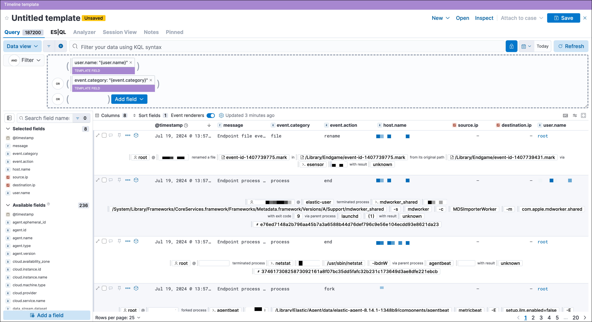

<DocBadge template="technical preview" />

You can attach Timeline templates to detection rules. When attached, the rule's alerts use the template when they are investigated in Timeline. This enables immediately viewing the alert's most interesting fields when you start an investigation.

Templates can include two types of filters:

* **Regular filter**: Like other KQL filters, defines both the source event field and its value. For example: `host.name : "win-server"`.

* **Template filter**: Only defines the event field and uses a placeholder
    for the field's value. When you investigate an alert in Timeline, the field's value is taken from the alert.

For example, if you define the `host.name: "{host.name}"` template filter, when alerts generated by the rule are investigated in Timeline, the alert's
`host.name` value is used in the filter. If the alert's `host.name` value is
`Linux_stafordshire-061`, the Timeline filter is:
`host.name: "Linux_stafordshire-061"`.

<DocCallOut title="Note">
For information on how to add Timeline templates to rules, refer to <DocLink slug="/serverless/security/rules-create">Create a detection rule</DocLink>.
</DocCallOut>

When you load ((elastic-sec)) prebuilt rules, ((elastic-sec)) also loads a selection of prebuilt Timeline templates, which you can attach to detection rules. **Generic** templates use broad KQL queries to retrieve event data, and **Comprehensive** templates use detailed KQL queries to retrieve additional information. The following prebuilt templates appear by default:

* **Alerts Involving a Single Host Timeline**: Investigate detection alerts involving a single host.
* **Alerts Involving a Single User Timeline**: Investigate detection alerts involving a single user.
* **Generic Endpoint Timeline**: Investigate ((elastic-endpoint)) detection alerts.
* **Generic Network Timeline**: Investigate network-related detection alerts.
* **Generic Process Timeline**: Investigate process-related detection alerts.
* **Generic Threat Match Timeline**: Investigate threat indicator match detection alerts.
* **Comprehensive File Timeline**: Investigate file-related detection alerts.
* **Comprehensive Network Timeline**: Investigate network-related detection alerts.
* **Comprehensive Process Timeline**: Investigate process-related detection alerts.
* **Comprehensive Registry Timeline**: Investigate registry-related detection alerts.

<DocCallOut title="Tip">
You can <DocLink slug="/serverless/security/timeline-templates-ui" section="manage-existing-timeline-templates">duplicate prebuilt templates</DocLink> and use them as
a starting point for your own custom templates.
</DocCallOut>

## Timeline template legend

When you add filters to a Timeline template, the items are color coded to
indicate which type of filter is added. Additionally, you change Timeline
filters to template filters as you build your template.

Regular Timeline filter 
    : Clicking **Convert to template field** changes the filter to a template filter:

    <DocImage size="m" url="../images/timeline-templates-ui/-events-template-filter-value.png" alt="" />

Template filter 

    : <DocImage size="m" url="../images/timeline-templates-ui/-events-timeline-template-filter.png" alt="" />  
    When you <DocLink slug="/serverless/security/timeline-templates-ui" section="manage-existing-timeline-templates">convert a template to a Timeline</DocLink>, template filters with placeholders are disabled:

    <DocImage size="m" url="../images/timeline-templates-ui/-events-invalid-filter.png" alt="" />

    To enable the filter, either specify a value or change it to a field's existing filter (refer to <DocLink slug="/serverless/security/timelines-ui" section="edit-existing-filters">Edit existing filters</DocLink>).

## Create a Timeline template

1. Choose one of the following:
   * Go to **Investigations** → **Timelines**. Click the **Templates** tab, then click **Create new Timeline template**.
   * Go to the Timeline bar (which is at the bottom of most pages), click the <DocIcon type="plusInCircle" title="New Timeline" /> button, then click **Create new Timeline template**.
   * From an open Timeline or Timeline template, click **New** → **New Timeline template**.

1. Add filters to the new Timeline template. Click **Add field**, and select the required option:

    * **Add field**: Add a regular Timeline filter.
    * **Add template field**: Add a template filter with a value placeholder.

    <DocCallOut title="Tip">
    You can also drag and send items to the template from the **Overview**, **Hosts**, **Network**, and **Alerts** pages.
    </DocCallOut>

    

1. Click **Save** to give the template a title and description.

**Example**

To create a template for process-related alerts on a specific host:

* Add a regular filter for the host name:
    `host.name: "Linux_stafordshire-061"`

* Add template filter for process names: `process.name: "{process.name}"`

When alerts generated by rules associated with this template are investigated
in Timeline, the host name is `Linux_stafordshire-061`, whereas the process name
value is retrieved from the alert's `process.name` field.

## Manage existing Timeline templates

You can view, duplicate, export, delete, and create templates from existing Timelines:

1. Go to **Investigations** → **Timelines** → **Templates**.

    

1. Click the **All actions** icon in the relevant row, and then select the action:

    * **Create timeline from template** (refer to <DocLink slug="/serverless/security/timeline-templates-ui" section="create-a-timeline-template">Create a Timeline template</DocLink>)
    * **Duplicate template**
    * **Export selected** (refer to <DocLink slug="/serverless/security/timeline-templates-ui" section="export-and-import-timeline-templates">Export and import Timeline templates</DocLink>)
    * **Delete selected**
    * **Create query rule from timeline** (only available if the Timeline contains a KQL query)
    * **Create EQL rule from timeline** (only available if the Timeline contains an EQL query)

<DocCallOut title="Tip">
To perform the same action on multiple templates, select templates, then the required action from the **Bulk actions** menu.
</DocCallOut>

<DocCallOut title="Note">
You cannot delete prebuilt templates.
</DocCallOut>

## Export and import Timeline templates

You can import and export Timeline templates, which enables importing templates from one {/*space or (*/}((elastic-sec)) instance to another. Exported templates are saved in an `ndjson` file.

1. Go to **Investigations** → **Timelines** → **Templates**.
1. To export templates, do one of the following:

    * To export one template, click the **All actions** icon in the relevant row and then select **Export selected**.

    * To export multiple templates, select all the required templates and then click **Bulk actions** → **Export selected**.

1. To import templates, click **Import**, then select or drag and drop the template `ndjson` file.

    <DocCallOut title="Note">
    Each template object in the file must be represented in a single line.
    Multiple template objects are delimited with newlines.
    </DocCallOut>

<DocCallOut title="Note">
You cannot export prebuilt templates.
</DocCallOut>

