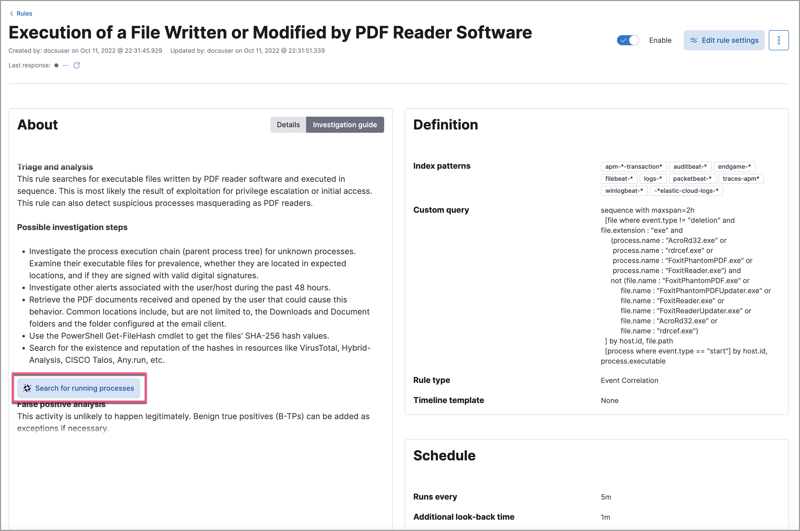

<DocBadge template="technical preview" />

Detection rule investigation guides suggest steps for triaging, analyzing, and responding to potential security issues. When you build a custom rule, you can also set up an investigation guide that incorporates Osquery. This allows you to run live queries from a rule's investigation guide as you analyze alerts produced by the rule.

<DocCallOut title="Requirements">

* The [Osquery manager integration](((kibana-ref))/manage-osquery-integration.html) must be installed.
* ((agent))'s [status](((fleet-guide))/monitor-elastic-agent.html) must be `Healthy`. Refer to [((fleet)) Troubleshooting](((fleet-guide))/fleet-troubleshooting.html) if it isn't.
* You must have the appropriate user role to use this feature.

</DocCallOut>

## Add live queries to an investigation guide

<DocCallOut title="Note">
You can only add Osquery to investigation guides for custom rules because prebuilt rules cannot be edited.
</DocCallOut>

1. Go to **Rules** → **Detection rules (SIEM)**, select a rule, then click **Edit rule settings** on the rule details page.
1. Select the **About** tab, then expand the rule's advanced settings.
1. Scroll down to the Investigation guide section. In the toolbar, click the **Osquery** button (<DocImage alt="Click the Osquery button" size="20px" url="../images/invest-guide-run-osquery/-osquery-osquery-button.png" />).
    1. Add a descriptive label for the query; for example, `Search for executables`.
    1. Select a saved query or enter a new one.

        <DocCallOut title="Tip">
        Use <DocLink id="serverlessSecurityOsqueryPlaceholderFields">placeholder fields</DocLink> to dynamically add existing alert data to your query.
        </DocCallOut>

    1. Expand the **Advanced** section to set a timeout period for the query, and view or set [mapped ECS fields](((kibana-ref))/osquery.html#osquery-map-fields) included in the results from the live query (optional).

        <DocCallOut title="Note">
        Overwriting the query's default timeout period allows you to support queries that take longer to run. The default and minimum supported value for the **Timeout** field is `60`. The maximum supported value is `900`. 
        </DocCallOut>

        <DocImage size="l" url="../images/invest-guide-run-osquery/-osquery-setup-osquery-investigation-guide.png" alt="Shows results from running a query from an investigation guide" />

1. Click **Save changes** to add the query to the rule's investigation guide.

## Run live queries from an investigation guide

1. Go to **Rules** → **Detection rules (SIEM)**, then select a rule to open its details.
1. Go to the About section of the rule details page and click **Investigation guide**.
1. Click the query. The Run Osquery pane displays with the **Query** field autofilled. Do the following:
    1. Select one or more ((agent))s or groups to query. Start typing in the search field to get suggestions for ((agent))s by name, ID, platform, and policy.
    1. Expand the **Advanced** section to set a timeout period for the query, and view or set the [mapped ECS fields](((kibana-ref))/osquery.html#osquery-map-fields) which are included in the live query's results (optional).

      <DocCallOut title="Note">
      Overwriting the query's default timeout period allows you to support queries that take longer to run. The default and minimum supported value for the **Timeout** field is `60`. The maximum supported value is `900`. 
      </DocCallOut>

1. Click **Submit** to run the query. Query results display in the flyout.

    <DocCallOut title="Note">
    Refer to <DocLink id="serverlessSecurityViewOsqueryResults">Examine Osquery results</DocLink> for more information about query results.
    </DocCallOut>

1. Click **Save for later** to save the query for future use (optional).

    <DocImage size="xl" url="../images/invest-guide-run-osquery/-osquery-run-query-investigation-guide.png" alt="Shows results from running a query from an investigation guide" />

