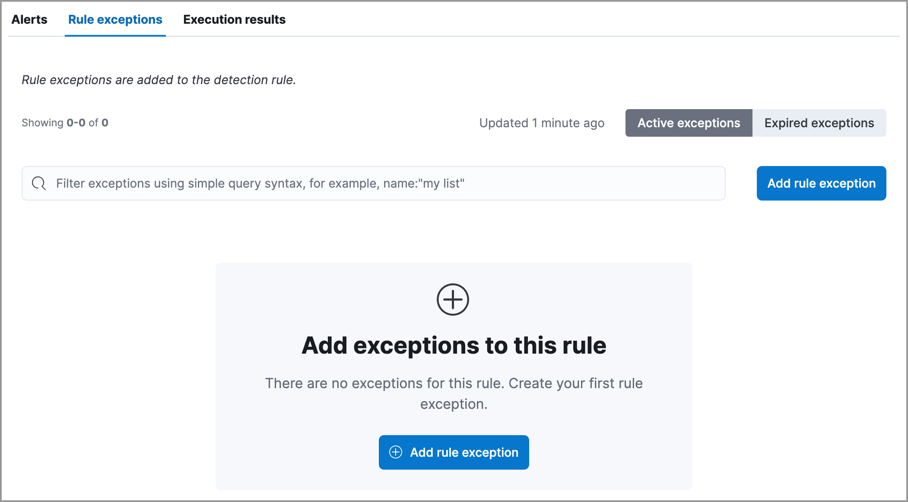
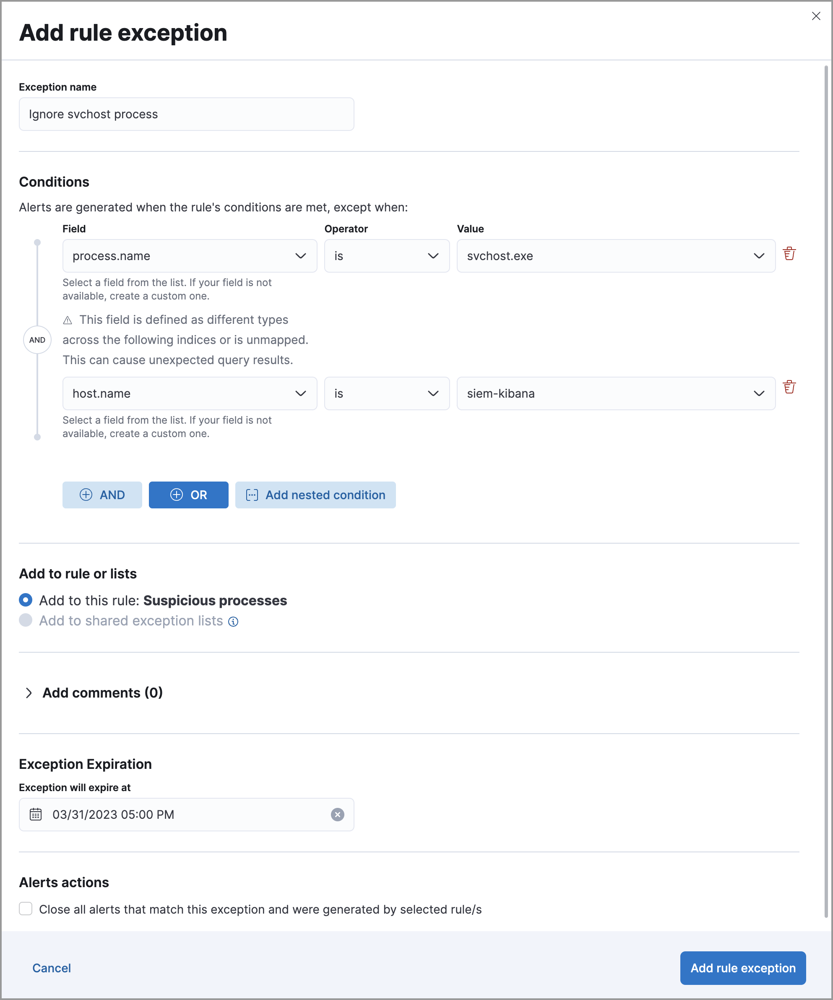
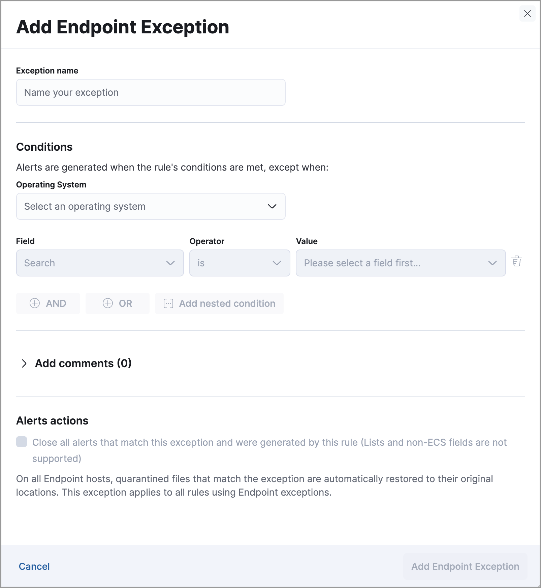
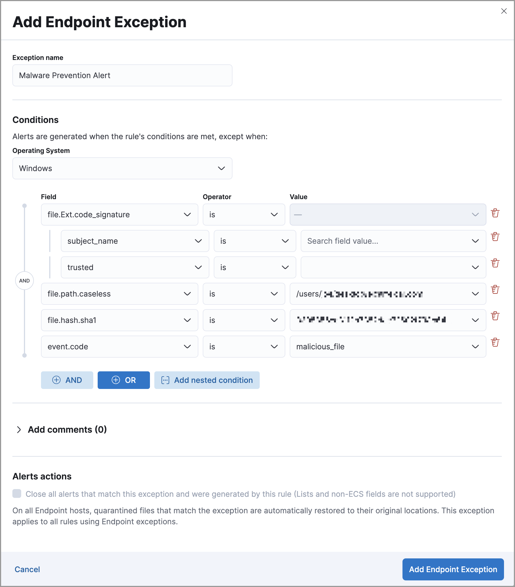
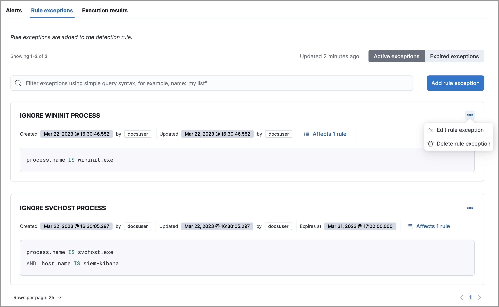
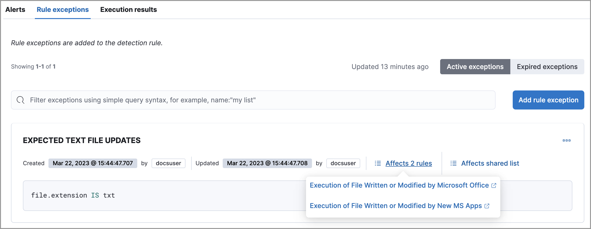

<DocBadge template="technical preview" />
<div id="add-exceptions"></div>

You can add exceptions to a rule from the rule details page, the Alerts table, the alert details flyout, or the Shared Exception Lists page. When you add an exception, you can also close all alerts that meet the exception’s criteria.

<DocCallOut title="Important" color="warning">

* To ensure an exception is successfully applied, ensure that the fields you've defined for its query are correctly and consistently mapped in their respective indices. Refer to [ECS](((ecs-ref))) to learn more about supported mappings.

* Be careful when adding exceptions to <DocLink id="serverlessSecurityRulesUiCreate" section="create-an-event-correlation-rule">event correlation</DocLink> rules. Exceptions are evaluated against every event in the sequence, and if an exception matches any events that are necessary to complete the sequence, alerts are not created.

    To exclude values from a
    specific event in the sequence, update the rule's EQL statement. For example:

       ```eql
       `sequence
         [file where file.extension == "exe"
         and file.name != "app-name.exe"]
         [process where true
         and process.name != "process-name.exe"]`
       ```

* Be careful when adding exceptions to <DocLink id="serverlessSecurityRulesUiCreate" section="create-an-indicator-match-rule">indicator match</DocLink> rules. Exceptions are evaluated against source and indicator indices, so if the exception matches events in _either_ index, alerts are not generated. 

</DocCallOut>

<div id="detection-rule-exceptions"></div>

## Add exceptions to a rule

1. Do one of the following:

    * To add an exception from the rule details page:
        1. Go to the rule details page of the rule to which you want to add an
            exception (**Rules** → **Detection rules (SIEM)** → **_Rule name_**).

        1. Scroll down the rule details page, select the **Rule exceptions** tab, then click **Add rule exception**.

    

    * To add an exception from the Alerts table:
        1. Go to **Alerts**.
        1. Scroll down to the Alerts table, go to the alert you want to create an exception for, click the **More Actions** menu (<DocIcon type="boxesHorizontal" title="Actions menu" size="m" />), then select **Add rule exception**.

    * To add an exception from the alert details flyout:
        1. Go to **Alerts**.
        1. Click the **View details** button from the Alerts table. 
        1. In the alert details flyout, click **Take action → Add rule exception**. 

    * To add an exception from the Shared Exception Lists page:
        1. Go to **Rules** → **Shared exception lists**.
        1. Click **Create shared exception list** → **Create exception item**. 

1. In the **Add rule exception** flyout, name the exception. 
1. Add conditions that define the exception. When the exception's query evaluates to `true`, rules don't generate alerts even when their criteria are met.

    <DocCallOut title="Important" color="warning">
    Rule exceptions are case-sensitive, which means that any character that's entered as an uppercase or lowercase letter will be treated as such. In the event you _don't_ want a field evaluated as case-sensitive, some ECS fields have a `.caseless` version that you can use.
    </DocCallOut>

    <DocCallOut title="Note">
    When you create a new exception from an alert, exception conditions are auto-populated with relevant alert data. Data from custom highlighted fields is listed first. A comment that describes the auto-generated exception conditions is also added to the **Add comments** section.
    </DocCallOut>

      1. **Field**: Select a field to identify the event being filtered.

          <DocCallOut>

          A warning displays for fields with conflicts. Using these fields might cause unexpected exceptions behavior. Refer to <DocLink id="serverlessSecurityTsDetectionRules" section="rule-exceptions-field-conflicts">Troubleshooting type conflicts and unmapped fields</DocLink> for more information.

          </DocCallOut>

      1. **Operator**: Select an operator to define the condition:
         * `is` | `is not` — Must be an exact match of the defined value.
         * `is one of` | `is not one of` — Matches any of the defined values.
         * `exists` | `does not exist` — The field exists.
         * `is in list` | `is not in list` — Matches values in a value list.

           <DocCallOut title="Note">

           * An exception defined by a value list must use `is in list` or `is not in list` in all conditions.
           * Wildcards are not supported in value lists.
           * If a value list can't be used due to <DocLink id="serverlessSecurityValueListsExceptions" section="create-value-lists">size or data type</DocLink>, it'll be unavailable in the **Value** menu.

           </DocCallOut>

         * `matches` | `does not match` — Allows you to use wildcards in **Value**, such as `C:\\path\\*\\app.exe`. Available wildcards are `?` (match one character) and `*` (match zero or more characters). The selected **Field** data type must be [keyword](((ref))/keyword.html#keyword-field-type), [text](((ref))/text.html#text-field-type), or [wildcard](((ref))/keyword.html#wildcard-field-type).

             <DocCallOut title="Note">

             Some characters must be escaped with a backslash, such as `\\` for a literal backslash, `\*` for an asterisk, and `\?` for a question mark. Windows paths must be divided with double backslashes (for example, `C:\\Windows\\explorer.exe`), and paths that already include double backslashes might require four backslashes for each divider.

             </DocCallOut>

             <DocCallOut title="Important" color="warning">

             Using wildcards can impact performance. To create a more efficient exception using wildcards, use multiple conditions and make them as specific as possible. For example, adding conditions using `process.name` or `file.name` can help limit the scope of wildcard matching.

             </DocCallOut>

      1. **Value**: Enter the value associated with the **Field**. To enter multiple values (when using `is one of` or `is not one of`), enter each value, then press **Return**.

          <DocCallOut title="Note">
          Identical, case-sensitive values are supported for the `is one of` and `is not one of` operators. For example, if you want to match the values `Windows` and `windows`, add both values to the **Value** field. 
          </DocCallOut>

          In the following example, the exception was created from the Rules page and prevents the rule from generating alerts when the `svchost.exe` process runs on hostname `siem-kibana`.

          

1. Click **AND** or **OR** to create multiple conditions and define their relationships.

1. Click **Add nested condition** to create conditions using nested fields. This is only required for
    <DocLink id="serverlessSecurityAddExceptions" section="nested-field-list">these nested fields</DocLink>. For all other fields, nested conditions should not be used.

1. Choose to add the exception to a rule or a shared exception list. 

    <DocCallOut title="Note">
    If you are creating an exception from the Shared Exception Lists page, you can add the exception to multiple rules.  
    </DocCallOut>

    <DocCallOut title="Tip"> 
    If a shared exception list doesn't exist, you can <DocLink id="serverlessSecuritySharedExceptionLists">create one</DocLink> from the Shared Exception Lists page.
    </DocCallOut>

1. (Optional) Enter a comment describing the exception.

1. (Optional) Enter a future expiration date and time for the exception. 

1. Select one of the following alert actions:

   * **Close this alert**: Closes the alert when the exception is added. This option
    is only available when adding exceptions from the Alerts table.

   * **Close all alerts that match this exception and were generated by this rule**: Closes all alerts that match the exception's conditions and were generated only by the current rule.

1. Click **Add rule exception**. 

<div id="endpoint-rule-exceptions"></div>

## Add ((elastic-endpoint)) exceptions

Like detection rule exceptions, you can add Endpoint agent exceptions either by editing the Endpoint Security rule or by adding them as actions on alerts generated by the Endpoint Security rule. ((elastic-endpoint)) alerts have the following fields:

* `kibana.alert.original_event.module determined:endpoint`
* `kibana.alert.original_event.kind:alert`

You can also add Endpoint exceptions to rules that are associated with ((elastic-endpoint)) rule exceptions. To associate rules when creating or editing a rule, select the <DocLink id="serverlessSecurityRulesUiCreate" section="configure-advanced-rule-settings-optional">**((elastic-endpoint)) exceptions**</DocLink> option.

Endpoint exceptions are added to the Endpoint Security rule **and** the ((elastic-endpoint)) on your hosts.

<DocCallOut title="Important" color="warning">

Exceptions added to the Endpoint Security rule affect all alerts sent
from the Endpoint agent. Be careful not to unintentionally prevent useful Endpoint
alerts.

Additionally, to add an Endpoint exception to the Endpoint Security rule, there must be at least one Endpoint Security alert generated in the system. For non-production use, if no alerts exist, you can trigger a test alert using malware emulation techniques or tools such as the Anti Malware Testfile from the [European Institute for Computer Anti-Virus Research (EICAR)](https://www.eicar.org/).

</DocCallOut>

<DocCallOut title="Important" color="warning">

[Binary fields](((ref))/binary.html) are not supported in detection rule exceptions.

</DocCallOut>

1. Do one of the following:

    * To add an Endpoint exception from the rule details page:
        1. Go to the rule details page (**Rules** → **Detection rules (SIEM)**), and then search for and select the Elastic **Endpoint Security** rule.
        1. Scroll down the rule details page, select the **Endpoint exceptions** tab, then click **Add endpoint exception**.

    * To add an Endpoint exception from the Alerts table:
        1. Go to **Alerts**.
        1. Scroll down to the Alerts table, and from an ((elastic-endpoint))
            alert, click the **More actions** menu (<DocIcon type="boxesHorizontal" title="Actions menu" size="m" />), then select **Add Endpoint exception**.

    * To add an Endpoint exception from Shared Exception Lists page:
        1. Go to **Rules** → **Shared exception lists**.
        1. Expand the Endpoint Security Exception List or click the list name to open the list's details page. Next, click **Add endpoint exception**. 

       <DocCallOut title="Note">
       The Endpoint Security Exception List is automatically created. By default, it's associated with the Endpoint Security rule and any rules with the <DocLink id="serverlessSecurityRulesUiCreate" section="configure-advanced-rule-settings-optional">**((elastic-endpoint)) exceptions**</DocLink> option selected.
       </DocCallOut>

    The **Add Endpoint Exception** flyout opens.

    

1. If required, modify the conditions. Refer to <DocLink id="serverlessSecurityAddExceptions" section="exceptions-with-nested-conditions">Exceptions with nested conditions</DocLink> for more information on when nested conditions are required.

   <DocCallOut title="Important" color="warning">
   Rule exceptions are case-sensitive, which means that any character that's entered as an uppercase or lowercase letter will be treated as such. In the event you _don't_ want a field evaluated as case-sensitive, some ECS fields have a `.caseless` version that you can use.
   </DocCallOut>

   <DocCallOut title="Note">
   - Fields with conflicts are marked with a warning icon (<DocIcon type="warning" title="Warning" size="s"  />). Using these fields might cause unexpected exceptions behavior. For more information, refer to <DocLink id="serverlessSecurityTsDetectionRules" section="rule-exceptions-field-conflicts">Troubleshooting type conflicts and unmapped fields</DocLink>.
   - Identical, case-sensitive values are supported for the `is one of` and `is not one of` operators. For example, if you want to match the values `Windows` and `windows`, add both values to the **Value** field. 
   </DocCallOut>

1. (Optional) Add a comment to the exception.

1. You can select any of the following:

   * **Close this alert**: Closes the alert when the exception is added. This option
    is only available when adding exceptions from the Alerts table.

   * **Close all alerts that match this exception and were generated by this rule**:
    Closes all alerts that match the exception's conditions.

1. Click **Add Endpoint Exception**. An exception is created for both the detection rule and the ((elastic-endpoint)). 

    <DocCallOut title="Note">
    It might take longer for exceptions to be applied to hosts within larger deployments.
    </DocCallOut>

<div id="ex-nested-conditions"></div>

## Exceptions with nested conditions

Some Endpoint objects contain nested fields, and the only way to ensure you are
excluding the correct fields is with nested conditions. One example is the
`process.Ext` object:

```json
{
  "ancestry": [],
  "code_signature": {
    "trusted": true,
    "subject_name": "LFC",
    "exists": true,
    "status": "trusted"
  },
  "user": "WDAGUtilityAccount",
  "token": {
    "elevation": true,
    "integrity_level_name": "high",
    "domain": "27FB305D-3838-4",
    "user": "WDAGUtilityAccount",
    "elevation_type": "default",
    "sid": "S-1-5-21-2047949552-857980807-821054962-504"
  }
}
```

<div id="nested-field-list"></div>

Only these objects require nested conditions to ensure the exception functions
correctly:

* `Endpoint.policy.applied.artifacts.global.identifiers`
* `Endpoint.policy.applied.artifacts.user.identifiers`
* `Target.dll.Ext.code_signature`
* `Target.process.Ext.code_signature`
* `Target.process.Ext.token.privileges`
* `Target.process.parent.Ext.code_signature`
* `Target.process.thread.Ext.token.privileges`
* `dll.Ext.code_signature`
* `file.Ext.code_signature`
* `file.Ext.macro.errors`
* `file.Ext.macro.stream`
* `process.Ext.code_signature`
* `process.Ext.token.privileges`
* `process.parent.Ext.code_signature`
* `process.thread.Ext.token.privileges`

### Nested condition example

Creates an exception that excludes all LFC-signed trusted processes:



<div id="manage-exception"></div>

## View and manage exceptions 

To view a rule's exceptions, open the rule's details page (**Rules** → **Detection rules (SIEM)** → **_Rule name_**), then scroll down and select the **Rule exceptions** or **Endpoint exceptions** tab. All exceptions that belong to the rule will display in a list. From the list, you can filter, edit, and delete exceptions. You can also toggle between **Active exceptions** and **Expired exceptions**.



<div id="rules-using-same-exception"></div>

## Find rules using the same exceptions
To find out if an exception is used by other rules, select the **Rule exceptions** or **Endpoint exceptions** tab, navigate to an exception list item, then click **Affects _X_ rules**. 

<DocCallOut title="Note">
Changes that you make to the exception also apply to other rules that use the exception.
</DocCallOut>

