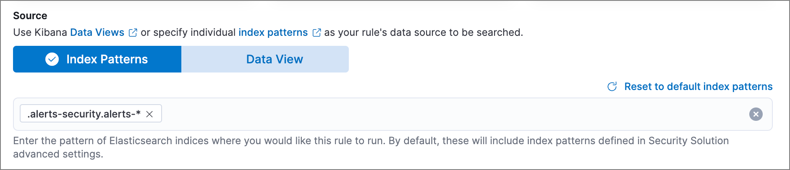

<DocBadge template="technical preview" />

Create building block rules when you do not want to see their generated alerts
in the UI. This is useful when you want:

* A record of low-risk alerts without producing noise in the Alerts table.
* Rules that execute on the alert indices (`.alerts-security.alerts-<kibana space>`).
    You can then use building block rules to create hidden alerts that act as a
    basis for an 'ordinary' rule to generate visible alerts.

## Set up rules that run on alert indices

To create a rule that searches alert indices, select **Index Patterns** as the rule's **Source** and enter the index pattern for alert indices (`.alerts-security.alerts-*`):

## View building block alerts in the UI

By default, building block alerts are excluded from the Overview and Alerts pages.
You can choose to include building block alerts on the Alerts page, which expands the number of alerts.

1. Go to **Alerts**.
1. In the Alerts table, select **Additional filters** →
    **Include building block alerts**, located on the far-right.

<DocCallOut title="Note">
On a building block rule details page, the rule's alerts are displayed (by
default, **Include building block alerts** is selected).
</DocCallOut>

