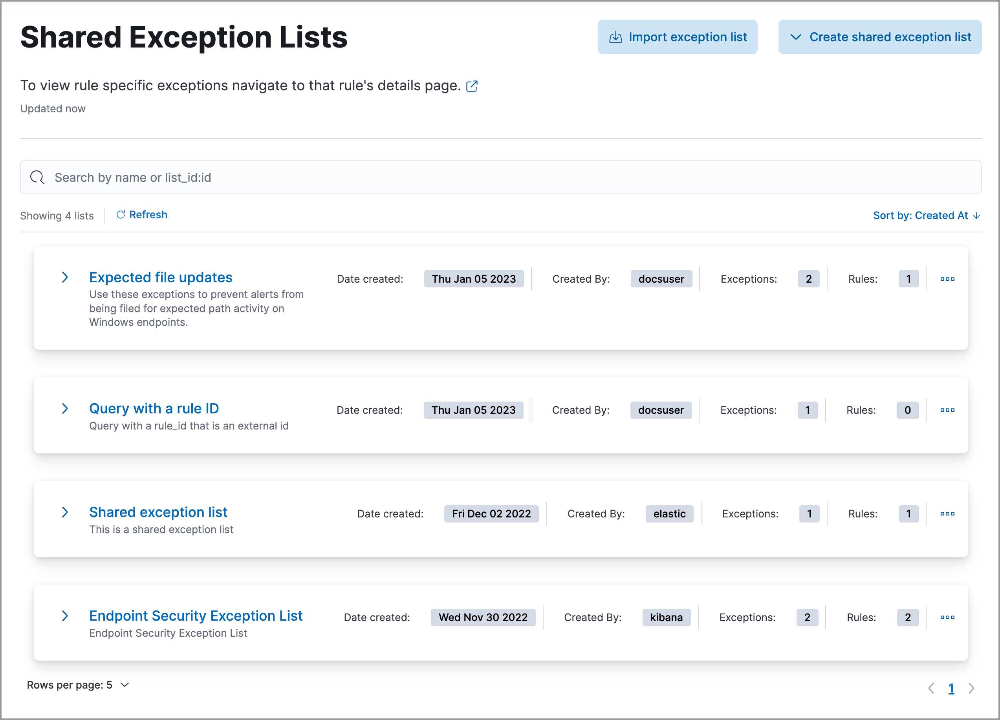

<DocBadge template="technical preview" />

You can associate rule exceptions with detection and endpoint rules to prevent trusted processes and network activity from generating unnecessary alerts, therefore, reducing the number of false positives. 

When creating exceptions, you can assign them to <DocLink slug="/serverless/security/rule-exceptions" section="exceptions-for-individual-rules">individual rules</DocLink> or to <DocLink slug="/serverless/security/rule-exceptions" section="exceptions-shared-among-multiple-rules">multiple rules</DocLink>.

## Exceptions for individual rules

Exceptions, also referred to as _exception items_, contain the source event conditions that determine when alerts shouldn't be generated. 

You can create exceptions that apply exclusively to a single rule. These types of exceptions can't be used by other rules, and you must manage them from the rule’s details page. To learn more about creating and managing single-rule exceptions, refer to <DocLink slug="/serverless/security/add-exceptions">Add and manage exceptions</DocLink>.

<DocImage size="xl" url="../images/detections-ui-exceptions/-detections-exception-item-example.png" alt="An exception item" />

<DocCallOut title="Note">
You can also use <DocLink slug="/serverless/security/value-lists-exceptions">value lists</DocLink> to define exceptions for detection rules. Value lists allow you to match an exception against a list of possible values.
</DocCallOut>

## Exceptions shared among multiple rules 

If you want an exception to apply to multiple rules, you can add an exception to a shared exception list. Shared exception lists allow you to group exceptions together and then associate them with multiple rules. Refer to <DocLink slug="/serverless/security/shared-exception-lists">Create and manage shared exception lists</DocLink> to learn more.

