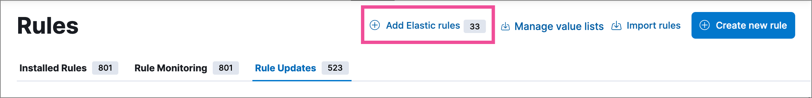
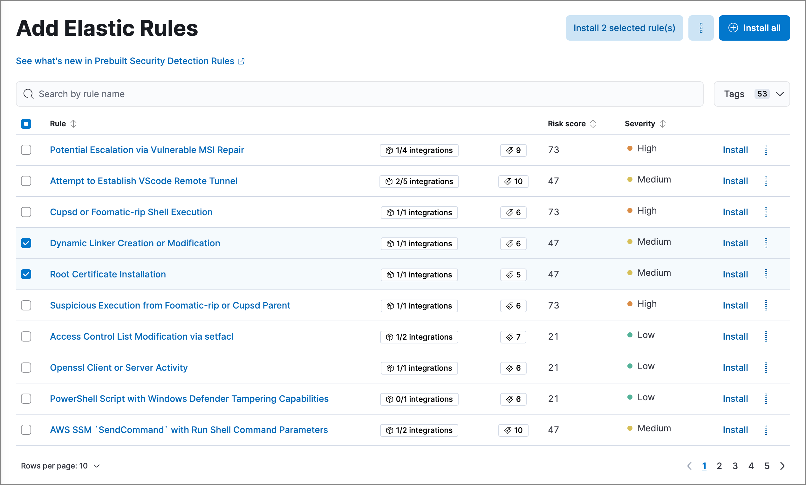
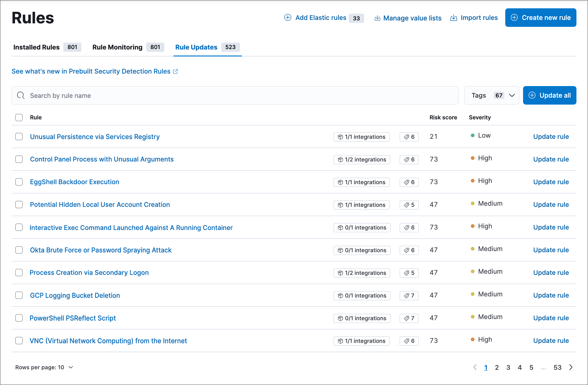

<DocBadge template="technical preview" />

Follow these guidelines to start using the ((security-app))'s <DocLink slug="/serverless/security/prebuilt-rules">prebuilt rules</DocLink>, keep them updated, and make sure they have the data needed to run successfully. 

* <DocLink slug="/serverless/security/prebuilt-rules-management" section="install-and-enable-elastic-prebuilt-rules">Install and enable Elastic prebuilt rules</DocLink>
* <DocLink slug="/serverless/security/prebuilt-rules-management" section="prebuilt-rule-tags">Prebuilt rule tags</DocLink>
* <DocLink slug="/serverless/security/prebuilt-rules-management" section="select-and-duplicate-all-prebuilt-rules">Select and duplicate all prebuilt rules</DocLink>
* <DocLink slug="/serverless/security/prebuilt-rules-management" section="update-elastic-prebuilt-rules">Update Elastic prebuilt rules</DocLink>
* <DocLink slug="/serverless/security/rules-ui-management" section="confirm-rule-prerequisites">Confirm rule prerequisites</DocLink>

<DocCallOut title="Note">

* Prebuilt rules don't start running by default. You must first install the rules, then enable them. After installation, only a few prebuilt rules will be enabled by default, such as the Endpoint Security rule.

* You can't modify most settings on Elastic prebuilt rules. You can only edit <DocLink slug="/serverless/security/rules-create" section="set-up-alert-notifications-optional">rule actions</DocLink> and <DocLink slug="/serverless/security/add-exceptions">add exceptions</DocLink>. If you want to modify other settings on a prebuilt rule, you must first duplicate it, then make your changes to the duplicated rule. However, your customized rule is entirely separate from the original prebuilt rule, and will not get updates from Elastic if the prebuilt rule is updated.

</DocCallOut>

## Install and enable Elastic prebuilt rules

1. Go to **Rules** → **Detection rules (SIEM)**. The badge next to **Add Elastic rules** shows the number of prebuilt rules available for installation. 

    

1. Click **Add Elastic rules**.

    <DocCallOut title="Tip">
    To examine the details of a rule before you install it, select the rule name. This opens the rule details flyout.
    </DocCallOut>

1. Do one of the following:
   * Install all available rules: Click **Install all**.
   * Install a single rule: Click **Install rule** for that rule.
   * Install multiple rules: Select the rules and click **Install _x_ selected rule(s)**.

      <DocCallOut title="Tip">

      Use the search bar and **Tags** filter to find the rules you want to install. For example, filter by `OS: Windows` if your environment only includes Windows endpoints. For more on tag categories, refer to <DocLink slug="/serverless/security/prebuilt-rules-management" section="prebuilt-rule-tags">Prebuilt rule tags</DocLink>.

      </DocCallOut>

   

1. Go back to the **Rules** page, search or filter for any rules you want to run, and do either of the following:

   * Enable a single rule: Turn on the rule's **Enabled** switch.
   * Enable multiple rules: Select the rules, then click **Bulk actions** → **Enable**.

Once you enable a rule, it starts running on its configured schedule. To confirm that it's running successfully, check its **Last response** status in the rules table, or open the rule's details page and check the <DocLink slug="/serverless/security/alerts-ui-monitor" section="execution-results">**Execution results**</DocLink> tab.

## Prebuilt rule tags

Each prebuilt rule includes several tags identifying the rule's purpose, detection method, associated resources, and other information to help categorize your rules. These tags are category-value pairs; for example, `OS: Windows` indicates rules designed for Windows endpoints. Categories include:

* `Data Source`: The application, cloud provider, data shipper, or Elastic integration providing data for the rule.
* `Domain`: A general category of data source types (such as cloud, endpoint, or network).
* `OS`: The host operating system, which could be considered another data source type.
* `Resources`: Additional rule resources such as investigation guides.
* `Rule Type`: Identifies if the rule depends on specialized resources (such as machine learning jobs or threat intelligence indicators), or if it's a higher-order rule built from other rules' alerts.
* `Tactic`: MITRE ATT&CK tactics that the rule addresses.
* `Threat`: Specific threats the rule detects (such as Cobalt Strike or BPFDoor).
* `Use Case`: The type of activity the rule detects and its purpose. Use cases include:
    * `Active Directory Monitoring`: Detects changes related to Active Directory.
    * `Asset Visibility`: Detects changes to specified asset types.
    * `Configuration Audit`: Detects undesirable configuration changes.
    * `Guided Onboarding`: Example rule, used for ((elastic-sec))'s guided onboarding tour.
    * `Identity and Access Audit`: Detects activity related to identity and access management (IAM).
    * `Log Auditing`: Detects activity on log configurations or storage.
    * `Network Security Monitoring`: Detects network security configuration activity.
    * `Threat Detection`: Detects threats.
    * `Vulnerability`: Detects exploitation of specific vulnerabilities.

## Select and duplicate all prebuilt rules

1. Go to **Rules** → **Detection rules (SIEM)**, then select the **Elastic rules** filter.
1. Click **Select all _x_ rules** above the rules table.
1. Click **Bulk actions** → **Duplicate**.
1. Select whether to duplicate the rules' exceptions, then click **Duplicate**.

You can then modify the duplicated rules and, if required, delete the prebuilt ones. However, your customized rules are entirely separate from the original prebuilt rules, and will not get updates from Elastic if the prebuilt rules are updated.

## Update Elastic prebuilt rules

Elastic regularly updates prebuilt rules to optimize their performance and ensure they detect the latest threats and techniques. When updated versions are available for your installed prebuilt rules, the **Rule Updates** tab appears on the **Rules** page, allowing you to update your installed rules with the latest versions.

1. Go to **Rules** → **Detection rules (SIEM)**, then select the **Rule Updates** tab.

    <DocCallOut title="Note">
    The **Rule Updates** tab doesn't appear if all your installed prebuilt rules are up to date.
    </DocCallOut>

    

1. (Optional) To examine the details of a rule's latest version before you update it, select the rule name. This opens the rule details flyout.

    Select the **Updates** tab to view rule changes field by field, or the **JSON view** tab to view changes for the entire rule in JSON format. Both tabs display side-by-side comparisons of the **Current rule** (what you currently have installed) and the **Elastic update** version (what you can choose to install). Deleted characters are highlighted in red; added characters are highlighted in green.

    To accept the changes and install the updated version, select **Update**.

    

1. Do one of the following to update prebuilt rules on the **Rules** page:
    * Update all available rules: Click **Update all**.
    * Update a single rule: Click **Update rule** for that rule.
    * Update multiple rules: Select the rules and click **Update _x_ selected rule(s)**.

        <DocCallOut title="Tip">
        Use the search bar and **Tags** filter to find the rules you want to update. For example, filter by `OS: Windows` if your environment only includes Windows endpoints. For more on tag categories, refer to <DocLink slug="/serverless/security/prebuilt-rules-management" section="prebuilt-rule-tags">Prebuilt rule tags</DocLink>.
        </DocCallOut>
