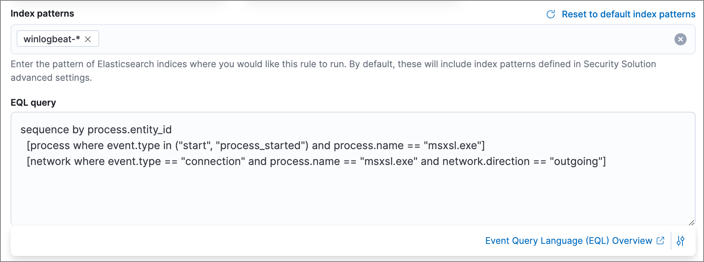
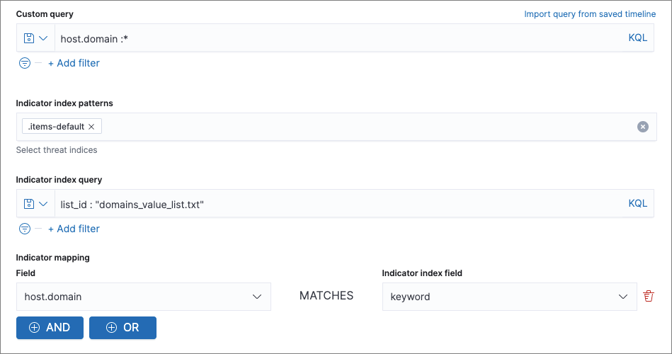
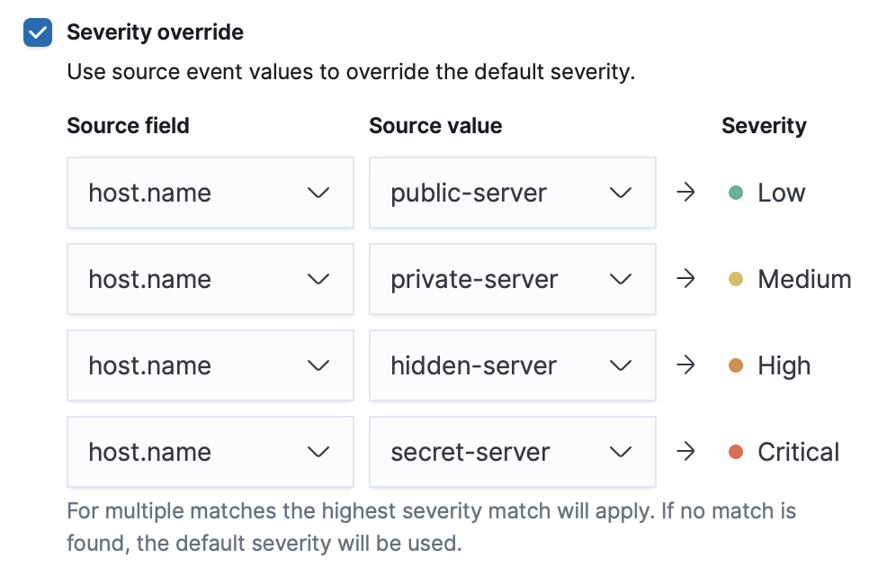
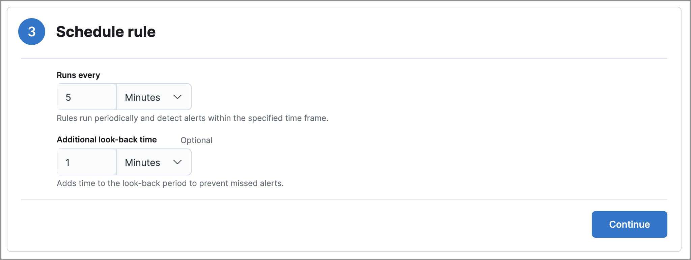
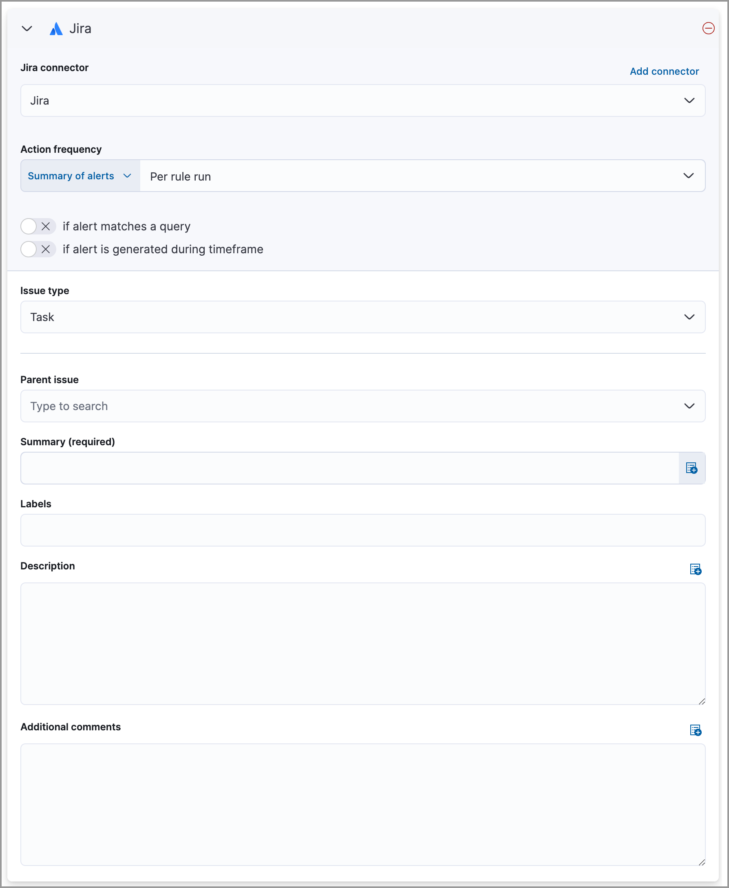
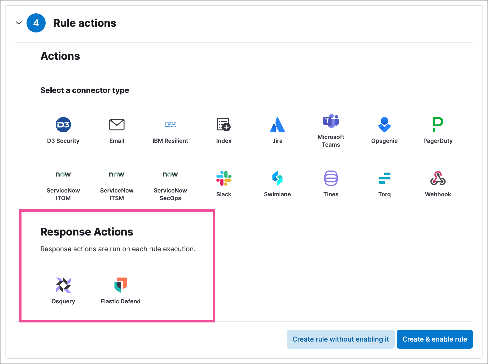
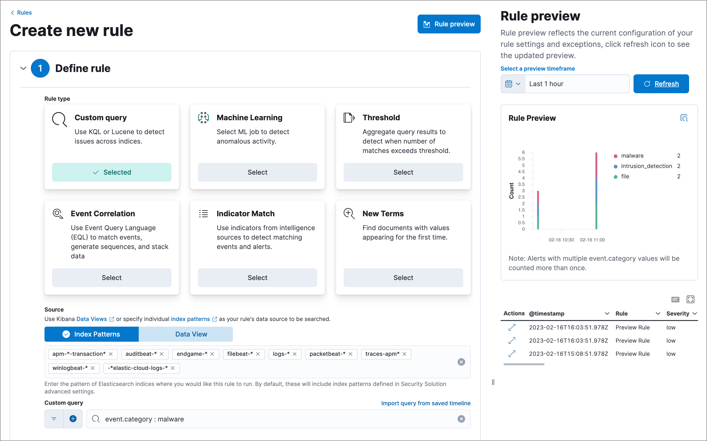

<DocBadge template="technical preview" />
<div id="rules-ui-create"></div>

To create a new detection rule, follow these steps:

1. Define the <DocLink slug="/serverless/security/about-rules" section="rule-types">**rule type**</DocLink>. The configuration for this step varies depending on the rule type. 
1. Configure basic rule settings.
1. Configure advanced rule settings (optional).
1. Set the rule's schedule.
1. Set up rule actions (optional).
1. Set up response actions (optional).

<DocCallOut title="Requirements">

* To create detection rules, you must have access to data views, which requires the appropriate user role.

* You'll also need permissions to enable and view detections, manage rules, manage alerts, and preview rules. These permissions depend on the user role. Refer to <DocLink slug="/serverless/security/detections-requirements">Detections requirements</DocLink> for more information.

</DocCallOut>

<DocCallOut title="Tip">
At any step, you can <DocLink slug="/serverless/security/rules-create" section="preview-your-rule-optional">preview the rule</DocLink> before saving it to see what kind of results you can expect.
</DocCallOut>

<div id="create-ml-rule"></div>

## Create a machine learning rule

<DocCallOut title="Important" color="warning">
To create or edit ((ml)) rules, you need an appropriate user role. Additionally, the selected ((ml)) job must be running for the rule to function correctly.
</DocCallOut>
1. Go to **Rules** → **Detection rules (SIEM)** → **Create new rule**. The **Create new rule** page displays.
1. To create a rule based on a ((ml)) anomaly threshold, select **Machine Learning**,
    then select:

    1. The required ((ml)) jobs. 

        <DocCallOut title="Note">
        If a required job isn't currently running, it will automatically start when you finish configuring and enable the rule.
        </DocCallOut>

    1. The anomaly score threshold above which alerts are created.

1. <DocBadge template="technical preview" /> (Optional) Use **Suppress alerts by** to reduce the number of repeated or duplicate alerts created by the rule. Refer to <DocLink slug="/serverless/security/alert-suppression">Suppress detection alerts</DocLink> for more information.

    <DocCallOut title="Note">
    Because ((ml)) rules generate alerts from anomalies, which don't contain source event fields, you can only use anomaly fields when configuring alert suppression.
    </DocCallOut>

    {/* The following steps are repeated across multiple rule types. If you change anything 
    in these steps or sub-steps, apply the change to the other rule types, too. */}
1. (Optional) Add **Related integrations** to associate the rule with one or more [Elastic integrations](((integrations-docs))). This indicates the rule's dependency on specific integrations and the data they generate, and allows users to confirm each integration's <DocLink slug="/serverless/security/rules-ui-management" section="confirm-rule-prerequisites">installation status</DocLink> when viewing the rule. 

    1. Click **Add integration**, then select an integration from the list. You can also start typing an integration's name to find it faster.

    1. Enter the version of the integration you want to associate with the rule, using [semantic versioning](https://semver.org/). For version ranges, you must use tilde or caret syntax. For example, `~1.2.3` is from 1.2.3 to any patch version less than 1.3.0, and `^1.2.3` is from 1.2.3 to any minor and patch version less than 2.0.0.

1. Click **Continue** to <DocLink slug="/serverless/security/rules-create" section="configure-basic-rule-settings">configure basic rule settings</DocLink>.

<div id="create-custom-rule"></div>

## Create a custom query rule
1. Go to **Rules** → **Detection rules (SIEM)** → **Create new rule**. The **Create new rule** page displays.
1. To create a rule based on a KQL or Lucene query, select **Custom query**,
    then:

    1. Define which ((es)) indices or data view the rule searches for alerts.
    1. Use the filter and query fields to create the criteria used for detecting
        alerts.

        The following example (based on the prebuilt rule Volume Shadow Copy Deleted or Resized via VssAdmin) detects when the `vssadmin delete shadows`
        Windows command is executed:

        * **Index patterns**: `winlogbeat-*`

            Winlogbeat ships Windows event logs to ((elastic-sec)).

        * **Custom query**: `event.action:"Process Create (rule: ProcessCreate)" and process.name:"vssadmin.exe" and process.args:("delete" and "shadows")`

            Searches the `winlogbeat-*` indices for `vssadmin.exe` executions with
            the `delete` and `shadow` arguments, which are used to delete a volume's shadow
            copies.

            

    1. You can use saved queries (<DocIcon type="filterInCircle" title="Filter" />) and queries from saved Timelines (**Import query from saved Timeline**) as rule conditions.

        When you use a saved query, the **Load saved query "_query name_" dynamically on each rule execution** check box appears:

            * Select this to use the saved query every time the rule runs. This links the rule to the saved query, and you won't be able to modify the rule's **Custom query** field or filters because the rule will only use settings from the saved query. To make changes, modify the saved query itself.

            * Deselect this to load the saved query as a one-time way of populating the rule's **Custom query** field and filters. This copies the settings from the saved query to the rule, so you can then further adjust the rule's query and filters as needed. If the saved query is later changed, the rule will not inherit those changes.

1. (Optional) Use **Suppress alerts by** to reduce the number of repeated or duplicate alerts created by the rule. Refer to <DocLink slug="/serverless/security/alert-suppression">Suppress detection alerts</DocLink> for more information.

    {/* The following steps are repeated across multiple rule types. If you change anything 
    in these steps or sub-steps, apply the change to the other rule types, too. */}
1. (Optional) Create a list of **Required fields** that the rule needs to function. This list is informational only, to help users understand the rule; it doesn't affect how the rule actually runs.

    1. Click **Add required field**, then select a field from the index patterns or data view you specified for the rule. You can also start typing a field's name to find it faster, or type in an entirely new custom field.

    1. Enter the field's data type.

1. (Optional) Add **Related integrations** to associate the rule with one or more [Elastic integrations](((integrations-docs))). This indicates the rule's dependency on specific integrations and the data they generate, and allows users to confirm each integration's <DocLink slug="/serverless/security/rules-ui-management" section="confirm-rule-prerequisites">installation status</DocLink> when viewing the rule. 

    1. Click **Add integration**, then select an integration from the list. You can also start typing an integration's name to find it faster.

    1. Enter the version of the integration you want to associate with the rule, using [semantic versioning](https://semver.org/). For version ranges, you must use tilde or caret syntax. For example, `~1.2.3` is from 1.2.3 to any patch version less than 1.3.0, and `^1.2.3` is from 1.2.3 to any minor and patch version less than 2.0.0.

1. Click **Continue** to <DocLink slug="/serverless/security/rules-create" section="configure-basic-rule-settings">configure basic rule settings</DocLink>.

<div id="create-threshold-rule"></div>

## Create a threshold rule
1. Go to **Rules** → **Detection rules (SIEM)** → **Create new rule**. The **Create new rule** page displays.
1. To create a rule based on a source event field threshold, select **Threshold**, then:
    1. Define which ((es)) indices the rule analyzes for alerts.
    1. Use the filter and query fields to create the criteria used for detecting
        alerts.

        <DocCallOut title="Note">
        You can use saved queries (<DocIcon type="filterInCircle" title="Filter" />) and queries from saved Timelines (**Import query from saved Timeline**) as rule conditions.
        </DocCallOut>

    1. Use the **Group by** and **Threshold** fields to determine which source event field is used as a threshold and the threshold's value.
    1. Use the **Count** field to limit alerts by cardinality of a certain field.

        For example, if **Group by** is `source.ip, destination.ip` and its **Threshold** is `10`, an alert is generated for every pair of source and destination IP addresses that appear in at least 10 of the rule's search results.

        You can also leave the **Group by** field undefined. The rule then creates an alert when the number of search results is equal to or greater than the threshold value. If you set **Count** to limit the results by `process.name` >= 2, an alert will only be generated for source/destination IP pairs that appear with at least 2 unique process names across all events.

        <DocCallOut title="Important" color="warning">
        Alerts created by threshold rules are synthetic alerts that do not resemble the source documents. The alert itself only contains data about the fields that were aggregated over (the **Group by** fields). Other fields are omitted, because they can vary across all source documents that were counted toward the threshold. Additionally, you can reference the actual count of documents that exceeded the threshold from the `kibana.alert.threshold_result.count` field.
        </DocCallOut>

1. <DocBadge template="technical preview" /> (Optional) Select **Suppress alerts** to reduce the number of repeated or duplicate alerts created by the rule. Refer to <DocLink slug="/serverless/security/alert-suppression">Suppress detection alerts</DocLink> for more information.

    {/* The following steps are repeated across multiple rule types. If you change anything 
    in these steps or sub-steps, apply the change to the other rule types, too. */}
1. (Optional) Create a list of **Required fields** that the rule needs to function. This list is informational only, to help users understand the rule; it doesn't affect how the rule actually runs.

    1. Click **Add required field**, then select a field from the index patterns or data view you specified for the rule. You can also start typing a field's name to find it faster, or type in an entirely new custom field.

    1. Enter the field's data type.

1. (Optional) Add **Related integrations** to associate the rule with one or more [Elastic integrations](((integrations-docs))). This indicates the rule's dependency on specific integrations and the data they generate, and allows users to confirm each integration's <DocLink slug="/serverless/security/rules-ui-management" section="confirm-rule-prerequisites">installation status</DocLink> when viewing the rule. 

    1. Click **Add integration**, then select an integration from the list. You can also start typing an integration's name to find it faster.

    1. Enter the version of the integration you want to associate with the rule, using [semantic versioning](https://semver.org/). For version ranges, you must use tilde or caret syntax. For example, `~1.2.3` is from 1.2.3 to any patch version less than 1.3.0, and `^1.2.3` is from 1.2.3 to any minor and patch version less than 2.0.0.

1. Click **Continue** to <DocLink slug="/serverless/security/rules-create" section="configure-basic-rule-settings">configure basic rule settings</DocLink>.

<div id="create-eql-rule"></div>

## Create an event correlation rule
1. Go to **Rules** → **Detection rules (SIEM)** → **Create new rule**. The **Create new rule** page displays.
1. To create an event correlation rule using EQL, select **Event Correlation**, then:
    1. Define which ((es)) indices or data view the rule searches when querying for events.
    1. Write an [EQL query](((ref))/eql-syntax.html) that searches for matching events or a series of matching events.

        <DocCallOut title="Tip">
        To find events that are missing in a sequence, use the [missing events](((ref))/eql-syntax.html#eql-missing-events) syntax.
        </DocCallOut>  

        For example, the following rule detects when `msxsl.exe` makes an outbound
        network connection:    

        * **Index patterns**: `winlogbeat-*`

            Winlogbeat ships Windows events to ((elastic-sec)).

        * **EQL query**:

            ```eql
            sequence by process.entity_id
              [process
                where event.type in ("start", "process_started")
                and process.name == "msxsl.exe"]
              [network
                where event.type == "connection"
                and process.name == "msxsl.exe"
                and network.direction == "outgoing"]
            ```

            Searches the `winlogbeat-*` indices for sequences of a `msxsl.exe` process start
            event followed by an outbound network connection event that was started by the
            `msxsl.exe` process.

            

            <DocCallOut title="Note">
            For sequence events, the ((security-app)) generates a single alert when all events listed in the sequence are detected. To see the matched sequence events in more detail, you can view the alert in the Timeline, and, if all events came from the same process, open the alert in Analyze Event view.

            </DocCallOut>

1. (Optional) Click the EQL settings icon (<DocIcon type="controlsVertical" title="EQL settings" />) to configure additional fields used by [EQL search](((ref))/eql.html#specify-a-timestamp-or-event-category-field):
    * **Event category field**: Contains the event classification, such as `process`, `file`, or `network`. This field is typically mapped as a field type in the [keyword family](((ref))/keyword.html). Defaults to the `event.category` ECS field.
    * **Tiebreaker field**: Sets a secondary field for sorting events (in ascending, lexicographic order) if they have the same timestamp.
    * **Timestamp field**: Contains the event timestamp used for sorting a sequence of events. This is different from the **Timestamp override** advanced setting, which is used for querying events within a range. Defaults to the `@timestamp` ECS field.

1. <DocBadge template="technical preview" /> (Optional) Use **Suppress alerts by** to reduce the number of repeated or duplicate alerts created by the rule. Refer to <DocLink slug="/serverless/security/alert-suppression">Suppress detection alerts</DocLink> for more information.

    {/* The following steps are repeated across multiple rule types. If you change anything 
    in these steps or sub-steps, apply the change to the other rule types, too. */}
1. (Optional) Create a list of **Required fields** that the rule needs to function. This list is informational only, to help users understand the rule; it doesn't affect how the rule actually runs.

    1. Click **Add required field**, then select a field from the index patterns or data view you specified for the rule. You can also start typing a field's name to find it faster, or type in an entirely new custom field.

    1. Enter the field's data type.

1. (Optional) Add **Related integrations** to associate the rule with one or more [Elastic integrations](((integrations-docs))). This indicates the rule's dependency on specific integrations and the data they generate, and allows users to confirm each integration's <DocLink slug="/serverless/security/rules-ui-management" section="confirm-rule-prerequisites">installation status</DocLink> when viewing the rule. 

    1. Click **Add integration**, then select an integration from the list. You can also start typing an integration's name to find it faster.

    1. Enter the version of the integration you want to associate with the rule, using [semantic versioning](https://semver.org/). For version ranges, you must use tilde or caret syntax. For example, `~1.2.3` is from 1.2.3 to any patch version less than 1.3.0, and `^1.2.3` is from 1.2.3 to any minor and patch version less than 2.0.0.

1. Click **Continue** to <DocLink slug="/serverless/security/rules-create" section="configure-basic-rule-settings">configure basic rule settings</DocLink>.

<div id="create-indicator-rule"></div>

## Create an indicator match rule

<DocCallOut title="Note">
((elastic-sec)) provides limited support for indicator match rules. See <DocLink slug="/serverless/security/detection-engine-overview" section="limited-support-for-indicator-match-rules">Limited support for indicator match rules</DocLink> for more information.
</DocCallOut>

1. Go to **Rules** → **Detection rules (SIEM)** → **Create new rule**. The **Create new rule** page displays.
1. To create a rule that searches for events whose specified field value matches the specified indicator field value in the indicator index patterns, select **Indicator Match**, then fill in the following fields:
    1. **Source**: The individual index patterns or data view that specifies what data to search.
    1. **Custom query**: The query and filters used to retrieve the required results from
        the ((elastic-sec)) event indices. For example, if you want to match documents that only contain a `destination.ip` address field, add `destination.ip : *`.

        <DocCallOut title="Tip">
        If you want the rule to check every field in the indices, use this
        wildcard expression: `*:*`.
        </DocCallOut>

        <DocCallOut title="Note">
        You can use saved queries (<DocIcon type="filterInCircle" title="Filter" />) and queries from saved Timelines (**Import query from saved Timeline**) as rule conditions.
        </DocCallOut>

    1. **Indicator index patterns**: The indicator index patterns containing field values for which you want to generate alerts. This field is automatically populated with indices specified in the `securitySolution:defaultThreatIndex` advanced setting. For more information, see <DocLink slug="/serverless/security/advanced-settings" section="update-default-elastic-security-threat-intelligence-indices">Update default Elastic Security threat intelligence indices</DocLink>.

        <DocCallOut title="Important" color="warning">
        Data in indicator indices must be <DocLink slug="/serverless/security/siem-field-reference">ECS compatible</DocLink>, and so it must contain a `@timestamp` field.
        </DocCallOut>

    1. **Indicator index query**: The query and filters used to filter the fields from
        the indicator index patterns. The default query `@timestamp > "now-30d/d"` searches specified indicator indices for indicators ingested during the past 30 days and rounds the start time down to the nearest day (resolves to UTC `00:00:00`).

    1. **Indicator mapping**: Compares the values of the specified event and indicator fields, and generates an alert if the values are identical. 
        
        <DocCallOut title="Note">
        Only single-value fields are supported.
        </DocCallOut>

        To define which field values are compared from the indices, add the following:

        * **Field**: The field used for comparing values in the ((elastic-sec)) event
            indices.

        * **Indicator index field**: The field used for comparing values in the indicator
            indices.

    1. You can add `AND` and `OR` clauses to define when alerts are generated.

        For example, to create a rule that generates alerts when `host.name` **and**
        `destination.ip` field values in the `logs-*` or `packetbeat-*` ((elastic-sec)) indices
        are identical to the corresponding field values in the `mock-threat-list` indicator
        index, enter the rule parameters seen in the following image:

        

        <DocCallOut title="Tip">
        Before you create rules, create <DocLink slug="/serverless/security/timelines-ui">Timeline templates</DocLink> so
        they can be selected here. When alerts generated by the rule are investigated in the Timeline, Timeline query values are replaced with their corresponding alert field values.
        </DocCallOut>

1. <DocBadge template="technical preview" /> (Optional) Use **Suppress alerts by** to reduce the number of repeated or duplicate alerts created by the rule. Refer to <DocLink slug="/serverless/security/alert-suppression">Suppress detection alerts</DocLink> for more information.

    {/* The following steps are repeated across multiple rule types. If you change anything 
    in these steps or sub-steps, apply the change to the other rule types, too. */}
1. (Optional) Create a list of **Required fields** that the rule needs to function. This list is informational only, to help users understand the rule; it doesn't affect how the rule actually runs.

    1. Click **Add required field**, then select a field from the index patterns or data view you specified for the rule. You can also start typing a field's name to find it faster, or type in an entirely new custom field.

    1. Enter the field's data type.

1. (Optional) Add **Related integrations** to associate the rule with one or more [Elastic integrations](((integrations-docs))). This indicates the rule's dependency on specific integrations and the data they generate, and allows users to confirm each integration's <DocLink slug="/serverless/security/rules-ui-management" section="confirm-rule-prerequisites">installation status</DocLink> when viewing the rule. 

    1. Click **Add integration**, then select an integration from the list. You can also start typing an integration's name to find it faster.

    1. Enter the version of the integration you want to associate with the rule, using [semantic versioning](https://semver.org/). For version ranges, you must use tilde or caret syntax. For example, `~1.2.3` is from 1.2.3 to any patch version less than 1.3.0, and `^1.2.3` is from 1.2.3 to any minor and patch version less than 2.0.0.

1. Click **Continue** to <DocLink slug="/serverless/security/rules-create" section="configure-basic-rule-settings">configure basic rule settings</DocLink>.

<div id="indicator-value-lists"></div>

### Use value lists with indicator match rules

While there are numerous ways you can add data into indicator indices, you can use value lists as the indicator match index in an indicator match rule. Take the following scenario, for example:

You uploaded a value list of known ransomware domains, and you want to be notified if any of those domains matches a value contained in a domain field in your security event index pattern.

1. Upload a value list of indicators.
1. Create an indicator match rule and fill in the following fields:
    1. **Index patterns**: The Elastic Security event indices on which the rule runs.
    1. **Custom query**: The query and filters used to retrieve the required results from the Elastic Security event indices (e.g., `host.domain :*`).
    1. **Indicator index patterns**: Value lists are stored in a hidden index called `.items-<Kibana space>`. Enter the name of the ((kib)) space in which this rule will run in this field.
    1. **Indicator index query**: Enter the value `list_id :`, followed by the name of the value list you want to use as your indicator index (uploaded in Step 1 above).
    1. **Indicator mapping**
        * **Field**: Enter the field from the Elastic Security event indices to be used for comparing values.
        * **Indicator index field**: Enter the type of value list you created (i.e., `keyword`, `text`, or `IP`).

        <DocCallOut title="Tip">
        If you don't remember this information, go to **Rules** → **Detection rules (SIEM)** → **Manage value lists**. Locate the appropriate value list and note the field in the corresponding `Type` column. (Examples include keyword, text, and IP.)
        </DocCallOut>



<div id="create-new-terms-rule"></div>

## Create a new terms rule

1. Go to **Rules** → **Detection rules (SIEM)** → **Create new rule**. The **Create new rule** page displays.
1. To create a rule that searches for each new term detected in source documents, select **New Terms**, then:
    1. Specify what data to search by entering individual ((es)) index patterns or selecting an existing data view.
    1. Use the filter and query fields to create the criteria used for detecting
        alerts.

        <DocCallOut title="Note">
        You can use saved queries (<DocIcon type="filterInCircle" title="Filter" />) and queries from saved Timelines (**Import query from saved Timeline**) as rule conditions.

        </DocCallOut>

    1. Use the **Fields** menu to select a field to check for new terms. You can also select up to three fields to detect a combination of new terms (for example, a `host.ip` and `host.id` that have never been observed together before).

        <DocCallOut title="Important" color="warning">
        When checking multiple fields, each unique combination of values from those fields is evaluated separately. For example, a document with `host.name: ["host-1", "host-2", "host-3"]` and `user.name: ["user-1", "user-2", "user-3"]` has 9 (3x3) unique combinations of `host.name` and `user.name`. A document with 11 values in `host.name` and 10 values in `user.name` has 110 (11x10) unique combinations. The new terms rule only evaluates 100 unique combinations per document, so selecting fields with large arrays of values might cause incorrect results.
        </DocCallOut>

    1. Use the **History Window Size** menu to specify the time range to search in minutes, hours, or days to determine if a term is new. The history window size must be larger than the rule interval plus additional look-back time, because the rule will look for terms where the only time(s) the term appears within the history window is _also_ within the rule interval and additional look-back time.

        For example, if a rule has an interval of 5 minutes, no additional look-back time, and a history window size of 7 days, a term will be considered new only if the time it appears within the last 7 days is also within the last 5 minutes. Configure the rule interval and additional look-back time when you <DocLink slug="/serverless/security/rules-create" section="set-the-rules-schedule">set the rule's schedule</DocLink>.

1. <DocBadge template="technical preview" /> (Optional) Use **Suppress alerts by** to reduce the number of repeated or duplicate alerts created by the rule. Refer to <DocLink slug="/serverless/security/alert-suppression">Suppress detection alerts</DocLink> for more information.

    {/* The following steps are repeated across multiple rule types. If you change anything 
    in these steps or sub-steps, apply the change to the other rule types, too. */}
1. (Optional) Create a list of **Required fields** that the rule needs to function. This list is informational only, to help users understand the rule; it doesn't affect how the rule actually runs.

    1. Click **Add required field**, then select a field from the index patterns or data view you specified for the rule. You can also start typing a field's name to find it faster, or type in an entirely new custom field.

    1. Enter the field's data type.

1. (Optional) Add **Related integrations** to associate the rule with one or more [Elastic integrations](((integrations-docs))). This indicates the rule's dependency on specific integrations and the data they generate, and allows users to confirm each integration's <DocLink slug="/serverless/security/rules-ui-management" section="confirm-rule-prerequisites">installation status</DocLink> when viewing the rule. 

    1. Click **Add integration**, then select an integration from the list. You can also start typing an integration's name to find it faster.

    1. Enter the version of the integration you want to associate with the rule, using [semantic versioning](https://semver.org/). For version ranges, you must use tilde or caret syntax. For example, `~1.2.3` is from 1.2.3 to any patch version less than 1.3.0, and `^1.2.3` is from 1.2.3 to any minor and patch version less than 2.0.0.

1. Click **Continue** to <DocLink slug="/serverless/security/rules-create" section="configure-basic-rule-settings">configure basic rule settings</DocLink>.

<div id="create-esql-rule"></div>

## Create an ((esql)) rule

Use [((esql))](((ref))/esql.html) to query your source events and aggregate event data. Query results are returned in a table with rows and columns. Each row becomes an alert.

To create an ((esql)) rule:

1. Go to **Rules** → **Detection rules (SIEM)** → **Create new rule**. The **Create new rule** page appears.
1. Select **((esql))**, then write a query. 

    <DocCallOut title="Note">
    Refer to the sections below to learn more about <DocLink slug="/serverless/security/rules-create" section="esql-rule-query-types"> ((esql)) query types</DocLink>, <DocLink slug="/serverless/security/rules-create" section="esql-query-design"> query design considerations</DocLink>, and <DocLink slug="/serverless/security/rules-create" section="esql-rule-limitations"> rule limitations</DocLink>. 
    </DocCallOut>

    <DocCallOut title="Tip">
    Click the help icon (<DocIcon type="iInCircle" title="Click the ES|QL help icon" />) to open the in-product reference documentation for all ((esql)) commands and functions.
    </DocCallOut>

1. <DocBadge template="technical preview" /> (Optional) Use **Suppress alerts by** to reduce the number of repeated or duplicate alerts created by the rule. Refer to <DocLink slug="/serverless/security/alert-suppression">Suppress detection alerts</DocLink> for more information.

    {/* The following steps are repeated across multiple rule types. If you change anything 
    in these steps or sub-steps, apply the change to the other rule types, too. */}
1. (Optional) Create a list of **Required fields** that the rule needs to function. This list is informational only, to help users understand the rule; it doesn't affect how the rule actually runs.

    1. Click **Add required field**, then select a field from the index patterns or data view you specified for the rule. You can also start typing a field's name to find it faster, or type in an entirely new custom field.

    1. Enter the field's data type.

1. (Optional) Add **Related integrations** to associate the rule with one or more [Elastic integrations](((integrations-docs))). This indicates the rule's dependency on specific integrations and the data they generate, and allows users to confirm each integration's <DocLink slug="/serverless/security/rules-ui-management" section="confirm-rule-prerequisites">installation status</DocLink> when viewing the rule. 

    1. Click **Add integration**, then select an integration from the list. You can also start typing an integration's name to find it faster.

    1. Enter the version of the integration you want to associate with the rule, using [semantic versioning](https://semver.org/). For version ranges, you must use tilde or caret syntax. For example, `~1.2.3` is from 1.2.3 to any patch version less than 1.3.0, and `^1.2.3` is from 1.2.3 to any minor and patch version less than 2.0.0.

1. Click **Continue** to <DocLink slug="/serverless/security/rules-create" section="configure-basic-rule-settings">configure basic rule settings</DocLink>.

<div id="esql-rule-query-types"></div>

### ((esql)) query types 

((esql)) rule queries are loosely categorized into two types: aggregating and non-aggregating. 

<div id="esql-agg-query"></div>

#### Aggregating query

Aggregating queries use [`STATS...BY`](((ref))/esql-functions-operators.html#esql-agg-functions) functions to aggregate source event data. Alerts generated by a rule with an aggregating query only contain the fields that the ((esql)) query returns and any new fields that the query creates.

    <DocCallOut title="Note">
    A _new field_ is a field that doesn't exist in the query's source index and is instead created when the rule runs. You can access new fields in the details of any alerts that are generated by the rule. For example, if you use the `STATS...BY` function to create a column with aggregated values, the column is created when the rule runs and is added as a new field to any alerts that are generated by the rule. 
    </DocCallOut>

Here is an example aggregating query:

```esql
FROM logs-*
| STATS host_count = COUNT(host.name) BY host.name
| SORT host_count DESC
| WHERE host_count > 20
```

- This query starts by searching logs from indices that match the pattern `logs-*`. 
- The query then aggregates the count of events by `host.name`.
- Next, it sorts the result by `host_count` in descending order.
- Then, it filters for events where the `host_count` field appears more than 20 times during the specified rule interval.

<DocCallOut title="Note">
Rules that use aggregating queries might create duplicate alerts. This can happen  when events that occur in the additional look-back time are aggregated both in the current rule execution and in a previous rule execution.
</DocCallOut>

<div id="esql-non-agg-query"></div>

#### Non-aggregating query 

Non-aggregating queries don't use `STATS...BY` functions and don't aggregate source event data. Alerts generated by a non-aggregating query contain source event fields that the query returns, new fields the query creates, and all other fields in the source event document. 

    <DocCallOut title="Note">
    A _new field_ is a field that doesn't exist in the query's source index and is instead created when the rule runs. You can access new fields in the details of any alerts that are generated by the rule. For example, if you use the [`EVAL`](((ref))/esql-commands.html#esql-eval) command to append new columns with calculated values, the columns are created when the rule runs and are added as new fields to any alerts generated by the rule.
    </DocCallOut>

Here is an example non-aggregating query:

```esql
FROM logs-* METADATA _id, _index, _version
| WHERE event.category == "process"  AND event.id == "8a4f500d"
| LIMIT 10
```
- This query starts by querying logs from indices that match the pattern `logs-*`. The `METADATA _id, _index, _version` operator allows <DocLink slug="/serverless/security/rules-create" section="esql-non-agg-query-dedupe"> alert deduplication</DocLink>.  
- Next, the query filters events where the `event.category` is a process and the `event.id` is `8a4f500d`. 
- Then, it limits the output to the top 10 results.

<div id="esql-non-agg-query-dedupe"></div>

#### Turn on alert deduplication for rules using non-aggregating queries

To deduplicate alerts, a query needs access to the `_id`, `_index`, and `_version` metadata fields of the queried source event documents. You can allow this by adding the `METADATA _id, _index, _version` operator after the `FROM` source command, for example:

```esql
FROM logs-* METADATA _id, _index, _version
| WHERE event.category == "process"  AND event.id == "8a4f500d"
| LIMIT 10
```

When those metadata fields are provided, unique alert IDs are created for each alert generated by the query.

When developing the query, make sure you don't [`DROP`](((ref))/esql-commands.html#esql-drop) or filter out the `_id`, `_index`, or `_version` metadata fields. 

Here is an example of a query that fails to deduplicate alerts. It uses the `DROP` command to omit the `_id` property from the results table:

```esql
FROM logs-* METADATA _id, _index, _version
| WHERE event.category == "process"  AND event.id == "8a4f500d"
| DROP _id
| LIMIT 10
```

Here is another example of an invalid query that uses the `KEEP` command to only return `event.*` fields in the results table: 

```esql
FROM logs-* METADATA _id, _index, _version
| WHERE event.category == "process"  AND event.id == "8a4f500d"
| KEEP event.*
| LIMIT 10
```

<div id="esql-query-design"></div>

### Query design considerations 

When writing your query, consider the following:

- The [`LIMIT`](((ref))/esql-commands.html#esql-limit) command specifies the maximum number of rows an ((esql)) query returns and the maximum number of alerts created per rule run. Similarly, a detection rule's **Max alerts per run** setting specifies the maximum number of alerts it can create every time it runs.

    If the `LIMIT` value and **Max alerts per run** value are different, the rule uses the lower value to determine the maximum number of alerts the rule generates.

- When writing an aggregating query, use the [`STATS...BY`](((ref))/esql-commands.html#esql-stats-by) command with fields that you want to search and filter for after alerts are created. For example, using the `host.name`, `user.name`, `process.name` fields with the `BY` operator of the `STATS...BY` command returns these fields in alert documents, and allows you to search and filter for them from the Alerts table. 

- When configuring alert suppression on a non-aggregating query, we recommend sorting results by ascending `@timestamp` order. Doing so ensures that alerts are properly suppressed, especially if the number of alerts generated is higher than the **Max alerts per run** value.

<div id="esql-rule-limitations"></div>

### ((esql)) rule limitations  

If your ((esql)) query creates new fields that aren’t part of the ECS schema, they aren't mapped to the alerts index, so you can't search for or filter them in the Alerts table. As a workaround, create <DocLink slug="/serverless/security/runtime-fields">runtime fields</DocLink>. 

<div id="custom-highlighted-esql-fields"></div>

### Highlight fields returned by the ((esql)) rule query  

When configuring an ((esql)) rule's **<DocLink slug="/serverless/security/rules-create" section="rule-ui-advanced-params">Custom highlighted fields</DocLink>**, you can specify any fields that the rule's aggregating or non-aggregating query return. This can help ensure that returned fields are visible in the alert details flyout while you're investigating alerts.   

<div id="rule-ui-basic-params"></div>

## Configure basic rule settings

1. In the **About rule** pane, fill in the following fields:
    1. **Name**: The rule's name.
    1. **Description**: A description of what the rule does.
    1. **Default severity**: Select the severity level of alerts created by the rule:
        * **Low**: Alerts that are of interest but generally are not considered to be security incidents. Sometimes a combination of low severity alerts can indicate suspicious activity.

        * **Medium**: Alerts that require investigation.
        * **High**: Alerts that require an immediate investigation.
        * **Critical**: Alerts that indicate it is highly likely a security  incident has occurred.

    1. **Severity override** (optional): Select to use source event values to
        override the **Default severity** in generated alerts. When selected, a UI
        component is displayed where you can map the source event field values to
        severity levels. The following example shows how to map severity levels to `host.name`
        values:

        

        <DocCallOut title="Note">
        For threshold rules, not all source event values can be used for overrides; only the fields that were aggregated over (the `Group by` fields) will contain data. Please also note that overrides are not supported for event correlation rules.
        </DocCallOut>

    1. **Default risk score**: A numerical value between 0 and 100 that indicates the risk of events detected by the rule. This setting changes to a default value when you change the **Severity** level, but you can adjust the risk score as needed. General guidelines are:
        * `0` - `21` represents low severity.
        * `22` - `47` represents medium severity.
        * `48` - `73` represents high severity.
        * `74` - `100` represents critical severity.
    1. **Risk score override** (optional): Select to use a source event value to
        override the **Default risk score** in generated alerts. When selected, a UI
        component is displayed to select the source field used for the risk
        score. For example, if you want to use the source event's risk score in
        alerts:

        

        <DocCallOut title="Note">
        For threshold rules, not all source event values can be used for overrides; only the fields that were aggregated over (the `Group by` fields) will contain data.
        </DocCallOut>

    1. **Tags** (optional): Words and phrases used to categorize, filter, and search
        the rule.

1. Continue with **one** of the following:

    * <DocLink slug="/serverless/security/rules-create" section="configure-advanced-rule-settings-optional">Configure advanced rule settings (optional)</DocLink>
    * <DocLink slug="/serverless/security/rules-create" section="set-the-rules-schedule">Set the rule's schedule</DocLink>

<div id="rule-ui-advanced-params"></div>

## Configure advanced rule settings (optional)

1. Click **Advanced settings** and fill in the following fields where applicable:
    1. **Reference URLs** (optional): References to information that is relevant to
        the rule. For example, links to background information.

    1. **False positive examples** (optional): List of common scenarios that may produce
        false-positive alerts.

    1. **MITRE ATT&CK<sup>TM</sup> threats** (optional): Add relevant [MITRE](https://attack.mitre.org/) framework tactics, techniques, and subtechniques.
    1. **Custom highlighted fields** (optional): Specify highlighted fields for unique alert investigation flows. You can choose any fields that are available in the you selected for the rule's data source.

        After you create the rule, you can find all custom highlighted fields in the About section of the rule details page. If the rule has alerts, you can find custom highlighted fields in the <DocLink slug="/serverless/security/view-alert-details" section="investigation">Highlighted fields</DocLink> section of the alert details flyout. 

    1. **Setup guide** (optional): Instructions on rule prerequisites such as required integrations, configuration steps, and anything else needed for the rule to work correctly.

    1. **Investigation guide** (optional): Information for analysts investigating
        alerts created by the rule. You can also add action buttons to <DocLink slug="/serverless/security/invest-guide-run-osquery">run Osquery</DocLink> or <DocLink slug="/serverless/security/interactive-investigation-guides">launch Timeline investigations</DocLink> using alert data.

    1. **Author** (optional): The rule's authors.
    1. **License** (optional): The rule's license.
    1. **Elastic endpoint exceptions** (optional): Adds all Elastic Endpoint Security
        rule exceptions to this rule (refer to <DocLink slug="/serverless/security/add-exceptions" section="add-elastic-endpoint-exceptions">Add ((elastic-endpoint)) exceptions</DocLink> to learn more about adding endpoint exceptions).

        <DocCallOut title="Note">
        If you select this option, you can add <DocLink slug="/serverless/security/add-exceptions" section="add-elastic-endpoint-exceptions">Endpoint exceptions</DocLink> on the Rule details page. Additionally, all future exceptions added to the Endpoint Security rule also affect this rule.
        </DocCallOut>

    1. **Building block** (optional): Select to create a building-block rule. By default, alerts generated from a building-block rule are not displayed in the UI. See <DocLink slug="/serverless/security/building-block-rules">Use building block rules</DocLink> for more information.

    1. **Max alerts per run** (optional): Specify the maximum number of alerts the rule can create each time it runs. Default is 100.

    1. **Indicator prefix override**: Define the location of indicator data within the structure of indicator documents. When the indicator match rule executes, it queries specified indicator indices and references this setting to locate fields with indicator data. This data is used to enrich indicator match alerts with metadata about matched threat indicators. The default value for this setting is `threat.indicator`.

        <DocCallOut title="Important" color="warning">
        If your threat indicator data is at a different location, update this setting accordingly to ensure alert enrichment can still be performed.
        </DocCallOut>

    1. **Rule name override** (optional): Select a source event field to use as the
        rule name in the UI (Alerts table). This is useful for exposing, at a glance,
        more information about an alert. For example, if the rule generates alerts from
        Suricata, selecting `event.action` lets you see what action (Suricata category)
        caused the event directly in the Alerts table.

        <DocCallOut title="Note">
        For threshold rules, not all source event values can be used for overrides; only the fields that were aggregated over (the `Group by` fields) will contain data.
        </DocCallOut>

    1. **Timestamp override** (optional): Select a source event timestamp field. When selected, the rule's query uses the selected field, instead of the default `@timestamp` field, to search for alerts. This can help reduce missing alerts due to network or server outages. Specifically, if your ingest pipeline adds a timestamp when events are sent to ((es)), this avoids missing alerts due to ingestion delays.
        However, if you know your data source has an inaccurate `@timestamp` value, it is recommended you select the **Do not use @timestamp as a fallback timestamp field** option to ignore the `@timestamp` field entirely.

        <DocCallOut title="Tip">
        The [Microsoft](((filebeat-ref))/filebeat-module-microsoft.html) and
        [Google Workspace](((filebeat-ref))/filebeat-module-google_workspace.html) ((filebeat)) modules have an `event.ingested` timestamp field that can be used instead of the default `@timestamp` field.
        </DocCallOut>

1. Click **Continue**. The **Schedule rule** pane is displayed.

    

1. Continue with <DocLink slug="/serverless/security/rules-create" section="set-the-rules-schedule">setting the rule's schedule</DocLink>.

<div id="rule-schedule"></div>

## Set the rule's schedule

1. Select how often the rule runs.
1. Optionally, add `Additional look-back time` to the rule. When defined, the
    rule searches indices with the additional time.

    For example, if you set a rule to run every 5 minutes with an additional
    look-back time of 1 minute, the rule runs every 5 minutes but analyzes the
    documents added to indices during the last 6 minutes.

    <DocCallOut title="Important" color="warning">

    It is recommended to set the `Additional look-back time` to at
    least 1 minute. This ensures there are no missing alerts when a rule does not
    run exactly at its scheduled time.

    ((elastic-sec)) prevents duplication. Any duplicate alerts that are discovered during the
    `Additional look-back time` are _not_ created.

    </DocCallOut>

1. Click **Continue**. The **Rule actions** pane is displayed.

    

1. Do either of the following:

    * Continue onto <DocLink slug="/serverless/security/rules-create" section="set-up-alert-notifications-optional">setting up alert notifications</DocLink> and <DocLink slug="/serverless/security/rules-create" section="set-up-response-actions-optional">Response Actions</DocLink> (optional).
    * Create the rule (with or without activation).

<div id="rule-notifications"></div>

## Set up rule actions (optional)

Use actions to set up notifications sent via other systems when alerts are generated.

<DocCallOut title="Note">
To use actions for alert notifications, you need the appropriate user role. For more information, see <DocLink slug="/serverless/security/cases-requirements">Cases requirements</DocLink>.
</DocCallOut>

1. Select a connector type to determine how notifications are sent. For example, if you select the ((jira)) connector, notifications are sent to your ((jira)) system.

    <DocCallOut title="Note">
    Each action type requires a connector. Connectors store the
    information required to send the notification from the external system. You can
    configure connectors while creating the rule or in **Project settings** → **Management** → **((connectors-ui))**. For more
    information, see [Action and connector types](((kibana-ref))/action-types.html).

    Some connectors that perform actions require less configuration. For example, you do not need to set the action frequency or variables for the [Cases connector](((kibana-ref))/cases-action-type.html).
    </DocCallOut>

    

1. After you select a connector, set its action frequency to define when notifications are sent:

    * **Summary of alerts**: Select this option to get a report that summarizes generated alerts, which you can review at your convenience. Alert summaries will be sent at the specified time intervals. 

        <DocCallOut title="Note">
        When setting a custom notification frequency, do not choose a time that is shorter than the rule's execution schedule. 
        </DocCallOut>

    * **For each alert**: Select this option to ensure notifications are sent every time new alerts are generated.  

1. (Optional) Specify additional conditions that need to be met for notifications to send. Click the toggle to enable a setting, then add the required details:

    * **If alert matches query**: Enter a KQL query that defines field-value pairs or query conditions that must be met for notifications to send. The query only searches alert documents in the indices specified for the rule.
    * **If alert is generated during timeframe**: Set timeframe details. Notifications are only sent if alerts are generated within the timeframe you define.

1. Complete the required connector type fields. Here is an example with ((jira)):

    

1. Use the default notification message or customize it. You can add more context to the message by clicking the icon above the message text box and selecting from a list of available <DocLink slug="/serverless/security/rules-create" section="alert-notification-placeholders">alert notification variables</DocLink>.

1. Create the rule with or without activation.

    <DocCallOut title="Note">
    When you activate a rule, it is queued, and its schedule is determined by
    its initial run time. For example, if you activate a rule that runs every 5
    minutes at 14:03 but it does not run until 14:04, it will run again at 14:09.
    </DocCallOut>

<DocCallOut title="Important" color="warning">

After you activate a rule, you can check if it is running as expected
using the <DocLink slug="/serverless/security/alerts-ui-monitor">Monitoring tab</DocLink> on the Rules page. If you see
values in the `Gap` column, you can <DocLink slug="/serverless/security/alerts-ui-monitor" section="troubleshoot-missing-alerts">Troubleshoot missing alerts</DocLink>.

When a rule fails to run, the ((security-app)) tries to rerun it at its next
scheduled run time.

</DocCallOut>

<div id="rule-action-variables"></div>

### Alert notification placeholders

You can use [mustache syntax](http://mustache.github.io/) to add variables to notification messages. The action frequency you choose determines the variables you can select from.   

The following variables can be passed for all rules: 

<DocCallOut title="Note">
Refer to [Action frequency: Summary of alerts](((kibana-ref))/rule-action-variables.html#alert-summary-action-variables) to learn about additional variables that can be passed if the rule's action frequency is **Summary of alerts**. 
</DocCallOut>

* `{{context.alerts}}`: Array of detected alerts
* `{{{context.results_link}}}`: URL to the alerts
* `{{context.rule.anomaly_threshold}}`: Anomaly threshold score above which
    alerts are generated (((ml)) rules only)

* `{{context.rule.description}}`: Rule description
* `{{context.rule.false_positives}}`: Rule false positives
* `{{context.rule.filters}}`: Rule filters (query rules only)
* `{{context.rule.id}}`: Unique rule ID returned after creating the rule
* `{{context.rule.index}}`: Indices rule runs on (query rules only)
* `{{context.rule.language}}`: Rule query language (query rules only)
* `{{context.rule.machine_learning_job_id}}`: ID of associated ((ml)) job (((ml))
    rules only)

* `{{context.rule.max_signals}}`: Maximum allowed number of alerts per rule
    execution

* `{{context.rule.name}}`: Rule name
* `{{context.rule.query}}`: Rule query (query rules only)
* `{{context.rule.references}}`: Rule references
* `{{context.rule.risk_score}}`: Default rule risk score

    <DocCallOut title="Note">
    This placeholder contains the rule's default values even when the **Risk score override** option is used.
    </DocCallOut>

* `{{context.rule.rule_id}}`: Generated or user-defined rule ID that can be
    used as an identifier across systems

* `{{context.rule.saved_id}}`: Saved search ID
* `{{context.rule.severity}}`: Default rule severity

    <DocCallOut title="Note">
    This placeholder contains the rule's default values even when the **Severity override** option is used.
    </DocCallOut>

* `{{context.rule.threat}}`: Rule threat framework
* `{{context.rule.threshold}}`: Rule threshold values (threshold rules only)
* `{{context.rule.timeline_id}}`: Associated Timeline ID
* `{{context.rule.timeline_title}}`: Associated Timeline name
* `{{context.rule.type}}`: Rule type
* `{{context.rule.version}}`: Rule version
* `{{date}}`: Date the rule scheduled the action
* `{{kibanaBaseUrl}}`: Configured `server.publicBaseUrl` value, or empty string if not configured
* `{{rule.id}}`: ID of the rule
* `{{rule.name}}`: Name of the rule
* `{{rule.spaceId}}`: Space ID of the rule
* `{{rule.tags}}`: Tags of the rule
* `{{rule.type}}`: Type of rule
* `{{state.signals_count}}`: Number of alerts detected

The following variables can only be passed if the rule’s action frequency is for each alert: 

* `{{alert.actionGroup}}`: Action group of the alert that scheduled actions for the rule
* `{{alert.actionGroupName}}`: Human-readable name of the action group of the alert that scheduled actions for the rule
* `{{alert.actionSubgroup}}`: Action subgroup of the alert that scheduled actions for the rule
* `{{alert.id}}`: ID of the alert that scheduled actions for the rule
* `{{alert.flapping}}`: A flag on the alert that indicates whether the alert status is changing repeatedly

<div id="placeholder-examples"></div>

#### Alert placeholder examples

To understand which fields to parse, see the [Detections API](((security-guide))/rule-api-overview.html) to view the JSON representation of rules.
{/* Link to classic docs until serverless API docs are available. */}

Example using `{{context.rule.filters}}` to output a list of filters:

```json
{{#context.rule.filters}}
{{^meta.disabled}}{{meta.key}} {{#meta.negate}}NOT {{/meta.negate}}{{meta.type}} {{^exists}}{{meta.value}}{{meta.params.query}}{{/exists}}{{/meta.disabled}}
{{/context.rule.filters}}
```

Example using `{{context.alerts}}` as an array, which contains each alert generated since the last time the action was executed:

```json
{{#context.alerts}}
Detection alert for user: {{user.name}}
{{/context.alerts}}
```

Example using the mustache "current element" notation `{{.}}` to output all the rule references in the `signal.rule.references` array:

```json
{{#signal.rule.references}} {{.}} {{/signal.rule.references}}
```

<div id="rule-response-action"></div>

### Set up response actions (optional)
Use response actions to set up additional functionality that will run whenever a rule executes:

* **Osquery**: Include live Osquery queries with a custom query rule. When an alert is generated, Osquery automatically collects data on the system related to the alert. Refer to <DocLink slug="/serverless/security/osquery-response-action">Add Osquery Response Actions</DocLink> to learn more.

* **((elastic-defend))**: Automatically run response actions on an endpoint when rule conditions are met. For example, you can automatically isolate a host or terminate a process when specific activities or events are detected on the host. Refer to <DocLink slug="/serverless/security/automated-response-actions" /> to learn more.

<DocCallOut title="Important" color="warning">
Host isolation involves quarantining a host from the network to prevent further spread of threats and limit potential damage. Be aware that automatic host isolation can cause unintended consequences, such as disrupting legitimate user activities or blocking critical business processes.
</DocCallOut>



<div id="preview-rules"></div>

## Preview your rule (optional)

You can preview any custom or prebuilt rule to find out how noisy it will be. For a custom rule, you can then adjust the rule's query or other settings.

<DocCallOut title="Note">
To preview rules, you must have the appropriate user role. Refer to <DocLink slug="/serverless/security/detections-requirements">Detections requirements</DocLink> for more information.
</DocCallOut>

Click the **Rule preview** button while creating or editing a rule. The preview opens in a side panel, showing a histogram and table with the alerts you can expect, based on the defined rule settings and past events in your indices. 



The preview also includes the effects of rule exceptions and override fields. In the histogram, alerts are stacked by `event.category` (or `host.name` for machine learning rules), and alerts with multiple values are counted more than once.

To interact with the rule preview:

* Use the date and time picker to define the preview's time range.

    <DocCallOut title="Tip">
    Avoid setting long time ranges with short rule intervals, or the rule preview might time out.
    </DocCallOut>

* Click **Refresh** to update the preview. 
    * When you edit the rule's settings or the preview's time range, the button changes from blue to green to indicate that the rule has been edited since the last preview.
    * For a relative time range (such as `Last 1 hour`), refresh the preview to check for the latest results. (Previews don't automatically refresh with new incoming data.)

* Click the **View details** icon (<DocIcon type="expand" title="View details" />) in the alerts table to view the details of a particular alert.

* To resize the preview, hover between the rule settings and preview, then click and drag the border. You can also click the border, then the collapse icon (<DocIcon type="menuRight" title="Collapse menu" />) to collapse and expand the preview.

* To close the preview, click the **Rule preview** button again.

