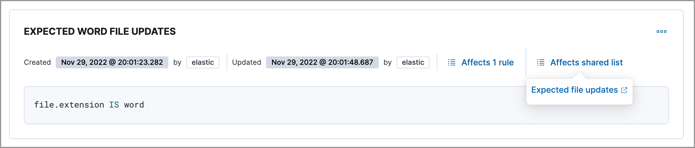
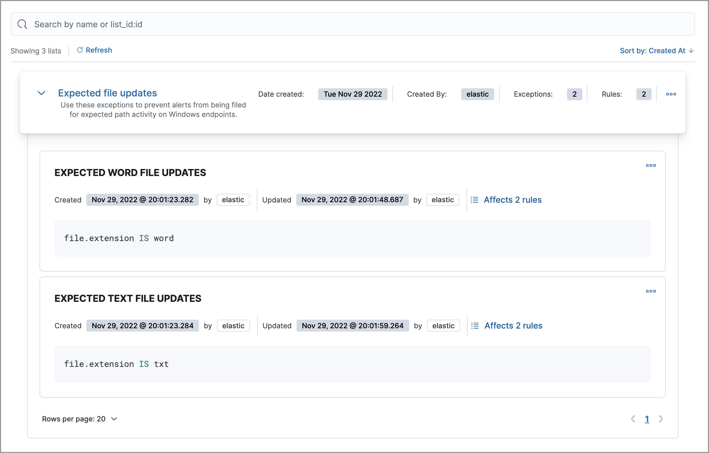
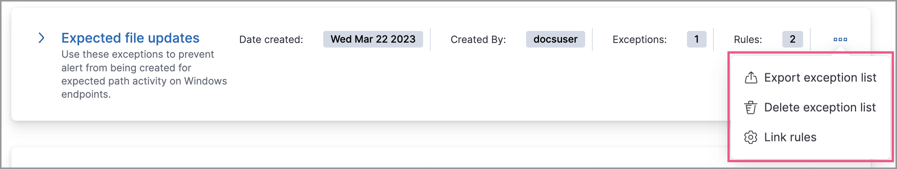

<DocBadge template="technical preview" />

Shared exception lists allow you to group exceptions together and then apply them to multiple rules. Use the Shared Exception Lists page to set up shared exception lists.  

## Create shared exception lists

Set up shared exception lists to contain exception items:

1. Go to **Rules** → **Shared exception lists**.
1. Click **Create shared exception list** → **Create shared list**. 
1. Give the shared exception list a name. 
1. (Optional) Provide a description. 
1. Click **Create shared exception list**.

## Add exception items to shared exception lists

Add exception items:

1. Go to **Rules** → **Shared exception lists**.
1. Click **Create shared exception list** → **Create exception item**. 

   <DocCallOut title="Tip">
   You can add exceptions to an empty shared exception list by expanding the list, or viewing its details page and clicking **Create rule exception**. After creating an exception, you can associate the shared exception list with rules. Refer to <DocLink slug="/serverless/security/shared-exception-lists" section="associate-shared-exception-lists-with-rules">Associate shared exception lists with rules</DocLink> to learn more.
   </DocCallOut>

1. In the **Add rule exception** flyout, name the exception item and add conditions that define when the exception prevents alerts. When the exception's query conditions are met (the query evaluates to `true`), rules do not generate alerts even when other rule criteria are met.
      1. **Field**: Select a field to identify the event being filtered.

      1. **Operator**: Select an operator to define the condition:
         * `is` | `is not` — Must be an exact match of the defined value.
         * `is one of` | `is not one of` — Matches any of the defined values.
         * `exists` | `does not exist` — The field exists.
         * `is in list` | `is not in list` — Matches values in a value list.

           <DocCallOut title="Note">

           * An exception defined by a value list must use `is in list` or `is not in list` in all conditions.
           * Wildcards are not supported in value lists.
           * If a value list can't be used due to <DocLink slug="/serverless/security/value-lists-exceptions" section="create-value-lists">size or data type</DocLink>, it'll be unavailable in the **Value** menu.

           </DocCallOut>

         * `matches` | `does not match` — Allows you to use wildcards in **Value**, such as `C:\path\*\app.exe`. Available wildcards are `?` (match one character) and `*` (match zero or more characters). The selected **Field** data type must be [keyword](((ref))/keyword.html#keyword-field-type), [text](((ref))/text.html#text-field-type), or [wildcard](((ref))/keyword.html#wildcard-field-type).

             <DocCallOut title="Important" color="warning">
             Using wildcards can impact performance. To create a more efficient exception using wildcards, use multiple conditions and make them as specific as possible. For example, adding conditions using `process.name` or `file.name` can help limit the scope of wildcard matching.
             </DocCallOut>

      1. **Value**: Enter the value associated with the **Field**. To enter multiple values (when using `is one of` or `is not one of`), enter each value, then press **Return**.

1. Click **AND** or **OR** to create multiple conditions and define their relationships.

1. Click **Add nested condition** to create conditions using nested fields. This is only required for
    <DocLink slug="/serverless/security/add-exceptions" section="nested-field-list">these nested fields</DocLink>. For all other fields, nested conditions should not be used.

1. Choose to add the exception to shared exception lists. 

    <DocCallOut title="Note">
    This option will be unavailable if a shared exception list doesn't exist. In addition, you can't add an endpoint exception item to the Endpoint Security Exception List from this UI. Refer to <DocLink slug="/serverless/security/add-exceptions" section="add-((elastic-endpoint))-exceptions">Add ((elastic-endpoint)) exceptions</DocLink> for instructions about creating endpoint exceptions. 
    </DocCallOut>

1. (Optional) Enter a comment describing the exception.
1. (Optional) Enter a future expiration date and time for the exception. 
1. (Optional) **Close all alerts that match this exception and were generated by this rule**:
    Closes all alerts that match the exception's conditions and were generated only by the current rule.

1. Click **Add rule exception**.

## Associate shared exception lists with rules

Apply shared exception lists to rules:

1. Go to **Rules** → **Shared exception lists**.
1. Do one of the following:
    * Select a shared exception list's name to open its details page, then click **Link rules**. 
    * Find the shared exception list you want to assign to rules, then from the **More actions** menu (<DocIcon type="boxesHorizontal" title="Actions menu" size="m" />), select **Link rules**.
1. Click the toggles in the **Link** column to select the rules you want to link to the exception list.

    <DocCallOut title="Tip">
    If you know a rule's name, you can enter it into the search bar.
    </DocCallOut>

1. Click **Save**. 
1. (Optional) To verify that the shared exception list was added to the rules you selected:

    1. Open a rule’s details page (**Rules** → **Detection rules (SIEM)** → **_Rule name_**).
    1. Scroll down the page, and then select the **Rule exceptions** tab. 
    1. Navigate to the exception items that are included in the shared exception list. Click the **Affects shared list** link to view the associated shared exception lists.

        

## View and filter exception lists 

The Shared Exception Lists page displays each shared exception list on an individual row, with the most recently created list at the top. Each row contains these details about the shared exception list:

* Shared exception list name
* Date the list was created
* Username of the user who created the list
* Number of exception items in the shared exception list
* Number of rules the shared exception list affects

To view the details of an exception item within a shared exception list, expand a row.

To filter exception lists by a specific value, enter a value in the search bar. You can search the following attributes:

* `name`
* `list_id`
* `created_by`

If no attribute is selected, the app searches the list name by default.

## Manage shared exception lists

You can edit, export, import, duplicate, and delete shared exception lists from the Shared Exception Lists page.  

To export or delete an exception list, select the required action button on the appropriate list. Note the following:

* Exception lists are exported to `.ndjson` files.
* Exception lists are also exported as part of any exported detection rules configured with exceptions. Refer to <DocLink slug="/serverless/security/rules-ui-management" section="export-and-import-rules">Export and import rules</DocLink>.
* If an exception list is linked to any rules, you'll get a warning asking you to confirm the deletion. 
* If an exception list contains expired exceptions, you can choose whether to include them in the exported file.  

