<DocBadge template="technical preview" />

The ((security-app)) is a highly interactive workspace designed for security analysts that provides a clear overview of events and alerts from your environment. You can use the interactive UI to drill down into areas of interest.

## Search

Filter for alerts, events, processes, and other important security data by entering [((kib)) Query Language (KQL)](((kibana-ref))/kuery-query.html) queries in the search bar, which appears at the top of each page throughout the app. A date/time filter set to `Today` is enabled by default, but can be changed to any time range.

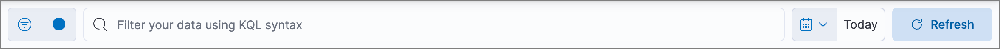

* To refine your search results, select **Add Filter** (<DocIcon type="plusInCircleFilled" title="Add" />), then enter the field, operator (such as `is not` or `is between`), and value for your filter.

* To save the current KQL query and any applied filters, select **Saved query menu** (<DocIcon type="filterInCircle" title="Filter" />), enter a name for the saved query, and select **Save saved query**.

## Navigation menu

The navigation menu contains direct links and expandable groups, identified by the group icon (<DocIcon type="spaces" title="Group" />).

* Click a top-level link to go directly to its landing page, which contains links and information for related pages.

* Click a group's icon (<DocIcon type="spaces" title="Group" />) to open its flyout menu, which displays links to related pages within that group. Click a link in the flyout to navigate to its landing page.

* Click the **Collapse side navigation** icon (<DocIcon type="menuLeft" title="Move menu left" />) to collapse and expand the main navigation menu.

{/* Hiding this as short-term fix for serverless; consider creating a serverless version of the image? */}
{/* 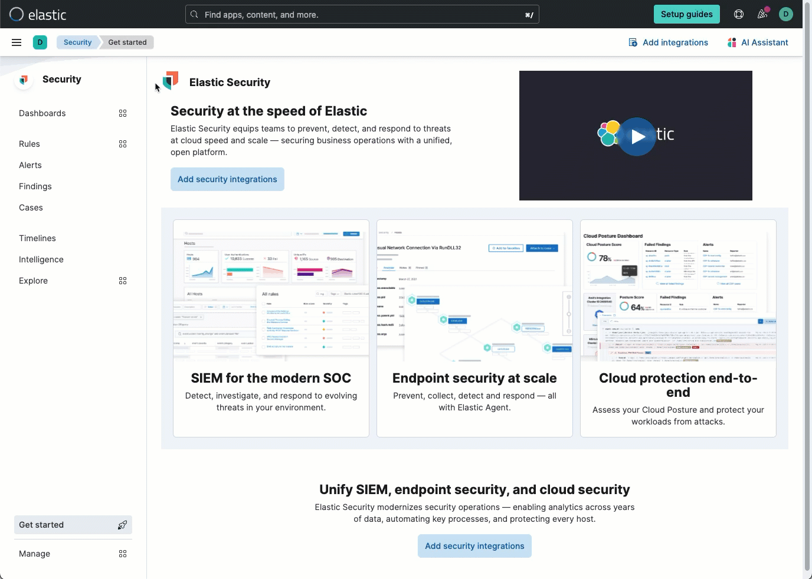 */}

## Visualization actions

Many ((elastic-sec)) histograms, graphs, and tables display an **Inspect** button (<DocIcon type="inspect" title="Inspect" />) when you hover over them. Click to examine the ((es)) queries used to retrieve data throughout the app. 

<DocImage size="l" url="images/es-ui-overview/-getting-started-inspect-icon-context.png" alt="Inspect icon" />

Other visualizations display an options menu (<DocIcon type="boxesHorizontal" title="More actions" />), which allows you to inspect the visualization's queries, add it to a new or existing case, or open it in Lens for customization.

<DocImage size="xl" url="images/es-ui-overview/-getting-started-viz-options-menu-open.png" alt="Options menu opened" />

## Inline actions for fields and values

Throughout the ((security-app)), you can hover over many data fields and values to display inline actions, which allow you to customize your view or investigate further based on that field or value. 

<DocImage size="l" url="images/es-ui-overview/-detections-inline-actions-menu.png" alt="Inline additional actions menu" />

In some visualizations, these actions are available in the legend by clicking a value's options icon (<DocIcon type="boxesVertical" title="More actions" />).

<DocImage size="xl" url="images/es-ui-overview/-getting-started-inline-actions-legend.png" alt="Actions in a visualization legend" />

Inline actions include the following (some actions are unavailable in some contexts):

* **Filter In**: Add a filter that includes the selected value.
* **Filter Out**: Add a filter that excludes the selected value.
* **Add to timeline**: Add a filter to Timeline for the selected value.
* **Toggle column in table**: Add or remove the selected field as a column in the alerts or events table. (This action is only available on an alert's or event's details flyout.)
* **Show top _x_**: Display a pop-up window that shows the selected field's top events or detection alerts.
* **Copy to Clipboard**: Copy the selected field-value pair to paste elsewhere.

## ((security-app)) pages

The ((security-app)) contains the following pages that enable analysts to view, analyze, and manage security data.

### Discover

Use the <DocLink slug="/serverless/elasticsearch/explore-your-data-discover-your-data">Discover UI</DocLink> to filter your data or learn about its structure.  

### Dashboards

Expand this section to access the Overview, Detection & Response, Kubernetes, Cloud Security Posture, Cloud Native Vulnerability Management, and Entity Analytics dashboards, which provide interactive visualizations that summarize your data. You can also create and view custom dashboards. Refer to <DocLink slug="/serverless/security/dashboards-overview">Dashboards</DocLink> for more information.

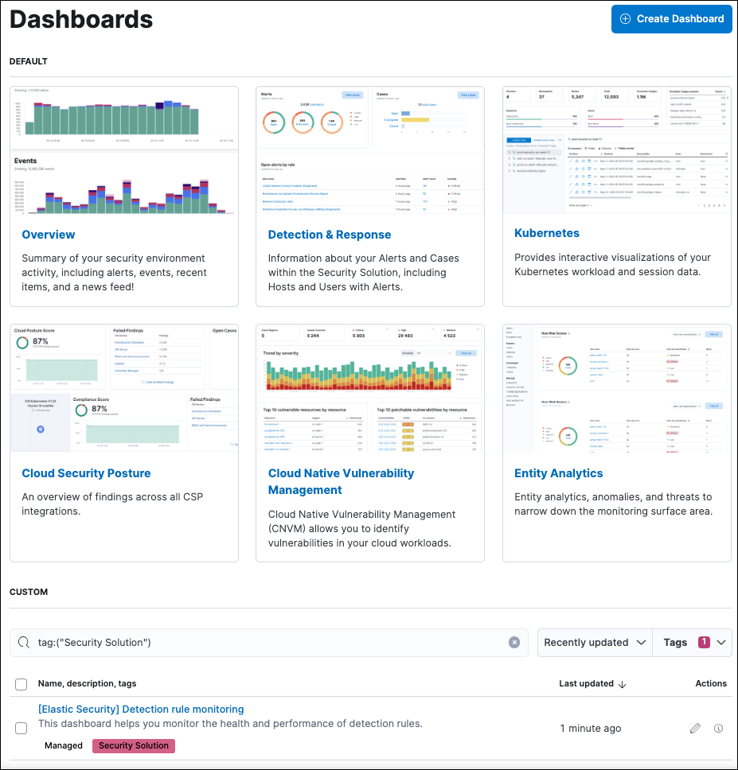

### Rules

Expand this section to access the following pages:

* <DocLink slug="/serverless/security/rules-ui-management">**Rules**</DocLink>: Create and manage rules to monitor suspicious events.

    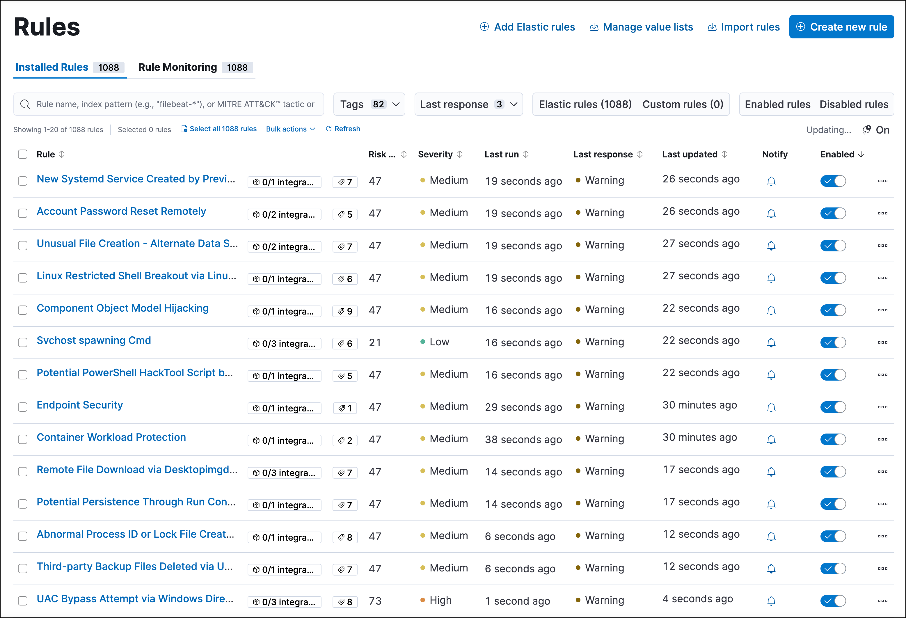

* <DocLink slug="/serverless/security/benchmark-rules">**Benchmark Rules**</DocLink>: View, enable, or disable benchmark rules.

    

* <DocLink slug="/serverless/security/rule-exceptions" section="exceptions-shared-among-multiple-rules">**Shared Exception Lists**</DocLink>: View and manage rule exceptions and shared exception lists.

    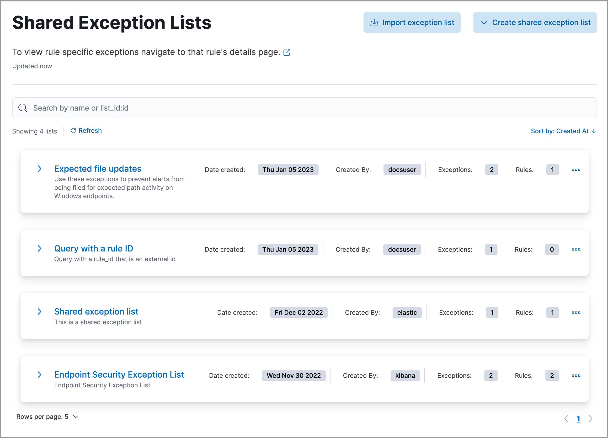

* <DocLink slug="/serverless/security/rules-coverage">**MITRE ATT&CK® coverage**</DocLink>: Review your coverage of MITRE ATT&CK® tactics and techniques, based on installed rules.

    

### Alerts

View and manage alerts to monitor activity within your network. Refer to <DocLink slug="/serverless/security/alerts-manage" /> for more information.

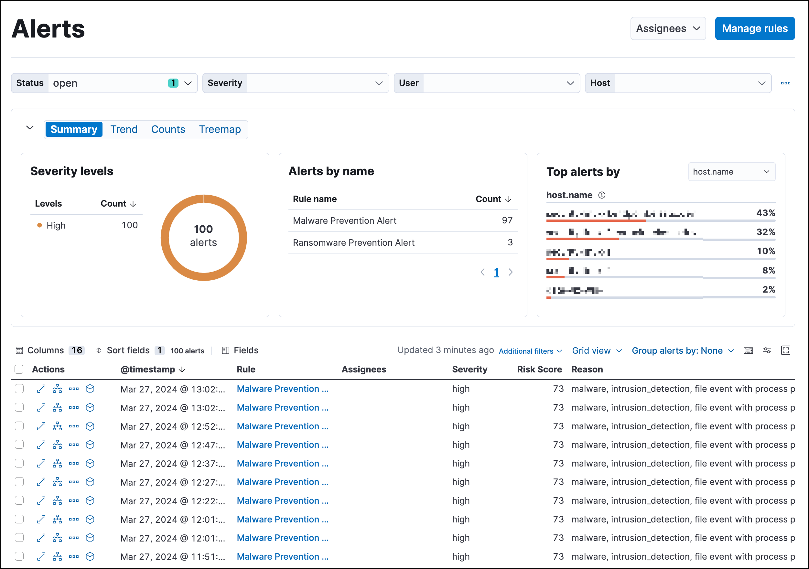

### Findings

Identify misconfigurations and vulnerabilities in your cloud infrastructure. For setup instructions, refer to <DocLink slug="/serverless/security/cspm" />, <DocLink slug="/serverless/security/kspm" />, or <DocLink slug="/serverless/security/vuln-management-overview" />.

### Cases

Open and track security issues. Refer to <DocLink slug="/serverless/security/cases-overview">Cases</DocLink> to learn more.

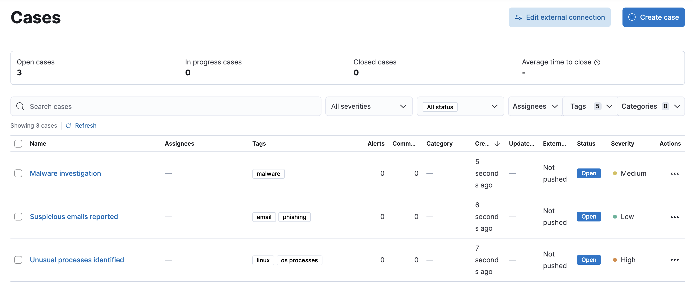

### Investigations

Expand this section to access the following pages:

    * <DocLink slug="/serverless/security/timelines-ui">Timelines</DocLink>: Investigate alerts and complex threats — such as lateral movement — in your network. Timelines are interactive and allow you to share your findings with other team members.

        

        <DocCallOut title="Tip">
        Click the **Timeline** button at the bottom of the ((security-app)) to start an investigation.
        </DocCallOut>

    * <DocLink slug="/serverless/security/query-operating-systems">Osquery</DocLink>: Deploy Osquery with ((agent)), then run and schedule queries.

### Intelligence

The Intelligence section contains the Indicators page, which collects data from enabled threat intelligence feeds and provides a centralized view of indicators of compromise (IoCs). Refer to <DocLink slug="/serverless/security/indicators-of-compromise">Indicators of compromise</DocLink> to learn more.

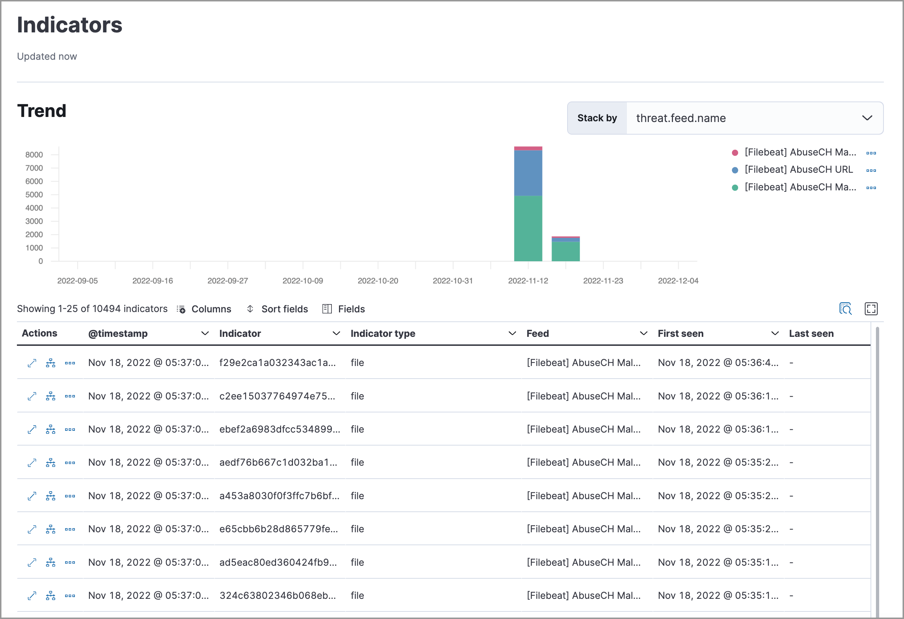

### Explore

Expand this section to access the following pages:

* <DocLink slug="/serverless/security/hosts-overview">**Hosts**</DocLink>: Examine key metrics for host-related security events using graphs, charts, and interactive data tables.

    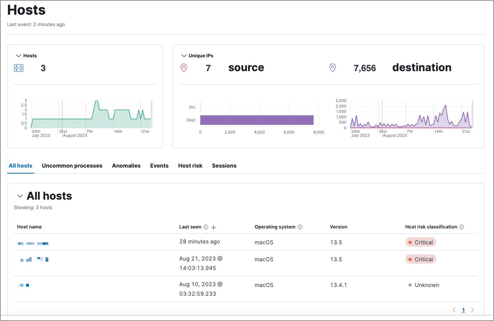

* <DocLink slug="/serverless/security/network-page-overview">**Network**</DocLink>: Explore the interactive map to discover key network activity metrics and investigate network events further in Timeline.

    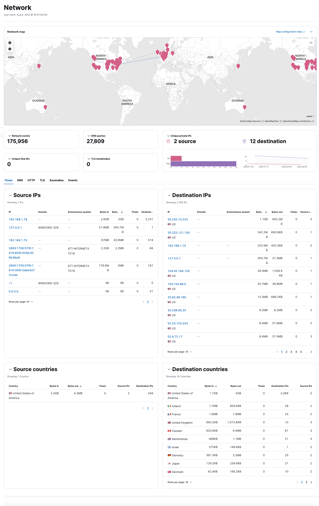

* <DocLink slug="/serverless/security/users-page">**Users**</DocLink>: Access a comprehensive overview of user data to help you understand authentication and user behavior within your environment.

    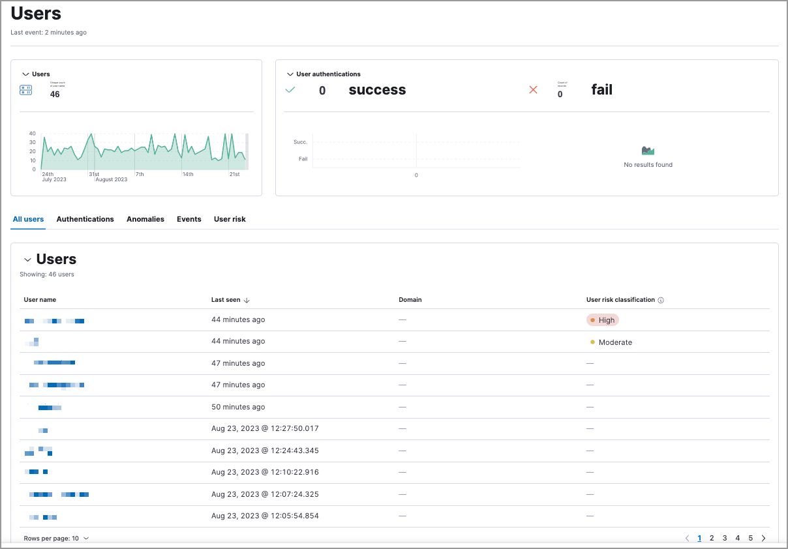

### Assets

The Assets section allows you to manage the following features:

* [((fleet))](((fleet-guide))/manage-agents-in-fleet.html)
* [((integrations))](((fleet-guide))/integrations.html)
* <DocLink slug="/serverless/security/manage-endpoint-protection">Endpoint protection</DocLink>
    * <DocLink slug="/serverless/security/endpoints-page">Endpoints</DocLink>: View and manage hosts running ((elastic-defend)).
    * <DocLink slug="/serverless/security/policies-page">Policies</DocLink>: View and manage ((elastic-defend)) integration policies.
    * <DocLink slug="/serverless/security/trusted-applications">Trusted applications</DocLink>: View and manage trusted Windows, macOS, and Linux applications.
    * <DocLink slug="/serverless/security/event-filters">Event filters</DocLink>: View and manage event filters, which allow you to filter endpoint events you don't need to want stored in ((es)).
    * <DocLink slug="/serverless/security/host-isolation-exceptions">Host isolation exceptions</DocLink>: View and manage host isolation exceptions, which specify IP addresses that can communicate with your hosts even when those hosts are blocked from your network.
    * <DocLink slug="/serverless/security/blocklist">Blocklist</DocLink>: View and manage the blocklist, which allows you to prevent specified applications from running on hosts, extending the list of processes that ((elastic-defend)) considers malicious.
    * <DocLink slug="/serverless/security/response-actions-history">Response actions history</DocLink>: Find the history of response actions performed on hosts.
* <DocLink slug="/serverless/security/cloud-native-security-overview">Cloud security</DocLink>
    * <DocLink slug="/serverless/security/d4c-overview">Container Workload Protection</DocLink>: Identify and block unexpected system behavior in Kubernetes containers.

### ((ml-cap))

Manage ((ml)) jobs and settings. Refer to [((ml-cap)) docs](((ml-docs))/ml-ad-overview.html) for more information.

### Get started

Quickly add security integrations that can ingest data and monitor your hosts.

### Project settings

Configure project-wide settings related to users, billing, data management, and more.

### Dev tools

Use additional API and analysis tools to interact with your data.

## Accessibility features

Accessibility features, such as keyboard focus and screen reader support, are built into the Elastic Security UI. These features offer additional ways to navigate the UI and interact with the application.

### Interact with draggable elements

Use your keyboard to interact with draggable elements in the Elastic Security UI:

* Press the `Tab` key to apply keyboard focus to an element within a table. Or, use your mouse to click on an element and apply keyboard focus to it.

<DocImage size="xl" url="images/es-ui-overview/-getting-started-timeline-accessiblity-keyboard-focus.gif" alt="Demo that shows how to give a draggable element keyboard focus" />

* Press `Enter` on an element with keyboard focus to display its menu and press `Tab` to apply focus sequentially to menu options. The `f`, `o`, `a`, `t`, `c` hotkeys are automatically enabled during this process and offer an alternative way to interact with menu options.

<DocImage size="l" url="images/es-ui-overview/-getting-started-timeline-accessiblity-keyboard-focus-hotkeys.gif" alt="Demo that shows how to display an element menu" />

* Press the spacebar once to begin dragging an element to a different location and press it a second time to drop it. Use the directional arrows to move the element around the UI.

<DocImage size="xl" url="images/es-ui-overview/-getting-started-timeline-ui-accessiblity-drag-n-drop.gif" alt="Demo that shows how to drag and drop an element to another location in the Elastic Security UI" />

* If an event has an event renderer, press the `Shift` key and the down directional arrow to apply keyboard focus to the event renderer and `Tab` or `Shift` + `Tab` to navigate between fields. To return to the cells in the current row, press the up directional arrow. To move to the next row, press the down directional arrow.

<DocImage size="xl" url="images/es-ui-overview/-getting-started-timeline-accessiblity-event-renderers.gif" alt="Demo that shows how to navigate an event renderer" />

### Navigate the Elastic Security UI
Use your keyboard to navigate through rows, columns, and menu options in the Elastic Security UI:

* Use the directional arrows to move keyboard focus right, left, up, and down in a table.

<DocImage size="xl" url="images/es-ui-overview/-getting-started-timeline-accessiblity-directional-arrows.gif" alt="" />

* Press the `Tab` key to navigate through a table cell with multiple elements, such as buttons, field names, and menus. Pressing the `Tab` key will sequentially apply keyboard focus to each element in the table cell.

<DocImage size="m" url="images/es-ui-overview/-getting-started-timeline-accessiblity-tab-keys.gif" alt="Demo that shows how to use Tab to navigate through a cell with multiple elements" />

* Use `CTRL + Home` to shift keyboard focus to the first cell in a row. Likewise, use `CTRL + End` to move keyboard focus to the last cell in the row.

<DocImage size="xl" url="images/es-ui-overview/-getting-started-timeline-accessiblity-shifting-keyboard-focus.gif" alt="Demo that shows how to Demo that shows how to shift keyboard focus" />

* Use the `Page Up` and `Page Down` keys to scroll through the page.

<DocImage size="xl" url="images/es-ui-overview/-getting-started-timeline-accessiblity-page-up-n-down.gif" alt="Demo that shows how to to scroll through the page" />
