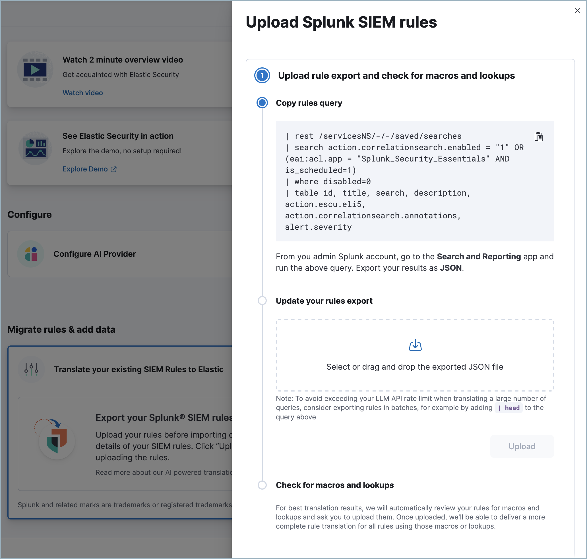
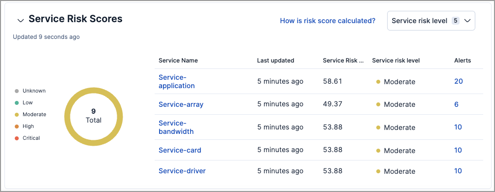
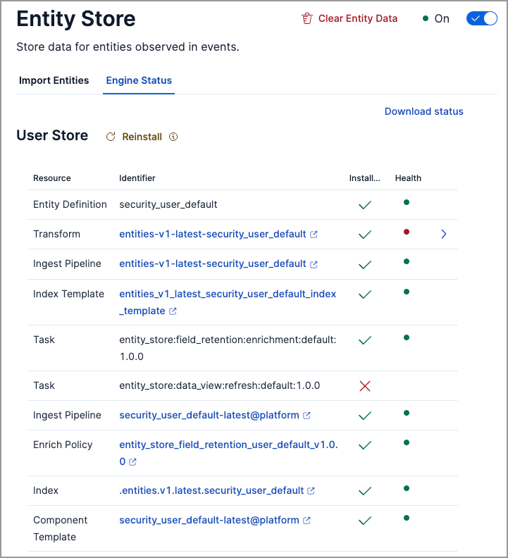
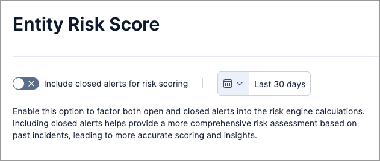
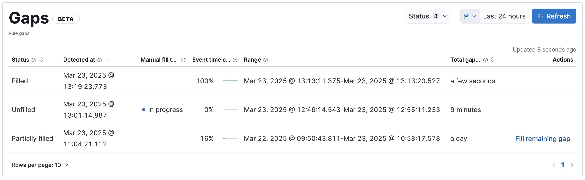

[[whats-new]]
[chapter]
= What's new in {minor-version}

Here are the highlights of what’s new and improved in {elastic-sec}. For detailed information about this release, check out our <<release-notes, release notes>>.

Other versions: {security-guide-all}/8.17/whats-new.html[8.17] | {security-guide-all}/8.16/whats-new.html[8.16] | {security-guide-all}/8.15/whats-new.html[8.15] | {security-guide-all}/8.14/whats-new.html[8.14] | {security-guide-all}/8.13/whats-new.html[8.13] | {security-guide-all}/8.12/whats-new.html[8.12] | {security-guide-all}/8.11/whats-new.html[8.11] | {security-guide-all}/8.10/whats-new.html[8.10] | {security-guide-all}/8.9/whats-new.html[8.9] | {security-guide-all}/8.8/whats-new.html[8.8] | {security-guide-all}/8.7/whats-new.html[8.7] | {security-guide-all}/8.6/whats-new.html[8.6] | {security-guide-all}/8.5/whats-new.html[8.5] | {security-guide-all}/8.4/whats-new.html[8.4] | {security-guide-all}/8.3/whats-new.html[8.3] | {security-guide-all}/8.2/whats-new.html[8.2] | {security-guide-all}/8.1/whats-new.html[8.1] | {security-guide-all}/8.0/whats-new.html[8.0] | {security-guide-all}/7.17/whats-new.html[7.17] | {security-guide-all}/7.16/whats-new.html[7.16] | {security-guide-all}/7.15/whats-new.html[7.15] | {security-guide-all}/7.14/whats-new.html[7.14] | {security-guide-all}/7.13/whats-new.html[7.13] | {security-guide-all}/7.12/whats-new.html[7.12] | {security-guide-all}/7.11/whats-new.html[7.11] | {security-guide-all}/7.10/whats-new.html[7.10] |
{security-guide-all}/7.9/whats-new.html[7.9]

// NOTE: The notable-highlights tagged regions are re-used in the Installation and Upgrade Guide. Full URL links are required in tagged regions.
// tag::notable-highlights[]

[float]
== Generative AI enhancements

[float]
=== Automatically migrate Splunk SIEM rules

{security-guide}/siem-migration.html[Automatic Migration] for detection rules helps you quickly convert SIEM rules from the Splunk Processing Language (SPL) to the Elasticsearch Query Language ({esql}). If comparable Elastic-authored rules exist, it simplifies onboarding by mapping your rules to them. Otherwise, it creates custom rules on the fly so you can verify and edit them instead of writing them from scratch.

[role="screenshot"]

[float]
=== Automatic Import improvements

{security-guide}/automatic-import.html[Automatic Import] now allows you to select API (CEL input) as a data source and to provide the associated OpenAPI specification (OAS) file to automatically generate a CEL program to consume an API.

[float]
=== Control which alerts Attack Discovery analyzes 

You can now specify which alerts {security-guide}/attack-discovery.html[Attack Discovery] analyzes using a date and time selector and a KQL filter.

[role="screenshot"]
image::whats-new/images/8.18/security-attack-discovery-settings.png[Attack Discovery's settings menu,60%]

[float]
=== Citations and documentation for AI Assistant 

{security-guide}/security-assistant.html[AI Assistant] can now cite sources including Elastic's product documentation, threat reports, and more.

[float]
== Entity Analytics enhancements

[float]
=== Monitor services installed in your environment

The {security-guide}/entity-store.html[entity store] now supports a new *service* entity type, expanding the range of entities you can track and monitor in your environment. Previously, only user and host entities were supported. With the addition of the service entity type, you can now investigate and protect the various services installed across your infrastructure.

[role="screenshot"]

[float]
=== Verify entity store engine status

Use the new **Engine Status** tab on the **Entity Store** page to {security-guide}/entity-store.html#verify-engine-status[verify] which engines are installed in your environment and check their current statuses. This tab provides a centralized view for monitoring engine health, allowing you to ensure proper functionality, and troubleshoot any potential issues.

[role="screenshot"]

[float]
=== Entity risk scoring and entity store are generally available 

{security-guide}/entity-risk-scoring.html[Entity risk scoring] and entity store are moving from technical preview to general availability. Use these features to monitor the risk score of entities in your environment and query persisted entity metadata.

[float]
=== Include closed alerts in risk score calculations

When {security-guide}/turn-on-risk-engine.html[turning on the risk engine], you now have the option to include `Closed` alerts in risk scoring calculations. By default, only `Open` and `Acknowledged` alerts are included. Additionally, you can specify a custom date and time range for the calculation, allowing for more flexible and tailored risk monitoring.

[role="screenshot"]

[float]
== Detection rules and alerts enhancements

[float]
=== Customize and manage prebuilt detection rules

Previously, you had limited ability to customize prebuilt rules, couldn’t export or import them, and could only accept Elastic changes during rule updates. Now, you can do so much more. 

After installing prebuilt rules, you're now able to {security-guide}/rules-ui-management.html#edit-rules-settings[edit] most of their settings to fit your custom needs. When updating rules, Elastic retains your changes whenever possible and helps you auto-resolve conflicts that may occur. Additional enhancements, such as the ability to compare different versions of a rule and edit the final update, have also been made to give you more control over the {security-guide}/prebuilt-rules-update-modified-unmodified.html[prebuilt rule update experience]. 

In addition to customizing prebuilt rules, you're now able to: 

* {security-guide}/rules-ui-management.html#import-export-rules-ui[Export and import] prebuilt rules that have been modified or left unchanged.
* {security-guide}/rules-ui-management.html#edit-rules-settings[Bulk-edit] prebuilt rules settings, such as custom highlighted fields or tags.  

[float]
=== Manual run enhancements

The {security-guide}/rules-ui-management.html#manually-run-rules[manual runs] functionality is now generally available and includes the following new features:

* Almost all rule actions are supported and can be activated when you run a rule manually.
* Gaps in rule executions—which can lead to missed alerts and inconsistent rule coverage—can be monitored and manually filled.

[role="screenshot"]

[float]
=== Preview logged {es} requests for more rule types

You can now {security-guide}/rules-ui-create.html#view-rule-es-queries[preview logged {es} requests] for new terms, threshold, custom, and machine learning rule types.

[float]
=== Suppress alerts for event correlation rules

{security-guide}/alert-suppression.html[Alert suppression] is now supported for event correlation rules using sequence queries.

[float]
== Investigations enhancements

[float]
=== Control access to Timeline and notes with more granularity

You now have more control over role access to {security-guide}/timelines-ui.html#timeline-privileges[Timeline] and {security-guide}/add-manage-notes.html#notes-privileges[notes]. When you upgrade to 8.18, roles that previously had `All` or `Read` access to Security will inherit these privileges for Timelines and notes.

[float]
=== Visualizations are available by default in the alert details flyout

The `securitySolution:enableVisualizationsInFlyout` advanced setting is now turned on by default and generally available. The **Session View** and **Analyzer Graph** {security-guide}/view-alert-details.html#expanded-visualizations-view[sub-tabs] in the alert details flyout are also available by default and generally available.

[float]
=== Quickly access visited places from the alert details flyout

From the {security-guide}/view-alert-details.html#right-panel[alert details flyout], you can click the history icon () to display a list of places that you visited from the alert's details flyout—for example, flyouts for other alerts or users. Click any list entry to quickly access the item's details.

[float]
== Response actions enhancements

[float]
=== Updated privileges for third-party response actions

A new {kib} feature privilege is now required when {security-guide}/response-actions-config.html[configuring third-party response actions]. To find and assign the privilege, navigate to **Management** -> **Actions and Connectors** -> **Endpoint Security**.

[float]
=== Run a script on CrowdStrike-enrolled hosts 

Using Elastic's CrowdStrike integration and connector, you can now {security-guide}/response-actions.html#runscript[run a script] on CrowdStrike-enrolled hosts by providing one of the following:

* The full script content
* The name of the script stored in a cloud storage location
* The file path of the script located on the host machine

[float]
=== Isolate and release Microsoft Defender for Endpoint–enrolled hosts

Using Elastic's Microsoft Defender for Endpoint integration and connector, you can now {security-guide}/third-party-actions.html#defender-response-actions[perform response actions] on hosts enrolled in Microsoft Defender's endpoint protection system. These actions are available in this release:

* Isolate a host from the network
* Release an isolated host

[float]
=== Third-party response actions are generally available 

{security-guide}/third-party-actions.html[Third-party response actions] are moving from technical preview to general availability. This includes response capabilities for Sentinel One, Crowdstrike, and Microsoft Defender for Endpoint.

[float]
== Maximum Osquery timeout is 24 hours

When {kibana-ref}/osquery.html#osquery-run-query[running Osquery queries], you can now set a timeout period of up to 24 hours (86,400 seconds). Overwriting the query's default timeout period allows you to support queries that take longer to run.

[float]
== Increased support for agentless integrations

An additional 14 {security-guide}/agentless-integrations.html[integrations] can now be deployed using agentless technology.

// end::notable-highlights[]

