[[whats-new]]
[chapter]
= What's new in {minor-version}

Here are the highlights of what’s new and improved in {elastic-sec}. For detailed information about this release, check out our <<release-notes, release notes>>.

Other versions: {security-guide-all}/8.18/whats-new.html[8.18] | {security-guide-all}/8.17/whats-new.html[8.17] | {security-guide-all}/8.16/whats-new.html[8.16] | {security-guide-all}/8.15/whats-new.html[8.15] | {security-guide-all}/8.14/whats-new.html[8.14] | {security-guide-all}/8.13/whats-new.html[8.13] | {security-guide-all}/8.12/whats-new.html[8.12] | {security-guide-all}/8.11/whats-new.html[8.11] | {security-guide-all}/8.10/whats-new.html[8.10] | {security-guide-all}/8.9/whats-new.html[8.9] | {security-guide-all}/8.8/whats-new.html[8.8] | {security-guide-all}/8.7/whats-new.html[8.7] | {security-guide-all}/8.6/whats-new.html[8.6] | {security-guide-all}/8.5/whats-new.html[8.5] | {security-guide-all}/8.4/whats-new.html[8.4] | {security-guide-all}/8.3/whats-new.html[8.3] | {security-guide-all}/8.2/whats-new.html[8.2] | {security-guide-all}/8.1/whats-new.html[8.1] | {security-guide-all}/8.0/whats-new.html[8.0] | {security-guide-all}/7.17/whats-new.html[7.17] | {security-guide-all}/7.16/whats-new.html[7.16] | {security-guide-all}/7.15/whats-new.html[7.15] | {security-guide-all}/7.14/whats-new.html[7.14] | {security-guide-all}/7.13/whats-new.html[7.13] | {security-guide-all}/7.12/whats-new.html[7.12] | {security-guide-all}/7.11/whats-new.html[7.11] | {security-guide-all}/7.10/whats-new.html[7.10] |
{security-guide-all}/7.9/whats-new.html[7.9]

// NOTE: The notable-highlights tagged regions are re-used in the Installation and Upgrade Guide. Full URL links are required in tagged regions.
// tag::notable-highlights[]

[float]
== Generative AI enhancements

[float]
=== Use Elastic Managed LLM in Security AI Assistant

{kibana-ref}/elastic-managed-llm.html[Elastic Managed LLM] is now the default large language model connector in AI Assistant. It gives you immediate access to generative AI features without any setup or external model integration.

[role="screenshot"]
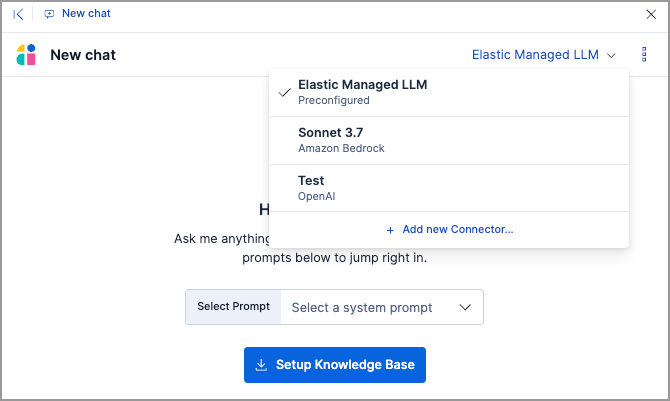

[float]
=== Use prompt tiles in Security AI Assistant

The {security-guide}/security-assistant.html[Security AI Assistant]'s chat UI now uses prompt tiles instead of default quick prompts. Prompt tiles help you begin structured tasks or investigations into common {elastic-sec} workflows.

[role="screenshot"]
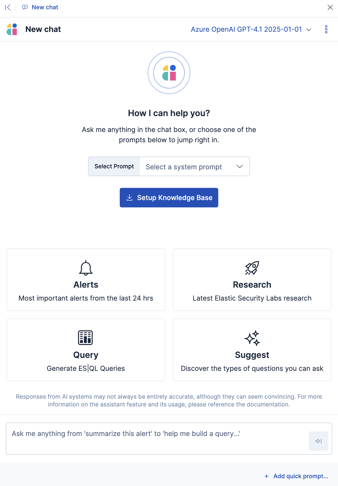

[float]
=== Schedule recurring attack discoveries

You can now {security-guide}/attack-discovery.html#schedule-discoveries[define recurring schedules] to automatically generate attack discoveries without needing manual runs. When discoveries are found, you'll receive notifications through your configured connectors, such as Slack or email. You can customize the notification content to tailor alert context to your needs.

[role="screenshot"]
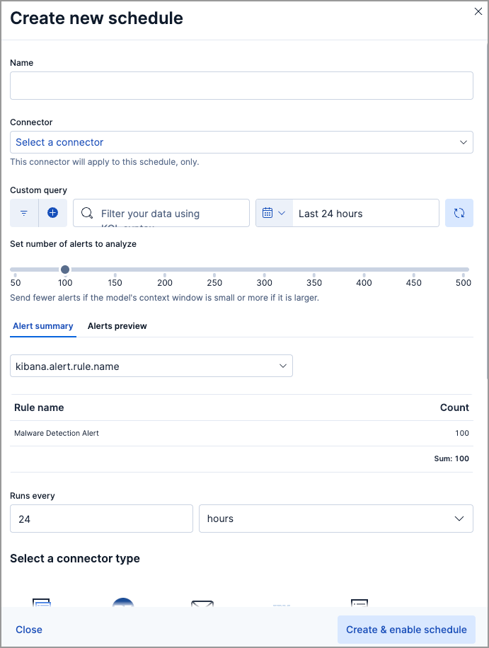

[float]
=== View and manage saved attack discoveries

{security-guide}/attack-discovery.html#saved-discoveries[Attack discoveries] are now automatically saved whenever they're generated. You can update their status, share manually generated discoveries with other {kib} users, and perform bulk actions, such as status changes or adding discoveries to cases. Use the search box and filters to quickly find relevant discoveries.

[role="screenshot"]
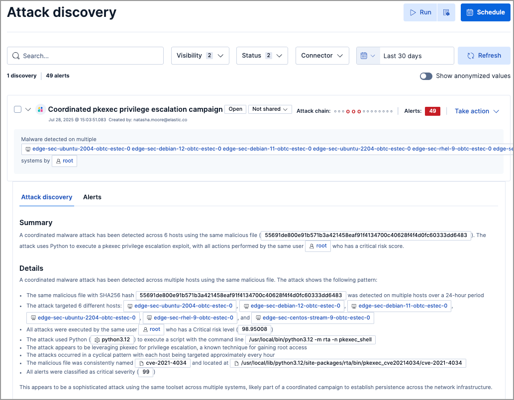

[float]
=== Automatic Migration is generally available

{security-guide}/siem-migration.html[Automatic Migration] is moving from technical preview to general availability. Use this feature to quickly convert SIEM rules from the Splunk Processing Language (SPL) to the Elasticsearch Query Language ({esql}).

[float]
== Detection rules and alerts enhancements

[float]
=== Revert a customized prebuilt rule to its original version

After modifying a prebuilt rule, you can {security-guide}/rules-ui-management.html#revert-rule-changes[restore its original version]. To do this, open the rule's details page, click **All actions** → **Revert to Elastic version**, review the modified fields, then click **Revert**. The original rule version might be unavailable for comparison if you haven't updated your rules in a while.

[role="screenshot"]
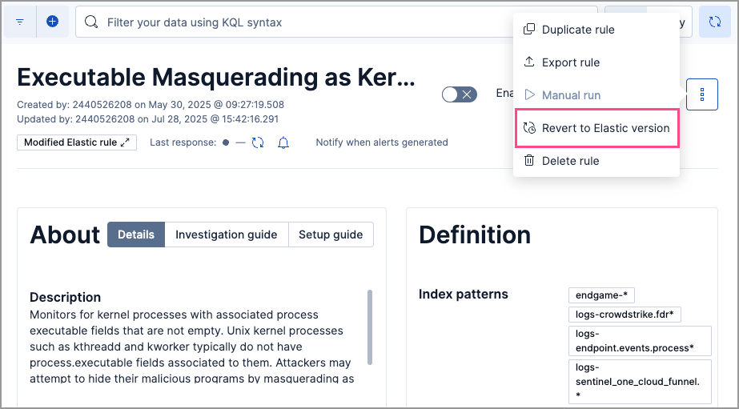

[float]
=== Modified fields on prebuilt rules are marked with a badge

Modified fields on prebuilt rules are marked with the **Modified** badge on the rule's details page. You can compare the original Elastic version and the modified version of the field by clicking on the badge.

[role="screenshot"]
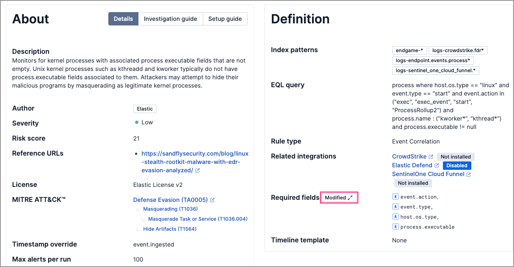

[float]
=== Bulk-apply and remove alert suppression from rules 

From the Rules table, use the **Bulk actions** menu to quickly {security-guide}/alert-suppression.html#_bulk_apply_and_remove_alert_suppression[apply or remove] alert suppression from multiple rules. Note that threshold rules have a dedicated option for bulk-applying alert suppression.

[role="screenshot"]
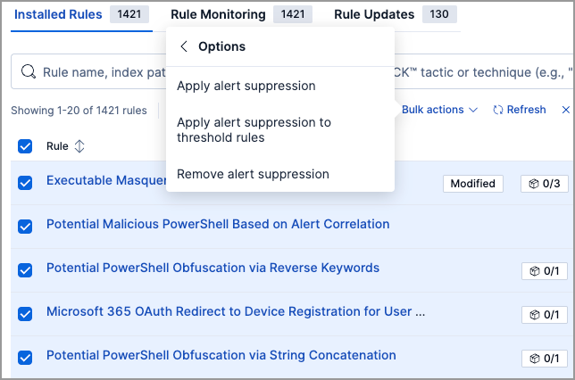

[float]
=== Improvements to gap fills 

Several enhancements have been made to the {security-guide}/alerts-ui-monitor.html#gaps-table[gap fill feature]:

* The Gaps table is now generally available and provides you with an option to fill all gaps for a rule.
* In the panel above the Rules table, the **Total rules with gaps** field now shows how many rules have unfilled gaps and how many are currently having their gaps filled. The **Only rules with gaps:** filter has also been renamed to **Only rules with unfilled gaps:** and now only shows rules that have unfilled gaps. Rules with partial gaps or gaps that are being filled are excluded from the filter results.
* You can now bulk-fill gaps for multiple rules.

[role="screenshot"]
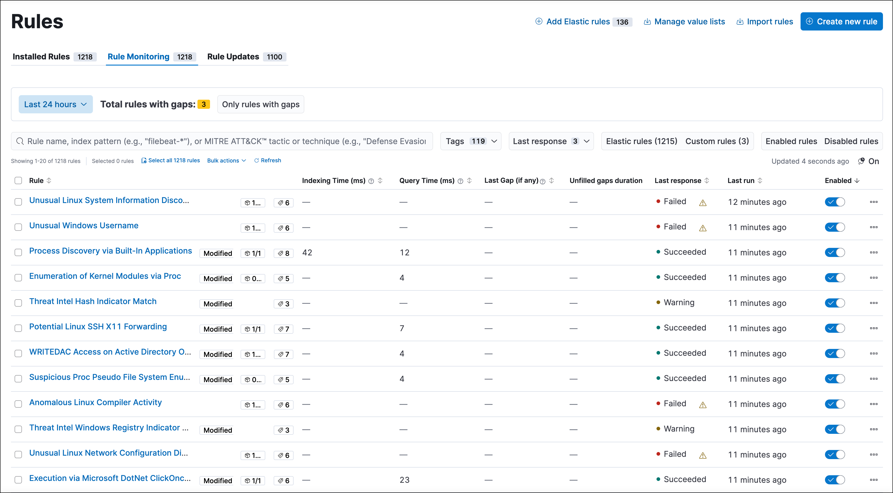

[float]
== Response actions enhancements

[float]
=== Run a script on Microsoft Defender for Endpoint-enrolled hosts

Using Elastic's Microsoft Defender for Endpoint integration and connector, you can now {security-guide}/response-actions.html#runscript-mde[run a script] on Microsoft Defender for Endpoint-enrolled hosts.

[role="screenshot"]
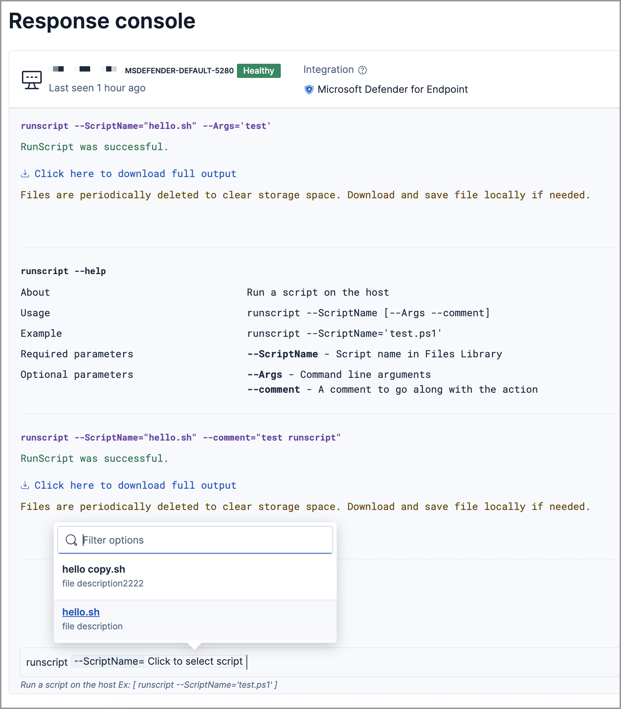

[float]
=== Select saved scripts when using `runscript` third-party response actions

When using the `runscript` response action with hosts enrolled in CrowdStrike and Microsoft Defender for Endpoint, you can now select from a list of saved custom scripts. This means you no longer need to type the script name manually. 

[float]
== Investigations enhancements

[float]
=== Customize highlighted fields for alerts

You can now add more fields to an alert's {security-guide}/view-alert-details.html#investigation-section[highlighted fields] to display information that's relevant to your investigations.

[role="screenshot"]
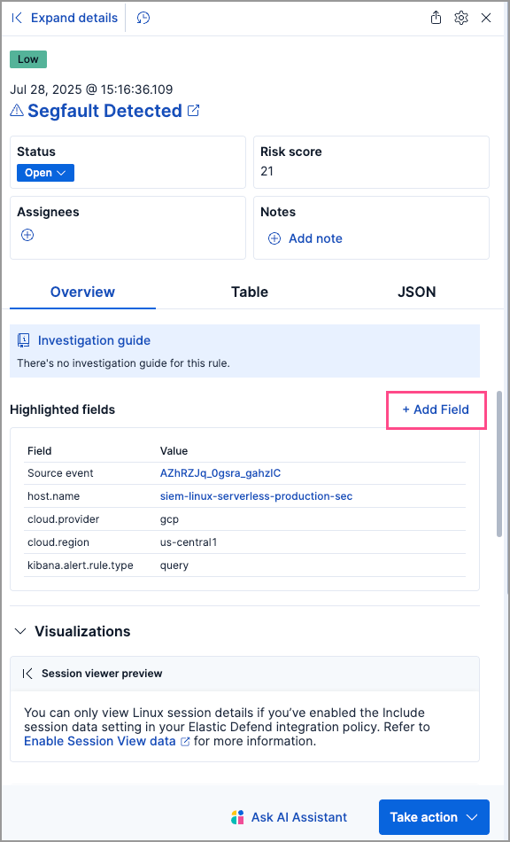

[float]
=== Access the response console from events

Now, you can access the response console from events, giving you more places to use response actions. You can now also {security-guide}/host-isolation-ov.html[isolate or release] a host from events.

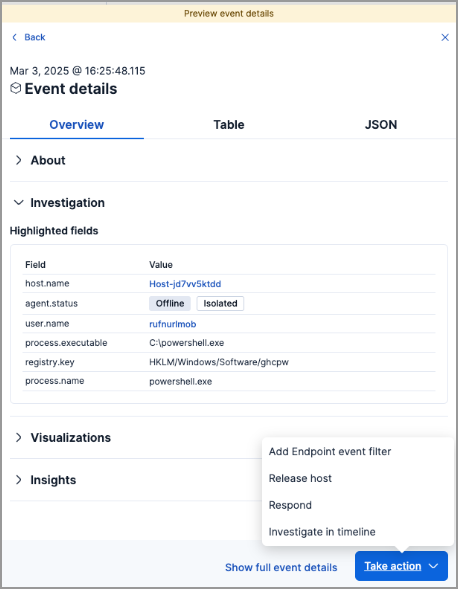

[float]
== Cloud Security enhancements

[float]
=== New integrations

{elastic-sec} now supports three new Cloud Security integrations: {integrations-docs}/rapid7_insightvm[Rapid7 InsightVM], {integrations-docs}/tenable_io[Tenable Vulnerability Management], and {integrations-docs}/qualys_vmdr[Qualys VMDR].

// end::notable-highlights[]

